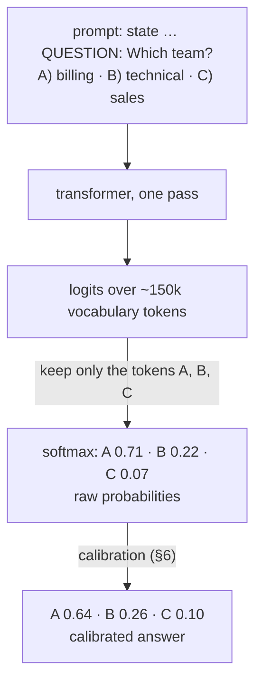
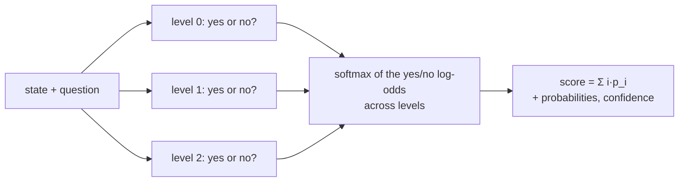
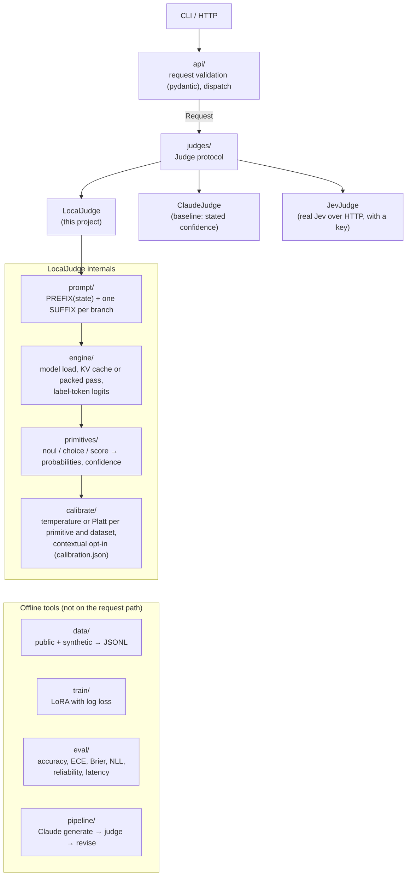
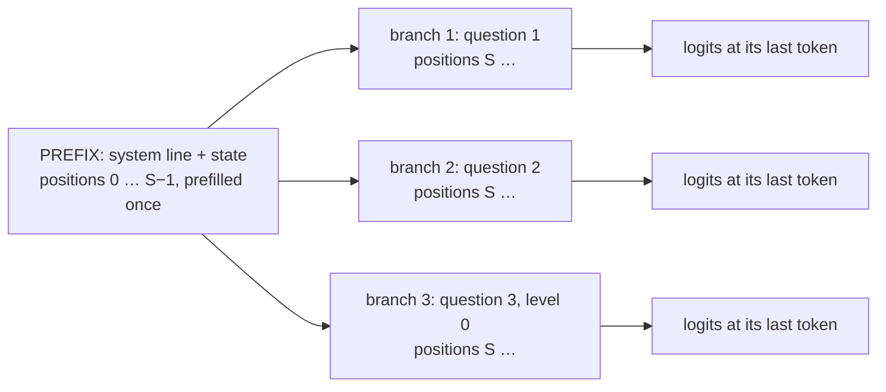
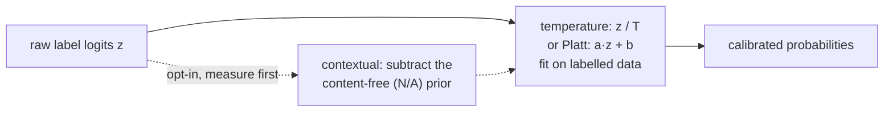
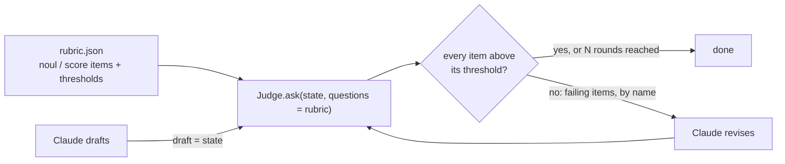
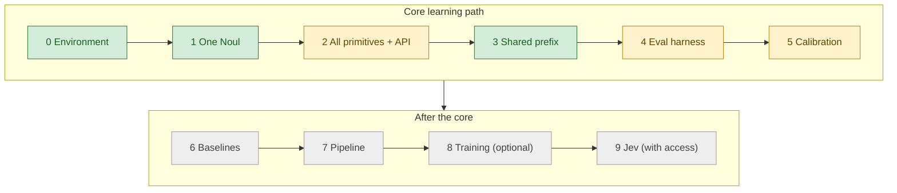

# minijev — Design & Architecture

*Status: design draft 2026-09-22, revised 2026-09-23 after the research in [RESEARCH.md](RESEARCH.md) and a working
proof of concept in [`poc/`](../poc/). The POC covers Phases 0–3 and parts of 4–5 (§12). For a plain-language
account of what we built and measured, see [WALKTHROUGH.md](WALKTHROUGH.md). The writing rules and the glossary are in
[CLAUDE.md](../CLAUDE.md).*

minijev is a small, local, open re-creation of the **idea** behind TypeSafe's Jev ("System One" model):
unstructured state in → typed, calibrated probabilistic decisions out, in one forward pass.

The purpose of this project is **understanding**, not competition. We build every part from published techniques,
so that you can see why each part works. minijev is *not* a copy of Jev. Nobody outside TypeSafe knows how Jev is
built.

---

## 1. Goals and non-goals

**Goals**
1. Accept the same request format as Jev's public API (`state` + typed `questions`). Return the same answer format.
2. Produce answers from a single forward pass of a small open transformer, with no text generation.
3. Make the probabilities **calibrated**. *Prove it* with measurements (ECE, Brier score, reliability diagrams).
4. Be a replaceable judge for a *generate → judge → revise* loop with Claude. Later, replace it with real Jev.
5. Be small enough to read from start to end: about 1–2k lines of Python.

**Non-goals**
- Match Jev's speed (about 100 ms on their hardware) or accuracy. We run on a laptop CPU.
- Reproduce RLCD. RLCD is unpublished. §7 explains what we do instead, and why.
- Reproduce Jev's internals. TypeSafe says Jev is "neither small nor an LLM" and has "a new model architecture".
  We copy its **interface and inference shape**. The public evidence defines these well (RESEARCH.md §3).
- Production hardening, auth, and multi-tenant serving.

---

## 2. What is known vs. inferred

Keep this table honest as you learn more. It is the base of the project: it separates what we know from what we
infer.

This table is the subset that is relevant to the design. RESEARCH.md §2 has the full table (35 rows) with links.

| Claim | Source | Status |
|---|---|---|
| "A new transformer-based model … that is not a large language model (LLM)" | TechCrunch, 2026-09-18 | Stated to press |
| "Jev is neither small nor an LLM"; built with "a new model architecture, parallel sampler" | TypeSafe launch blog + FAQ | Stated |
| Trained only on synthetic data | Blog FAQ; TechCrunch | Stated |
| Trained with "RLCD": probabilities optimized against outcomes | TypeSafe blog + docs | Stated goal, **method unpublished** |
| Three primitives: Choice, Score, Noul (yes/no) | docs.typesafe.ai | Stated (public API) |
| All questions evaluated "in parallel and in isolation against the same state in one go" | docs | Stated |
| 13 questions asked together or one per call give identical answers | docs `/cookbooks/parallel_questions` | Observed |
| Context: 64k tokens per request; 32k for "`state` plus the longest question" | docs `/models` | Stated |
| Choice: at most 255 options. Score: 2–10 levels | docs `/api` | Stated |
| High-cardinality Choice uses "a 2 stage-system of scoring independently then making an explicit choice" | launch blog | Stated |
| Score: "Every level is evaluated separately. The model doesn't see a level's number or its neighbours." | docs `/primitives/score` | Stated |
| Choice confidence = `(p_max − 1/k)/(1 − 1/k)`. Score confidence is ordinal (§5.5). | TypeSafe's `system-one-adapter-python`; fits all 16 doc examples | Observed in TypeSafe code |
| `score = Σ i·p_i` in level-index units, plus a `legend`. Values rounded to 2 decimals. | docs `/api` | Stated / Observed |
| Choice options declared as `criteria: {key: description}`; answer = `{choice, probabilities{key:p}, confidence}` | docs `/api`; browser-use/jev-ultrafast `model.py` | Stated; observed in a real client |
| Median latency 178 ms over 17 requests (~5k input tokens each), `jev-1.13.0` | jev-ultrafast `docs/performance.md` | Measured by a launch partner, not independent |
| Output tokens free, 70–500 ms latency | blog | Stated (their benchmarks) |
| Responses report **non-zero `output_tokens`**. The count grows with option count, not with description length, and does not add up across questions. | docs examples; jev-ultrafast | Observed. **Meaning unknown** (RESEARCH.md §3.7) |
| "Speculative fan-out": ask the operation *and* every possible target question in one request | jev-ultrafast + docs `/patterns/fan-out` | Observed usage pattern |
| Decode, not prefill, is the expensive part of inference. The founder announced a model that escapes "the tyranny of the KV cache". | Almeida, *(KV) Cache Rules Everything Around Me*, 2026-09-09 | Stated (founder's blog) |
| Calibration evidence (charts, datasets) | — | **None published** |
| Answers come from a readout of the probabilities of declared answers in one pass, with no generation | blog ("outputs all probabilities in parallel") | Stated in effect; **label-token readout is our inference** |
| The state is encoded once. Each question is a branch that sees only the state and itself, with positions restarting after the state. | budgets, isolation, billing, latency (above) | **Our inference**, strongly supported; reproduced exactly in `poc/` |

Our design follows the inferred rows. If TypeSafe publishes a paper, examine these rows again.

---

## 3. The core idea in one picture

At each step, a normal LLM gives a probability for **every token in its vocabulary**. Then it *samples* one token.
minijev stops after the **first** step. It does a readout of the probabilities for only the label tokens of your
allowed answers.



Each Jev property follows from this method:
- **Fast, and output is free:** one forward pass, and no decode loop.
- **Cannot invent an answer:** the readout looks only at the labels that you declared.
- **Limit on options:** each option needs a different single-token label (§5.2).
- **Many questions add little time:** the expensive part (the prefill of the state) is shared (§5.4).

The picture is exactly correct for Noul and small Choices. **Score is different.** Jev judges each level separately
and never shows the model the other levels. Thus a Score becomes one yes/no readout per level ("does this level
describe the state?"). minijev normalizes the readouts across levels (§5.2). Large Choices use the same pointwise
method as their first stage.



---

## 4. API contract (mirrors Jev)

The request and response follow Jev's [API reference](https://docs.typesafe.ai/api).

```json
{
  "model": "minijev-latest",
  "state": "Hi, my Stripe integration has failed for 3 days. Losing sales. Help ASAP.",
  "questions": {
    "urgency": { "type": "noul",   "instructions": "Does this message express urgency?" },
    "team":    { "type": "choice", "instructions": "Which team should handle this?",
                 "criteria": { "billing":   "Payments, invoices, refunds",
                               "technical": "Integrations, bugs, outages",
                               "sales":     "Pricing, new plans" } },
    "tone":    { "type": "score",  "instructions": "How upset is the customer?",
                 "criteria": ["calm", "mildly annoyed", "frustrated", "angry"] }
  }
}
```

The response below is the actual output of `poc/` with Qwen2.5-0.5B-Instruct on a laptop CPU:

```json
{
  "model": "minijev-poc (Qwen/Qwen2.5-0.5B-Instruct)",
  "answers": {
    "urgency": { "type": "noul",   "noul": 0.98 },
    "team":    { "type": "choice", "choice": "technical",
                 "probabilities": {"billing": 0.02, "technical": 0.97, "sales": 0.01},
                 "confidence": 0.96 },
    "tone":    { "type": "score",  "score": 1.92,
                 "legend": {"0": "calm", "1": "mildly annoyed", "2": "frustrated", "3": "angry"},
                 "probabilities": {"0": 0.09, "1": 0.08, "2": 0.65, "3": 0.18},
                 "confidence": 0.55 }
  },
  "usage": { "input_tokens": 264, "output_tokens": 0, "latency_ms": 1148 }
}
```

**Request fields**
- `state` can be a string, a JSON object, or an array. minijev serializes a non-string as indented JSON. Then
  questions can refer to fields by path (`` `ticket.messages[0].text` ``), as Jev's docs recommend.
- **Question ids are for the caller only. They never appear in the prompt.** Choice option names *and* descriptions
  do appear.
- `instructions` and every description can be a string, object, array, or `null`. A `null` Choice description means
  that the key alone gives the meaning.
- **Noul** takes optional `criteria: {"true": …, "false": …}`. These describe the meaning of yes and no.
- **Choice** `criteria` is a map from key to description. Jev allows 255 options. The POC's letter labels allow 25 (§5.2).
- **Score** `criteria` is an **ordered array** of 2–10 level descriptions, from low to high. There is no `levels` field.

**Response fields**
- Values are rounded to 2 decimals, as in Jev. Debug output gives full precision.
- Score: `score = Σ i·p_i` in **level units 0…n−1**, not [0, 1]. To normalize, callers divide by n−1.
  The response adds `legend`. The keys of `probabilities` are level index strings.
- `confidence` uses TypeSafe's formulas (§5.5). Noul answers have no confidence.
- `usage`: Jev returns `{input_tokens, output_tokens}`. minijev counts the state once plus every branch. It
  reports `output_tokens: 0`. **`latency_ms` is a minijev extension.**

---

## 5. Architecture



### 5.1 `judges/`: the replacement point
```python
class Judge(Protocol):
    def ask(self, req: Request) -> Response: ...
```
All three backends return the same `Response`. Thus the pipeline and the eval harness can compare *LocalJudge vs
Claude vs Jev* on identical data. This comparison is the most informative experiment in the project.

- **ClaudeJudge** asks Claude to give JSON probabilities. This is *verbalized* confidence: the model generates a
  number. The literature does not agree:
  - Kadavath et al. 2022: token probabilities are well calibrated for *pretrained* models.
  - Xiong et al. 2024: verbalized confidence is frequently overconfident.
  - Tian et al. 2023: for *RLHF-tuned* models, verbalized confidence can be **better** calibrated than token
    probabilities.

  Thus E2 is an open question. That is why it is important to run E2.
- **Do not write ClaudeJudge from the start.** TypeSafe's MIT-licensed
  [system-one-adapter-python](https://github.com/typesafe-ai/system-one-adapter-python) already answers requests in
  Jev's format with Anthropic, OpenAI, or Gemini models. It uses verbalized per-label distributions through
  structured output. It asks all questions in one call, so its questions are not isolated, as Jev's questions are.
  Include this difference in the E2 analysis.

### 5.2 `prompt/`: labels and templates
- **Noul** uses a readout of the `Yes`/`No` tokens, not letters. It also collects `yes`/`YES`/`no`/`NO` and the leading-space
  forms. Jev's docs say that a Noul whose "true" means "no" performs worse. From this, we infer that Jev's readout is
  also semantically yes/no. minijev renders optional `criteria.true` / `criteria.false` as "Yes means: …" /
  "No means: …".
- **Choice** is listwise by default:
  - Options get **single-token labels** `A`–`Z`, without `I`. `I` is a frequent first word of an answer, so it
    attracts unrelated probability. This allows 25 options. Do not use numbers: Qwen-family tokenizers split digits
    one per token, so `12` is two tokens.
  - minijev renders each option as `A) key: description`.
  - **Known weakness: the answer depends on the option order.** In the POC, a rotation of the options changed the
    winner in 54% of rotations at 0.5B and 9% at 1.5B (RESEARCH.md §7.3 R4). `choice_mode: "pointwise"` judges each
    option on its own, as a Score level. It gives exactly the same answer for every order. It is also Jev's first
    stage for large option sets. `choice_mode: "averaged"` asks every rotation of the list in the same pass and
    averages each option's probability. On 120 AG News articles it cut the answer changes from 20% to 3% at 0.5B,
    and pointwise cut them to 0% (RESEARCH.md §7.3 R10).
- **More than 25 options:** use two stages, as Jev does. Score every option pointwise and keep the top few. Then ask
  one listwise Choice over the remaining options. Alternatively, use verified single-token pairs (`AA`, `AB`, …).
- **Score is pointwise.** This is Jev's documented behaviour:
  - Each level gets its own branch: "QUESTION … PROPOSED ANSWER: <level> … Yes or No?".
  - Take the yes/no log-odds of each level. Then apply a softmax across levels.
  - The model never sees level numbers or the other levels.
  - Listwise levels (`A`, `B`, … in one prompt) remain as an ablation (E8).
- **At startup, verify** that every label is exactly one token. The POC's `Engine._variants` asserts it.
- **Leading-space problem:** the model can prefer `" A"` to `"A"`. Collect logits for **both** variants of each
  label. Combine them with `logsumexp`.
- **Template** (chat format for an instruct model). The assistant turn stays open. The readout takes its first token.
  The template does not need an "Answer:" prefix. In the POC, 0.998 or more of the next-token probability goes to
  the labels (§5.3 diagnostic).

```text
[system] You are a precise classifier. You read a STATE and answer one QUESTION about it.
[user]   STATE:
         <state text, or indented JSON>
                                               ◄── end of shared PREFIX
         QUESTION: <instructions>
         OPTIONS:
         A) <key>: <description>
         B) <key>: <description>
         Answer with the letter of the best option.
[assistant]                                    ◄── read next-token logits here
```

**Design rule: the state always comes first.** This rule makes the prefix shareable. It also explains why Jev's API
separates `state` from `questions` (Inferred).

### 5.3 `engine/`
- Library: Hugging Face `transformers` 4.49.0 on PyTorch 2.2.2 CPU (verified, §8). It gives one code path for
  inference *and* training, and you can examine the raw logits.
- `forward_prefix(text) -> Cache` and `next_token_logits(cache, suffix) -> Tensor[vocab]`.
- The engine returns only the logits for the label tokens. The full vocabulary vector never leaves the engine.
- Pass `logits_to_keep` as an index tensor, so that only the readout positions go through the LM head. If you do
  not, every position of a packed tree gets 150k logits.
- **Label-probability diagnostic:** also log the total *full-vocabulary* probability on the label tokens. If this
  value is low (for example, < 0.5), the model wanted to produce a different token ("The", a newline). The
  restricted softmax then hides a broken prompt. Give a clear warning.

### 5.4 Shared-prefix evaluation (the "parallel questions" method)
1. Run the model once over PREFIX → key/value cache (`past_key_values`).
2. For each question, run only its SUFFIX against that cache. Then reset the cache to the prefix length
   (`cache.crop(prefix_len)`, which is cheaper than a deepcopy) before the next question.
3. **Packed single pass**, the literal "one forward pass":
   - Put `[PREFIX][branch 1][branch 2]…` in one sequence.
   - Give it an additive 4D attention mask. Each branch then sees the prefix and its own causal past, and never
     another branch.
   - Restart `position_ids` at `len(PREFIX)` in every branch.
   - Read the logits at the last token of each branch.

   This layout is consistent with Jev's context limit: "state plus the *longest* question" (32k), with a separate
   total (64k). The kv layout is consistent with that limit too.
   Two errors to prevent: (a) do the readout for each branch at **its own last token**; (b) the mask must cover the prefix and the
   branch itself, and nothing else.
4. Keep a **naive** mode, which encodes everything again for each branch, as the reference.



Each branch attends only to the prefix and to itself. The positions of each branch restart at S.

**Done-check:** all three modes give the same probabilities. In the POC, they agree to 2.5e-5 in logits. Questions
asked together and questions asked alone differ by 3.4e-6 (RESEARCH.md §7.3 R2).

**Tokenization rule:** tokenize PREFIX and SUFFIX **separately**, then concatenate the token IDs. Never tokenize the
joined string. BPE can merge tokens differently across the boundary. Then the cached KV does not match the prompt.
This bug gives no error.

Cost model: `T ≈ c·len(state) + Σ c·len(suffix_i)`. The cost is still *linear* in the number of questions. But the
slope is small when the state is long and the questions are short. **Measured** on this laptop (RESEARCH.md §7.3 R3):
- The naive mode encoded a 1,000-token state again for 23 branches and took 93 s. The shared state took 10 s.
- On a CPU, the kv and packed modes cost approximately the same. On a GPU, the packed layout runs all branches in
  one kernel launch (Inferred, not measured).
- Added questions are cheap only when the state is the largest part. Each pointwise Score level repeats its question
  text, so these levels are the expensive part of a branch set.

### 5.5 `primitives/`: the maths
Let `z_i` = the combined logit for label i, and T = the calibrated temperature. For pointwise Score and Choice, `z_i`
is the yes/no log-odds of item i.

- **Probabilities**: `p = softmax(z / T)` over the declared labels only.
- **Why a softmax over yes/no log-odds, for pointwise items.** Let `q_i` = P(yes) for item i. Assume that
  exactly one item is correct, and that the branches judge independently (each branch sees only its own item).
  Then P(only item i is correct) = `q_i · Π_{j≠i} (1 − q_j)` = `[q_i / (1 − q_i)] · Π_j (1 − q_j)`. The last factor
  is the same for every i. Thus P(i) ∝ `q_i / (1 − q_i)`, which is `softmax(log-odds)`. Normalizing `q_i` directly
  has no such derivation.
  - A consequence: two items with `q` = 0.99 and 0.999 get about 0.09 and 0.91. The odds differ by 10×.
  - A temperature fitted on Noul log-odds does not transfer to this softmax. Fit `T` for Score and pointwise Choice
    on their own labeled data.
- **Noul**: return `P(yes)` from the yes/no pair. There is no confidence, because one number fully describes a
  distribution with two outcomes.
- **Choice**: `choice = argmax p`, and `confidence = (p_max − 1/k) / (1 − 1/k)`. It is 0 for a uniform distribution
  and 1 for a certain one. It equals `(k·p_max − 1)/(k − 1)`.
- **Score**: `score = Σ i·p_i` in **level units 0…n−1**, which is Jev's definition. If callers need [0, 1], they
  divide by n−1.
  - `confidence = max(0, 1 − Σ p_i·|i − mode| / MAD_uniform)`, where `MAD_uniform = mean_i |i − (n−1)/2|`.
  - It is ordinal: a split across distant levels gives a lower value than a split across adjacent levels. For
    example, on three levels, 0.6/0.4 on levels 0 and 2 gives 0. But 0.6/0.4 on levels 0 and 1 gives 0.4.
- Both confidence formulas come from TypeSafe's own `system-one-adapter-python`. They reproduce all 16 documented
  examples (RESEARCH.md §3.3).

---

## 6. Calibration (`calibrate/`)

Calibration is the core of the project. Raw LLM probabilities are usually miscalibrated. After RLHF, they are
frequently overconfident (GPT-4 technical report, 2023). The POC confirms this. On BoolQ, raw Qwen2.5 needed a
temperature of **T = 2.72** at 0.5B and **T = 1.93** at 1.5B (RESEARCH.md §7.3 R6).



1. **Temperature scaling** (Guo et al. 2017) is the default.
   - Learn one scalar `T` per primitive and per dataset (see the lesson below). To learn it, minimize the negative
     log-likelihood on a labelled validation set.
   - `T > 1` makes an overconfident model less confident. It never changes the argmax, so accuracy does not change.
   - In the POC, it decreased BoolQ ECE from 0.161 to 0.053 at 0.5B and from 0.099 to 0.060 at 1.5B.
   - **Platt scaling** (`a·z + b`) adds a bias term, which can also move the decision threshold. Its result was equal
     or better (ECE 0.047 at 1.5B).
2. **Contextual calibration** (Zhao et al. 2021, *Calibrate Before Use*) is **optional. Measure it before you use it.**
   - It runs each question with a content-free state (`"N/A"`) and divides out that prior: `p' ∝ p / p_contentfree`.
   - Its purpose is to correct label bias in few-shot prompts. For yes/no questions, an "N/A" state is itself
     evidence for "No". Thus it **over-corrects**.
   - In the POC, it increased the mean P(yes) to 0.96 and doubled the BoolQ ECE. It also decreased agreement with
     Jev's published answers at both model sizes.
   - For label bias in listwise Choice, use pointwise Choice (§5.2) or PriDe (Zheng et al. 2024).

minijev stores the result in `poc/calibration/<model>.json`: the fitted values, the chosen Noul calibrator and Choice
mode, and their provenance (data, split, sizes, splits checksum, prompt fingerprint). `experiments.py heldout` (E14)
fits it on the train split and chooses on the val split (docs/DATA.md). Fit it again after each template change.

**In the POC, the dials are in `poc/minijev.env`.** `ask()`, `Engine()` and the API read them through
`Settings.load()`. A `MINIJEV_*` environment variable overrides the same line in the file. The dials are:
- `MINIJEV_CALIBRATION`: `fitted` uses `calibration/<model>.json`; `none` gives raw probabilities.
- `MINIJEV_TEMP_NOUL`, `MINIJEV_TEMP_CHOICE`, `MINIJEV_TEMP_SCORE`, `MINIJEV_BIAS_NOUL`: `fitted`, or a number that
  replaces the fitted value (the Platt shift `b` goes with `MINIJEV_TEMP_NOUL = 1/a`).
- `MINIJEV_CHOICE_MODE`: `selected` (the mode that val chose for this model), `listwise`, `pointwise` or `averaged`.
- `MINIJEV_SCORE_MODE`: `pointwise` or `listwise`. `MINIJEV_SCORE_CONTRASTIVE`: pointwise levels name their
  neighbours (E16 decides the default).
- `MINIJEV_SHARE_QUESTION`: the two-level tree; a pointwise question's text is prefilled once for all its items.
- `MINIJEV_STATE_CACHE`: the API server keeps the key/values of this many recent states (0 = off).
- `MINIJEV_MIN_LABEL_MASS`: the warning threshold of the §5.3 diagnostic.
- `MINIJEV_MODEL`, `MINIJEV_THREADS`, `MINIJEV_ATTN`: the runtime.

A request can also mark two Nouls as opposites (`"opposite_of": "<question id>"`). `ask()` then averages their two
log-odds, so the pair sums to 1 (W6). The experiments use `Settings()`, which is uncalibrated and has every option off,
so `minijev.env` cannot change a measured result. The temperature is model-specific: each model has its own file.

**Lesson:** calibration is a property of *groups* of predictions on a *distribution* of data. A temperature fitted
on sentiment data can be wrong for support tickets. SemIf measured temperatures from 1.2 to 2.5 for different
workloads. Thus, fit per primitive *and* per dataset, and report how well `T` transfers. TypeSafe's docs say the same:
"does not guarantee that an individual answer is correct."

---

## 7. Training (`train/`): our replacement for RLCD

**What TypeSafe says:** probabilities "optimized against outcomes rather than human preference."

**What we do:** fine-tune with **log loss on the label token**. Log loss is a *strictly proper scoring rule*: only
the true probability minimizes the expected loss. Thus optimization of log loss against known outcomes *is*
optimization for calibration. It is the supervised version of "optimized against outcomes."

**Why TypeSafe says "RL" (Inferred):** RL is necessary in three cases:
- The reward arrives only after an action (delayed or real-world outcomes).
- The outcomes are noisy.
- The model reasons before it answers.

When each example has a known label, supervised training with a proper scoring rule is the direct method. Stretch
goal: a REINFORCE variant with reward = −Brier, and a comparison of the two. The nearest published version is RLCR
(Damani et al. 2025, *Beyond Binary Rewards*). Its reward adds a Brier score to correctness. It reports up to 90% lower
calibration error with no loss of accuracy.

**Recipe**
- Base: a small instruct model (§8). LoRA through `peft` (rank 8–16 on the attention projections).
- Loss: cross-entropy restricted to the label tokens at the answer position. With soft labels (below), use
  cross-entropy against the target distribution.
- **The data must contain real ambiguity.** If every training example is clear, the model learns to be certain.
  Include borderline cases. Where possible, use **soft labels** (for example, 5 labellers, 3 said "yes" → target 0.6).
- Synthetic data (`data/synth.py`): Claude generates (state, question, options, label) tuples across domains, and
  also intentionally ambiguous variants. For soft labels, tell Claude to label each item 5 times independently at
  temperature 1. Use the vote fractions.
  **Caution:** this calibrates minijev to the uncertainty of *Claude*, not to real outcomes. That is acceptable for
  training. But **eval sets must use ground-truth or human labels**. If they do not, you measure agreement with
  Claude, not calibration.
- Keep complete *domains* for eval only. This measures generalization, not only memorization.
- **Logit distillation** (Hinton et al. 2015) is the most informative way to learn from a teacher: match the
  teacher's probabilities, not its sampled answers. Frontier APIs no longer return logits, so the teacher must be an
  open-weight model. Jev's founder gives this argument in his distillation post (RESEARCH.md §9).

**Compute:** LoRA on a 0.5B model on your CPU is possible but slow (hours for a few thousand examples). If it is too
slow, run `train/` in a free Colab GPU notebook. The code is identical.

---

## 8. Stack & hardware constraints

Machine: Intel i7-8850H (6 cores), 32 GB RAM, x86_64 macOS, no CUDA. PyTorch cannot use the AMD GPU.

| Item | Choice | Why |
|---|---|---|
| Python | **3.12** via `uv` | PyTorch's last Intel-Mac build (2.2.2) does not support 3.13 |
| torch | **2.2.2** (CPU) | last x86_64 macOS wheels (confirmed with `uv pip install --dry-run`) |
| numpy | **< 2** | torch 2.2.2 was compiled against numpy 1.x |
| transformers, peft | **transformers 4.49.0** (verified); peft to match | Phase 0 passed: it loads Qwen2.5-0.5B/1.5B-Instruct on torch 2.2.2 + numpy 1.26.4, passes custom 4D attention masks through unchanged, and accepts `logits_to_keep` index tensors. Newer families (Qwen3+) need newer transformers; whether that runs on torch 2.2.2 is unknown (not tested) |
| model (dev) | Qwen2.5-0.5B-Instruct (verified) | fast iteration on CPU; calibratable but weak: 0.652 on BoolQ vs a 0.615 base rate |
| model (quality) | Qwen2.5-1.5B-Instruct (verified) | 0.782 on BoolQ, much closer to Jev on Score; 2.2× slower readout, 2.6–2.9× slower generation (measured) |
| API | FastAPI + pydantic | mirrors the Jev HTTP API |
| eval | numpy, scikit-learn, matplotlib | ECE, Brier, reliability plots |
| Claude | `anthropic` SDK, `ANTHROPIC_API_KEY` | ClaudeJudge, synthetic data, pipeline |

Latency is **seconds, not 100 ms**. We measured about 250–300 tokens/s on this CPU at 0.5B (RESEARCH.md §7.3 R3).
That is 1.1 s for one question on a 250-token state, and 10 s for 13 questions on a 1,000-token state.
An optional path to more speed later: llama.cpp (`llama-cpp-python`, GGUF quantized), for inference only.

---

## 9. Evaluation (`eval/`)

**Metrics:** accuracy · NLL · **Brier score** · **ECE** (10 equal-width bins) · reliability
diagram (PNG) · latency p50/p95.

**Datasets (start with public data; no synthesis is necessary):**
- Noul: BoolQ (question + passage → true/false)
- Choice: AG News (4-way topic), or a support-ticket intent dataset
- Score: Yelp review stars (5 ordered levels)
- Later: your own labelled data for the domain that is important to you

**Core experiments (each experiment teaches one lesson):**
- **E1 Raw vs calibrated**: ECE before and after each step. Temperature scaling does not change accuracy (it keeps
  the argmax). The expected result is a lower ECE. Contextual calibration rescales each option differently, so it **can change the
  argmax**. Expect accuracy to change. Zhao et al. report gains. But in the POC's BoolQ run, accuracy *decreased*
  (0.652 → 0.620 at 0.5B, 0.782 → 0.675 at 1.5B; see §6).
- **E2 Token probability vs stated confidence**: LocalJudge vs ClaudeJudge on the same data. Which is better
  calibrated? Which is more accurate?
- **E3 Parallel questions**: latency vs number of questions (1, 5, 20) at a fixed state length, and vs state length.
  This checks the shared-prefix model from §5.4.
- **E4 Label bias**: shuffle the option order. Measure how much the answers change before and after contextual
  calibration.
- **E5 Fine-tune**: base vs LoRA-trained, on held-out *domains*.
- **E6 (when you have access) Jev**: run the same harness on JevJudge. This is the first independent calibration
  check of TypeSafe's claim.
- **E7 Replicate Jev's documented behaviours.** The inputs and Jev's answers are public. Cover batched vs single,
  numbers-only Score levels, and Noul vs a yes/no Choice.
- **E8 Pointwise vs listwise** Score and Choice: accuracy, calibration, and sensitivity to option order.
- **E9 Agreement with Jev's published outputs**, on its doc examples and <https://evals.typesafe.ai/>.
- **E10 Generation vs readout.** Tell the same model to *generate* its answer, as a label or as JSON. Compare this
  with the minijev *readout*. Measure latency, output tokens, parse failures, accuracy, and calibration. Include the
  two strongest generation baselines: one generated token with logprobs (the same computation as a readout), and
  batched decode of all questions with the state cached. Without them, the comparison favours the readout.
- **E11 Quality on labelled data.** The same model answers BoolQ and AG News questions four ways: readout,
  calibrated readout, written answer, written probability. Measure accuracy, ECE, parse failures, and time.
- **E12 Same answer format.** One request answered in minijev's response JSON: read out, written freely by the same
  model, and written with the format enforced (structured output). Measure time, written tokens, and usable answers.
- **E13 Option-order flaw.** Ask each labelled Choice in several option orders. Measure how often the answer changes,
  and the accuracy and ECE, for listwise, debiased, all-orders-averaged, and pointwise readouts.
- **E14 Held-out calibration.** On frozen splits (docs/DATA.md): fit every temperature on train, choose the Noul
  calibrator and the Choice mode on val, report accuracy and ECE on test. Writes `poc/calibration/<model>.json`.

**Status in the POC** (RESEARCH.md §7.3, WALKTHROUGH.md):

| Experiment | Status |
|---|---|
| E1 | Done for Noul on BoolQ (R6) |
| E3 | Done (R3) |
| E4 | Done as option rotations (R4) |
| E7 | Numbers-only levels done (R5). Isolation holds by construction of the mask (R2): a code check, not a measurement of Jev |
| E8 | Order sensitivity done (R4) |
| E9 | Doc examples done at 0.5B and 1.5B (R5) |
| E10 | Done; see WALKTHROUGH.md |
| E11 | Done at 0.5B and 1.5B (RESEARCH.md §7.3 R8) |
| E12 | Done at 0.5B and 1.5B (RESEARCH.md §7.3 R9) |
| E13 | Done at 0.5B and 1.5B (RESEARCH.md §7.3 R10) |
| E14 | Held-out calibration on frozen splits (docs/DATA.md); fitted on train, chosen on val, reported on test |
| E2, E5, E6 | Open |

---

## 10. Pipeline (`pipeline/`): generate → judge → revise


- The CLI `minijev ask --state draft.txt --questions rubric.json` prints JSON. Claude Code can call it directly from
  a session. This is the loop that you described.
- The rubric contains the thresholds (for example, `"min": 0.8`). The pipeline sends the items below their threshold
  back to Claude *by name* ("clarity scored 0.42; the CTA question scored 0.30").
- **Warning: reward hacking.** Claude can learn to satisfy the judge, not to improve the draft. Keep a small
  human-rated set, and check it at regular intervals.

---

## 11. Repository layout

```
minijev/
  pyproject.toml            # python = "==3.12.*", pins from §8
  src/minijev/
    api/        schema.py (pydantic Request/Response), server.py (FastAPI), cli.py
    judges/     base.py, local.py, claude.py, jev.py
    prompt/     templates.py, labels.py
    engine/     model.py (load, prefix cache, label logits)
    primitives/ noul.py, choice.py, score.py, confidence.py
    calibrate/  contextual.py, temperature.py
  data/         loaders.py (public sets), synth.py (Claude-generated)
  train/        lora.py
  eval/         metrics.py, run.py, plots.py
  pipeline/     loop.py, rubrics/
  tests/
  poc/          experiments.py, data.py (frozen splits), results/*.json, calibration/, minijev.env.
                minijev_poc.py and server.py re-export the package for old imports.
```

What exists today (`src/minijev/`): `prompt.py` (system line, labels, templates, fingerprint), `settings.py` (dials and
fitted calibration), `engine.py` (model, naive / kv / packed), `judge.py` (branches, readout, `ask()`),
`primitives.py` (softmax, `answer()`, confidence), `calibrate.py` (temperature and Platt fits), `generation.py`
(generation baselines, structured output), `fixtures.py` (example requests, TLS-checked download), `api/` (FastAPI
server and request schemas), `cli.py` (`minijev ask`, `minijev serve`). The planned `judges/`, `train/`, `eval/` and
`pipeline/` do not exist yet.

```text
  docs/DESIGN.md, docs/RESEARCH.md (evidence), docs/WALKTHROUGH.md (what was done, explained)
```

---

## 12. Implementation phases

Each phase ends with something that you can run, and a clear done-check.

| Phase | Build | Done when |
|---|---|---|
| **0 Environment** | `uv` project on 3.12, pinned deps, load the 0.5B model, print next-token top-5 for a prompt | model loads and produces logits; import check passes (torch 2.2.2 + numpy<2 + transformers) |
| **1 One Noul** | prompt template, label-token extraction (both space variants), softmax | `urgency` example returns ~0.9; latency measured |
| **2 All primitives + API** | choice/score/confidence, pydantic schema, CLI | request from §4 returns the §4 response shape; unit tests for the maths |
| **3 Shared prefix** | KV cache reuse, sequential loop then batched | E3: N questions with a shared cache take ≪ N × the time of N uncached calls (growth stays linear, with a small slope) |
| **4 Eval harness** | metrics, BoolQ/AG News loaders, reliability plots | raw ECE and accuracy reported for all 3 primitives |
| **5 Calibration** | contextual + temperature, `calibration.json` | E1 and E4 done; ECE visibly lower |
| **6 Baselines** | ClaudeJudge, E2 | comparison table written up in `docs/RESULTS.md` |
| **7 Pipeline** | rubric loop with Claude | a draft improves across rounds on the human-rated check set |
| **8 Training** *(optional)* | synthetic data + LoRA | E5 on held-out domains |
| **9 Jev** *(when access)* | JevJudge, E6 | independent calibration numbers for Jev |

Phases 0–5 are the core learning path. After Phase 5, you understand the mechanism from start to end.

**Status (2026-09-23).** `poc/` demonstrates Phases 0, 1, and 3, as two flat files, not the `src/minijev` layout.
Phase 2 is partly done: all primitives and the `ask()` contract work, and `poc/tests/` has unit tests for the maths,
the attention mask, and the mode equivalence. The pydantic API and the CLI remain. Parts of Phases 4–5 are done:
- Noul calibration on BoolQ with temperature, Platt, and contextual calibration.
- Choice accuracy and calibration on AG News, in the generation-vs-readout comparison (E10).

Work that remains: the package layout, the pydantic API and CLI, Choice/Score calibration sets, and Phases 6–9.



Green is done in the POC. Yellow is partly done. Grey is not started.

---

## 13. Risks & open questions

- **Tokenization surprises:** single-token labels are different for each model. `labels.py` must assert this at load
  time.
- **Small-model judgment quality (measured).** Raw 0.5B is *overconfident* (T = 2.72 on BoolQ). Its accuracy,
  0.652 [0.608–0.698], is not measurably better than the base rate of 0.615. After temperature scaling, it is
  calibrated but gives almost no information. 1.5B gets 0.782 [0.743–0.825]. Calibration ≠ accuracy.
- **Label and position bias in listwise Choice** (Zheng et al. 2024). Measured: a rotation of the options changed the
  winner in 54% of rotations at 0.5B and 9% at 1.5B. To decrease the bias, use pointwise Choice, or average over
  option orders.
- **Pointwise "say yes" bias on small models.** At 0.5B, pointwise Score rated the severity of every ticket as the
  middle level. 1.5B corrects most of this bias (RESEARCH.md §7.3 R5).
- **Contextual calibration can over-correct** yes/no questions (§6).
- **Numerics.** fp32 CPU runs agree across modes to about 1e-5. In SemIf's measurements, bf16 prefix reuse changed
  5–6 of 777 argmaxes. If you add a GPU path, keep the three-mode equivalence test.
- **Distribution shift:** calibration fitted on public datasets does not necessarily transfer to your data (§6).
- **Prompt sensitivity:** changes in wording change the probabilities. Freeze the templates before you fit the
  calibration. Fit it again after each template change.
- **Old-torch problems:** the Intel Mac pins can block newer transformers features. The fallback is Colab or a Linux
  computer for training.
- **Answered:** Jev handles large option sets (up to 255) in two stages. It scores options independently, then makes
  an explicit choice among the top options (launch blog). The limit for long states is 32k tokens for the state plus
  the longest question. TypeSafe warns that irrelevant state decreases accuracy. Jev does not support images.

---

## 14. Reading list

- Vaswani et al. 2017, *Attention Is All You Need*: the transformer.
- Guo et al. 2017, *On Calibration of Modern Neural Networks*: ECE, temperature scaling.
- Zhao et al. 2021, *Calibrate Before Use*: contextual calibration, label bias.
- Kadavath et al. 2022, *Language Models (Mostly) Know What They Know*: LM token probabilities can be calibrated.
- OpenAI 2023, *GPT-4 Technical Report*: calibration plot before and after RLHF.
- Gneiting & Raftery 2007, *Strictly Proper Scoring Rules, Prediction, and Estimation*: why log loss and Brier reward honesty.
- Hu et al. 2021, *LoRA*: the fine-tuning method in §7.
- browser-use/jev-ultrafast (MIT): the best public example of real Jev calls. Read `jev_ultrafast/model.py` and `docs/performance.md`.
- TypeSafe: blog post and docs.typesafe.ai (`/concepts/system-one`, `/confidence`, `/primitives/*`).
- TypeSafe's [system-one-adapter-python](https://github.com/typesafe-ai/system-one-adapter-python) (MIT): the confidence
  formulas, and a ready LLM baseline for ClaudeJudge.
- Tian et al. 2023, *Just Ask for Calibration*: verbalized confidence can be better than token probabilities for RLHF
  models. [arXiv:2305.14975](https://arxiv.org/abs/2305.14975)
- Zheng et al. 2024, *Large Language Models Are Not Robust Multiple Choice Selectors*: option-ID selection bias; PriDe.
  [arXiv:2309.03882](https://arxiv.org/abs/2309.03882)
- Juravsky et al. 2024, *Hydragen*: efficient attention for shared prefixes. [arXiv:2402.05099](https://arxiv.org/abs/2402.05099)
- Damani et al. 2025, *Beyond Binary Rewards* (RLCR): RL with a Brier-score reward. [arXiv:2507.16806](https://arxiv.org/abs/2507.16806)
- Almeida 2026, *(KV) Cache Rules Everything Around Me*: prefill vs decode economics, from Jev's founder.
  <https://www.completeskeptic.com/p/kv-cache-rules-everything-around>
- RESEARCH.md §9 has the other items: Holtzman 2021, Nogueira 2020, He 2025, Nie 2025 (LLaDA).
