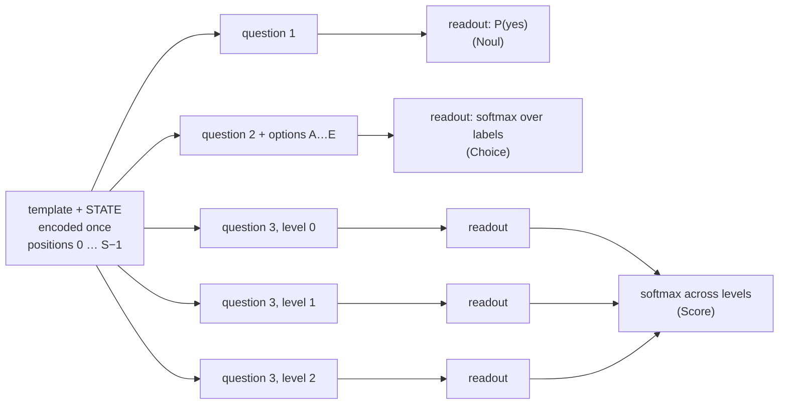
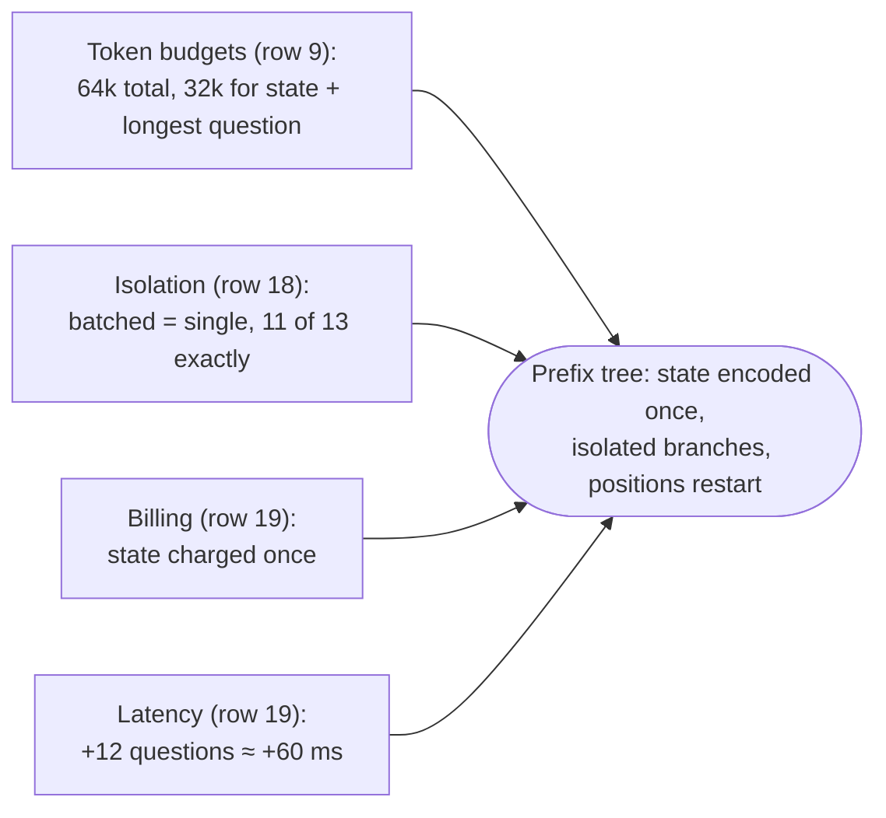
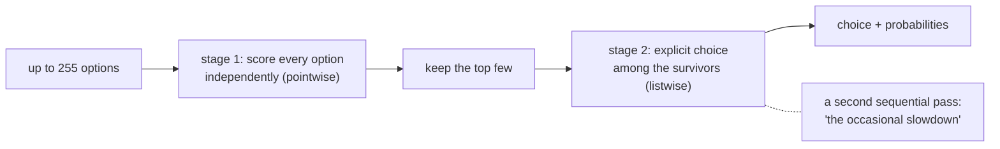
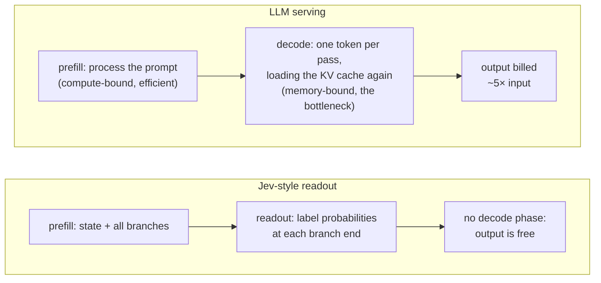
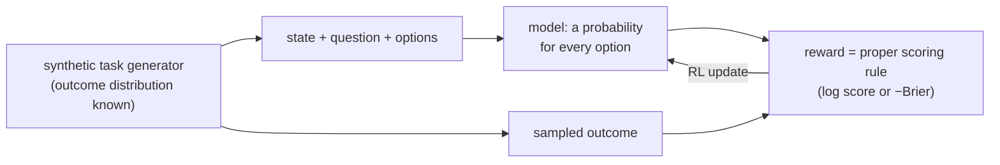

# minijev — Research notes: how Jev works, and how it could

*Status: research snapshot, 2026-09-23. We read the sources on that date. Jev version `jev-1.13.0`.*

This file is the companion to [DESIGN.md](DESIGN.md). DESIGN.md says what we will build. This file says what is
known about Jev, how sure we are, and how this changes the design. §6 lists the DESIGN.md edits, which we applied
on 2026-09-23. §7 is the runnable POC and its measured results. The writing rules and the glossary are in
[CLAUDE.md](../CLAUDE.md).

**Evidence labels in this file**
- **Stated**: TypeSafe says it (docs, launch blog, FAQ, press quotes).
- **Observed**: visible in real Jev outputs or third-party measurements (doc examples, cookbook tables, Browser Use's logs).
- **Inferred**: our reasoning from the above. It can be wrong.
- **Measured**: a result from our own POC runs (§7).

---

## 0. Summary

1. **The interface is easy to copy. Within one week of launch, people copied it.** Open clones do a readout of option
   probabilities directly from open LLMs. With Qwen3.5-4B, SemIf reports 0.845 agreement with Jev's published
   answers, against Jev's 0.883, on 102 aligned rows. The sample is small, but the conclusion is clear: the
   competitive advantage is not the interface. TypeSafe says the advantage is data and training.
2. **TypeSafe says Jev is "neither small nor an LLM"** and uses "a new model architecture, parallel sampler".
   TechCrunch calls it "transformer-based". Thus minijev reproduces Jev's **interface and inference shape**, not its
   internals. Nobody outside TypeSafe knows the internals.
3. **The evidence constrains the inference shape well.** Jev encodes the state once. Each question is a branch that
   sees only the state and itself. Four independent pieces of evidence agree: the 64k/32k token budgets, identical
   answers in a batch or alone, latency, and billing (§3.1).
4. **Score is pointwise.** The docs say that Jev judges each level on its own, without the other levels. DESIGN.md
   scored levels listwise before (A/B/C in one prompt). We corrected this on 2026-09-23.
5. **Choice uses two stages for high cardinality.** Jev scores options independently, then makes an explicit choice
   among the remaining options (Stated, launch blog). Small Choices appear to be one explicit listwise pick (Inferred).
6. **Several API details in DESIGN.md §4 were wrong**: Score `criteria`, the units of `score`, `legend`, Noul
   `criteria`, and `usage`. We corrected all of them on 2026-09-23 (§6).
7. **TypeSafe's own open-source adapter fully defines confidence:**
   - Choice: `(p_max − 1/k)/(1 − 1/k)`.
   - Score: an ordinal statistic, `1 − E|level − mode| / E|level − centre|`. The second expectation is under a
     uniform distribution.

   Together, the two formulas reproduce all 16 documented examples, within rounding (§3.3).
8. **TypeSafe has published no calibration evidence for Jev.** The RLCD method is unpublished. The nearest published
   method is RL with a Brier-score reward (RLCR, Damani et al. 2025).
9. **The founder's own writing agrees.** One week before launch, Almeida argued that decode, not prefill, is the
   expensive part of inference. Then he announced "a new kind of foundation model" for "breaking free from the
   tyranny of the KV cache". This agrees with a prefill-only design with no decode, which is why output can be free
   (§3.4). We found no 2025 article by him. His blog starts in July 2026.
10. **The POC reproduces the mechanism on a laptop (§7).**
    - A 0.5B open model answers requests in Jev's format from label probabilities.
    - The naive, KV-cached, and single-packed-pass evaluations agree to 2.5e-5 in logits. Batched and single agree
      to 3.4e-6. This replicates TypeSafe's isolation result.
    - A shared state gives 9× the speed on a 1,000-token state with 23 branches.
    - Small models show the problems that Jev must prevent:
      - Listwise letter labels have a position bias. The winner changes in 54% of option rotations at 0.5B and 9% at 1.5B. Pointwise gives 0%.
      - Contextual calibration with "N/A" over-corrects yes/no questions.
      - Temperature scaling on labeled data works: BoolQ ECE goes 0.161 → 0.053 at 0.5B and 0.099 → 0.060 at 1.5B.

---

## 1. Sources

**TypeSafe (primary).** We read all of these sources in full on 2026-09-23.
- Docs index: <https://docs.typesafe.ai/llms.txt>. Each page is also available as raw markdown at `<url>.md`.
  The pages that we used most:
  - [Models](https://docs.typesafe.ai/models) and [API reference](https://docs.typesafe.ai/api)
  - [Primitives](https://docs.typesafe.ai/primitives): [Choice](https://docs.typesafe.ai/primitives/choice), [Score](https://docs.typesafe.ai/primitives/score), [Noul](https://docs.typesafe.ai/primitives/noul)
  - [Confidence](https://docs.typesafe.ai/confidence), [AI primer](https://docs.typesafe.ai/introduction/machine-learning-primer), [Jev 1.13 jaggedness](https://docs.typesafe.ai/model-jaggedness/jev-1.13)
  - Cookbooks: [Parallel questions](https://docs.typesafe.ai/cookbooks/parallel_questions), [Self-consistency: nouls](https://docs.typesafe.ai/cookbooks/consistency_noul_cookbook)
- Launch post, with the FAQ (collapsed on the page): <https://typesafe.ai/blog/introducing-system-one-models-and-jev>
- Public workflow evals: <https://evals.typesafe.ai/>

**Real usage.** [browser-use/jev-ultrafast](https://github.com/browser-use/jev-ultrafast): `jev_ultrafast/model.py`, `docs/performance.md`, `docs/*measurement.json`.

**Press.** [TechCrunch, 2026-09-18](https://techcrunch.com/2026/09/18/a-new-kind-of-ai-model-from-a-chatgpt-inventor-is-thrilling-developers/),
read verbatim. [Wikipedia](https://en.wikipedia.org/wiki/Jev_(AI_model)) cites TechCrunch for "transformer-based".
We saw the [Latent Space interview](https://www.latent.space/p/jev) only through a summarizer. Thus no statement in
this file relies on it.

**The founder's writing.** Diogo Almeida's blog, [Complete Skeptic](https://www.completeskeptic.com), has 5 posts.
All are from 2026. The first is from 2026-07-04. Its archive API lists no older posts, and we found no 2025 article by
him elsewhere. These posts are relevant:
- [(KV) Cache Rules Everything Around Me](https://www.completeskeptic.com/p/kv-cache-rules-everything-around) (2026-09-09).
- [Is it even possible for the Chinese Labs to distill US models?](https://www.completeskeptic.com/p/is-it-even-possible-for-the-chinese)
  (2026-07-24). It compares logit distillation with behaviour cloning.
- The TypeSafe blog also has "The Bitterest Lesson" and "Lies, Damned Lies, and Benchmarks".

**TypeSafe's GitHub org** ([typesafe-ai](https://github.com/typesafe-ai)):
- [system-one-adapter-python](https://github.com/typesafe-ai/system-one-adapter-python) (MIT, created 2026-08-08)
  answers requests in Jev's format with Claude, GPT, or Gemini. It contains TypeSafe's confidence functions.
- A fork of [LLaDA](https://github.com/typesafe-ai/LLaDA), the masked-diffusion LM, made on 2025-07-13, with no
  commits of its own.
- A vLLM fork from May 2025. Its own commits are only a dev-container setup.

**Open clones.** None of them is affiliated with TypeSafe.
- [TheoLeeCJ/SemIf-OpenJev](https://github.com/TheoLeeCJ/SemIf-OpenJev): direct option logits, shared-state branches, calibration study.
- [ekzhang/openjev-sglang](https://github.com/ekzhang/openjev-sglang): Qwen3.6-35B-A3B on SGLang, prefill-only.
- [razorback16/openjev](https://github.com/razorback16/openjev): DiffusionGemma 26B-A4B, answer slots in one masked canvas.

---

## 2. Evidence table

This table replaces the table in DESIGN.md §2.

| # | Claim | Source | Status |
|---|---|---|---|
| 1 | Jev is "a new transformer-based model … that is not a large language model (LLM)" | TechCrunch | Stated to press |
| 2 | "Jev is neither small nor an LLM" | Launch blog FAQ | Stated |
| 3 | Built with "a new model architecture, parallel sampler … and … RLCD" | Launch blog | Stated |
| 4 | "Outside observers suspect [it] is built on top of an open-weight LLM" | TechCrunch | Speculation, reported |
| 5 | Trained only on synthetic data. "We make all the data ourselves." | Blog FAQ, TechCrunch | Stated |
| 6 | RLCD: probabilities "optimized against outcomes" | AI primer, system-one | Stated goal; **method unpublished** |
| 7 | One set of weights for all accounts; no fine-tuning or LoRA on customer data | Models | Stated |
| 8 | Questions are evaluated "in parallel and in isolation against the same state in one go" | Introduction | Stated |
| 9 | Context: 64k tokens per request, and 32k for "`state` plus the longest question" | Models | Stated |
| 10 | Choice: at most 255 options. Score: 2–10 levels. | API | Stated |
| 11 | High-cardinality Choice uses "a 2 stage-system of scoring independently then making an explicit choice" | Launch blog | Stated |
| 12 | Score: "Every level is evaluated separately. The model doesn't see a level's number or its neighbours." | Primitives/score | Stated |
| 13 | Question ids never reach the model. Choice option names *and* descriptions do. | Primitives, Choice | Stated |
| 14 | `score = Σ i·p_i` in level-index units (0 … n−1) | Primitives/score | Stated |
| 15 | Choice confidence = `(p_max − 1/k)/(1 − 1/k)`, the same as `(k·p_max − 1)/(k − 1)` | TypeSafe's adapter (`_utils/confidence_metrics.py`); fits 6/6 Choice examples, k = 2–5 | Observed in TypeSafe code |
| 16 | Score confidence = `max(0, 1 − Σ pᵢ·\|i − mode\| / MAD_uniform)`, an ordinal statistic | Same file; fits all 10 Score examples, including the 4- and 5-level ones | Observed in TypeSafe code |
| 17 | Returned values are rounded to 2 decimals | All examples | Observed |
| 18 | 13 questions, batched vs one call each: identical answers. 11/13 were exactly identical across 5 runs. The other 2 vary by the same small amount in both modes. | Parallel-questions cookbook (jev-1.12) | Observed |
| 19 | Same cookbook, ~54k-character article (≈11.8k tokens): batched 0.27 s; single question 0.21 s. State billed once: ≈11.8k tokens batched vs 13 × ≈11.2k. | Same | Observed |
| 20 | Run-to-run noise: byte-identical requests mostly give identical answers. Borderline values move with std ≈ 0.005. | Same | Observed |
| 21 | Latency. Docs: "most queries complete in about 100 ms". Cookbooks: 111–114 ms mean round trip. Browser Use: median 178 ms at ≈5.3k input tokens/request, and 102–335 ms (median ≈130 ms) on a small fixture. | Docs, cookbooks, jev-ultrafast | Observed (vendor and launch partner, not independent) |
| 22 | `input_tokens` exceeds the visible text by ≈270–300 tokens per request, plus approximately 20 per extra question. Example: 296 tokens for a ≈12-token state and a 6-token question. | API and primitives examples; token counts are our estimates | Observed; hidden template is Inferred |
| 23 | `output_tokens`: 20 for one Noul, 39 for two, 58 for three. 32 for a 2-option Choice, 34 for 3 options. 18 for a 3-level Score. Longer descriptions do not change it. Not additive across questions: 3 Scores give 43, 5 Choices give 212. | API and primitives examples | Observed; **meaning unknown** |
| 24 | Probability maps come back in a different key order from the request | Choice examples | Observed; cause unknown (unordered map, or internal option shuffling) |
| 25 | Known weaknesses: literal reading, counting, arithmetic, dates, indirection, prompt injection via state, context rot from irrelevant state | Jaggedness page | Stated |
| 26 | Noul vs a yes/no Choice on the same question: 0.22 vs 0.01. `refund` + `not_refund` nouls sum to 1.19. | Jaggedness page | Stated |
| 27 | No text generation. All answers come out of one parallel pass ("outputs all probabilities in parallel instead of autoregressively generating by token"). | Launch blog | Stated |
| 28 | Probabilities are a restricted next-token distribution over label tokens | — | Inferred; a dedicated head is equally possible |
| 29 | State is encoded once and shared by all question branches | Rows 9, 18, 19 | Inferred, strongly supported |
| 30 | Branch positions restart after the state, which is why the 32k limit is state + *longest* question | Row 9 | Inferred |
| 31 | Calibration evidence (charts, datasets, ECE) | — | **None published** |
| 32 | Workflow evals score against the average of GPT-6 Astra and Fable 5.1, not ground truth | evals.typesafe.ai, launch blog | Stated. This measures agreement with frontier models, not calibration. |
| 33 | Decode, not prefill, is the inference bottleneck. A week before launch: "if breaking free from the tyranny of the KV cache sounds interesting to you (if only there was a new kind of foundation model that could help 🤫)" | Almeida, Complete Skeptic, 2026-09-09 | Stated (founder's blog) |
| 34 | TypeSafe forked LLaDA, a masked-diffusion LM, on 2025-07-13, with no changes | GitHub | Observed; weak signal of interest in parallel, non-autoregressive decoding |
| 35 | TypeSafe's LLM baseline elicits *verbalized* per-label probabilities through structured output, with all questions in one call (not isolated) | system-one-adapter-python | Observed in TypeSafe code |

---

## 3. What the evidence says about the mechanism

### 3.1 One request is a prefix tree



The position ids of each branch restart at S. No branch attends to another branch.

Four independent pieces of evidence point to this shape:



1. **The two token budgets (row 9).** If Jev added every question to one long sequence, it would need only one
   limit on the total. A *separate* limit on "state plus the longest question" makes sense only in one case: each
   question is in its own branch after the state, and the position numbers restart in every branch. Then 64k limits
   the total work and memory for the state plus all branches. 32k limits the deepest path, that is, the largest
   position index.
2. **Isolation (row 18).** Answers do not change when other questions are added. Thus branches cannot attend to
   each other.
3. **Billing (row 19).** Jev charges for the state once per request, not once per question.
4. **Latency (row 19).** 12 added questions on an ≈11.8k-token state added ≈60 ms. This agrees with an expensive
   shared prefill followed by cheap branches.

Two methods calculate the same maths. The POC (§7) implements both and checks that they agree:

- **KV branching.** Prefill the state once, keep its keys and values, and run each branch against that cache.
  openjev-sglang does this with the SGLang radix cache, with N+1 one-token calls.
- **One packed pass.** Put the full tree in a single sequence. Use an attention mask so that each branch sees only
  the state and itself. Restart the position ids after the state. This is literally "one forward pass, in parallel
  and in isolation". Hydragen (Juravsky et al. 2024) is the published efficient-kernel version of this
  shared-prefix pattern.

### 3.2 The readout for each primitive (Inferred unless marked)

- **Noul** is one readout, P(yes). There is no `confidence`, because one number fully describes two outcomes.
  Optional `criteria.true` / `criteria.false` describe the meaning of yes and no. The jaggedness page says that a
  Noul whose `true` maps to "no" performs worse. From this, we infer that the readout is semantically yes/no, not an
  arbitrary label (Inferred).
- **Choice, small k** is one explicit pick with all options visible (Inferred from the contrast in the blog).
  The model sees the option names and descriptions. A `null` description means that the name alone gives the meaning.
- **Choice, large k** has two stages (Stated). Stage 1 scores options independently, as Score levels. Stage 2 makes
  an explicit pick among the top options. The blog mentions "the occasional slowdown", which agrees with a second
  *sequential* pass. TypeSafe has not published the k at which stage 2 starts. 255 = 2⁸ − 1. This is a weak sign of
  a byte-sized option index or a reserved block of label tokens (Inferred, weak).
- **Score** judges each level pointwise (Stated). Then it normalizes across levels, because the probabilities sum
  to 1. The docs show the results:
  - Levels given as bare numbers (`["0","1","2"]`) have no meaning in isolation, and Jev splits 0.45 / 0.55 / 0.
  - Each description must have a meaning on its own.
  - "Worse than the previous level" has no meaning for the model.

The launch blog describes the large-k Choice path as follows:



**A cheap test on real Jev: listwise or pointwise?** Pointwise-then-softmax obeys *independence of irrelevant
alternatives* (IIA). An added option does not change the probability ratios of the other options. A different
option order changes nothing. Listwise picks break both properties. See §8.

### 3.3 Confidence

`probabilities` is the answer. `confidence` is a summary of its shape. TypeSafe's MIT-licensed
[system-one-adapter-python](https://github.com/typesafe-ai/system-one-adapter-python), in `_utils/confidence_metrics.py`,
defines two statistics:

```python
choice_confidence = (max(p) - 1/k) / (1 - 1/k)            # peak, rescaled from uniform to certain
score_confidence  = max(0, 1 - sum(p_i * |i - mode|)      # ordinal: spread around the modal level ...
                              / mean(|i - (k-1)/2|))       # ... relative to a uniform distribution's spread
```

| Example (docs) | k | Reported | Adapter formula | Choice formula applied to Score | `1 − H/ln k` (clones) |
|---|---:|---:|---:|---:|---:|
| Choice `department` (API page) | 3 | 0.81 | 0.82 | — | 0.67 |
| Choice `department` (ambiguous ticket) | 3 | 0.42 | 0.415 | — | 0.27 |
| Choice `shipping_issue` | 5 | 0.67 | 0.675 | — | 0.64 |
| Choice `requested_resolution` | 4 | 0.20 | 0.20 | — | 0.17 |
| Choice yes/no (jaggedness) | 2 | 0.97 | 0.98 | — | 0.92 |
| Score `bug_severity` | 3 | 0.35 | 0.355 | 0.355 | 0.38 |
| Score numbers-only levels | 3 | 0.33 | 0.325 | 0.325 | 0.37 |
| Score `formality` | **5** | **0.89** | **0.883** | 0.825 | 0.75 |
| Score `relevance` | **4** | **0.52** | **0.52** | 0.36 | 0.50 |

With the adapter's formulas, all 16 documented examples fit within 0.01. The table shows nine of them. The
differences come from the 2-decimal rounding of `probabilities` in the docs.

For 3 levels with probability on *adjacent* levels, the Score formula equals the Choice formula. Every 3-level doc
example is of this type. This is why the Choice formula appeared to fit Scores until we examined the 4- and 5-level
examples.

The Score statistic is ordinal. A 0.6/0.4 split between levels 0 and 2 of three gives 0. The same split between
levels 0 and 1 gives 0.4.

openjev-sglang and razorback16 use `1 − H/ln k`. This formula does **not** match Jev.

### 3.4 "Neither small nor an LLM": what the model can be

TypeSafe states these facts: transformer-based; a new architecture; a "parallel sampler"; not small; not an LLM;
one set of weights for everyone.

**"Not an LLM" can have a narrow meaning** (Inferred): the model does not model or generate text, and its training
objective is decisions. This is fully compatible with a transformer that starts from a pretrained LM and is then
post-trained to give decisions. The jaggedness list is what we expect from a pretrained-LM backbone: literal reading,
context rot, prompt injection through the state, and weak counting and dates.

**Size, a Fermi estimate** (Inferred, large error bars). Assume these values: GPUs cost $2–3 per hour, prefill runs at
about 50% utilization (≈500 TFLOP/s bf16 on an H100), and each token costs about 2 × N_active FLOPs.

- **To break even at $0.042/Mtok, a GPU must process ≈13–20k tokens/s.**
- **This allows up to ≈12–20B active parameters in bf16,** or about 2× that in FP8.

Thus the price is evidence against a 70B-class dense model, unless TypeSafe subsidizes it. TypeSafe says it "can't
prove it isn't subsidized". An MoE, which is large in total but small in active parameters, agrees with "not small"
and with this price and latency. These numbers cannot decide the question.

**Why output is free: the founder's own argument.** Almeida's "(KV) Cache Rules Everything Around Me"
(2026-09-09, six days before launch) gives the economics that Jev is built on:

- *Prefill* (processing the input) "is very efficient on a GPU". Its compute cost is proportional to the number of
  tokens.
- *Decode* (generating output) is "the real bottleneck of inference". Each output token loads the full KV cache from
  memory again. This is "why output tokens cost 5x more than input tokens".
- At the end, the post announces "breaking free from the tyranny of the KV cache … a new kind of foundation model".

A model that answers in the same pass that processes the input has **no decode phase**. It does not load the cache
again for each token, and it keeps no KV cache between steps. That is exactly the packed prefix tree of §3.1. It is
also why output tokens can be "too cheap to meter" (Inferred, but now from the founder's own argument).



The POC measured the same difference on a laptop CPU: 3.1 ms per prefilled token vs 140 ms per generated token
(§7.3 R7).

**"Parallel sampler"** has at least two possible meanings:
- (a) The prefix-tree evaluation of §3.1: every readout in one pass.
- (b) A non-autoregressive, diffusion-style model that fills answer slots in parallel. Two data points are relevant:
  - TypeSafe forked LLaDA, a masked-diffusion LM, in July 2025 (row 34). That is a weak but real sign of interest.
  - razorback16/openjev does this with DiffusionGemma. Its questions share one canvas and can see each other. This
    conflicts with Jev's isolation evidence, unless the canvas is masked per question. A masked-diffusion transformer
    is also bidirectional. Thus every answer slot sees the full state, and a mask per question is possible, exactly
    as in §3.1.

The two meanings can both be true. No part of minijev depends on which meaning is correct.

### 3.5 RLCD: our best inference

TypeSafe states these facts: probabilities are "optimized against outcomes rather than human preference"; all data is
synthetic; TypeSafe calls itself "a data research lab". The Almeida quote in TechCrunch: "Half of [our company] is a
lab that basically owns this entire subfield of statistically well-understood synthetic data."

Related published techniques:
- **Proper scoring rules** (Gneiting & Raftery 2007). Only the true probability minimizes log loss and Brier score.
  Training on them against known outcomes is a calibration objective. This is DESIGN.md §7.
- **RLCR** (Damani et al. 2025, *Beyond Binary Rewards*). RL where the reward is correctness plus the Brier score
  of the confidence that the model states. It reports up to 90% less calibration error with no accuracy loss. This
  is the nearest published "RL for calibration".

Why TypeSafe calls it "RL" (Inferred, in addition to DESIGN.md §7):
- "statistically well-understood synthetic data" suggests that TypeSafe knows the *generating distribution*. Then it
  can sample outcomes from it, and it knows the true probabilities exactly. That is an ideal setup to reward
  calibrated probabilities.
- The workflow evals use *averaged* frontier-model answers as reference probabilities. This is a sign that the
  training targets are soft distributions, not hard labels (Inferred, weak).

The diagram shows one possible shape of the loop. **Inferred: RLCD is unpublished.**



Only an honest probability maximizes the expected reward. Thus optimization "against outcomes" is, by design,
optimization for calibration.

### 3.6 Determinism and noise

Observed: most answers are identical across runs. Borderline values move by about 0.005.

The probable cause (Inferred) is floating-point differences from server-side batching. This is the batch-invariance
problem (He / Thinking Machines 2025). The cause is not sampling, because a readout does not sample. Rounding to
2 decimals hides most of the noise.

The clones show the same effect. SemIf saw 5–6 of 777 argmaxes change between fresh scoring and bf16 prefix reuse.
minijev runs fp32 on CPU, so each mode is deterministic. The modes agree to about 1e-5 (Measured: 2.5e-5 or less, §7.3 R2).

### 3.7 Token accounting (unresolved)

Rows 22–23 contain the data. `input_tokens` includes a hidden template. `output_tokens` increases with the number of
options, does not change with description length, and does not add up across questions. It is not the length of the
returned JSON: three Scores in one request cost *less* than three single Scores. We cannot explain it yet. §8 has a
controlled experiment. The clones do different things: openjev-sglang reports N+1, and razorback16 reports 0.

### 3.8 What the clones teach

| Project | Backbone | Readout | Parallelism | Measured |
|---|---|---|---|---|
| SemIf | Qwen3.5-4B, also 0.6B / 2B / 27B | Direct option logits | Shared-state branches | See below |
| openjev-sglang | Qwen3.6-35B-A3B (MoE), B200 | Letter labels A–Z, then AA…, all verified as single tokens, up to 64 | SGLang radix cache, N+1 calls with `max_new_tokens=1` | Confidence is `1 − H/ln k` (≠ Jev) |
| razorback16/openjev | DiffusionGemma 26B-A4B | One masked slot per question on a shared canvas | One denoising pass, about 12 questions per chunk | Repeats the pass four times if any slot has entropy > 0.1 |

SemIf's measurements:
- The readout of 21 yes/no criteria takes 1.02 s as direct logits. Generation of the same criteria as a compact JSON
  array takes 5.33 s (5.2×).
- A 37 × 21 workload runs at 2.33 decisions/s fresh, 10.75 with serial prefix reuse, and 20.03 with parallel suffixes.
- Temperature scaling decreases ECE from 0.068 to 0.038 on authored decisions and from 0.208 to 0.069 on WANLI (T = 2.5).
- Agreement with Jev's published answers is 0.845 vs Jev's 0.883, on 102 aligned rows.

Lessons for minijev:
1. The interface is cheap to reproduce.
2. Most of the speed comes from a state that all branches share.
3. Calibration is per workload, with temperatures from 1.2 to 2.5.
4. Prefix reuse at reduced precision changes a few argmaxes.
5. The correct confidence formula is part of API compatibility.

---

## 4. How minijev maps onto Jev

| Jev behaviour | minijev mechanism | Fidelity |
|---|---|---|
| Typed answers, cannot go off-schema | Restricted softmax over declared label tokens | Same contract |
| State processed once; questions isolated | Prefix tree: KV branching or one packed pass with a block mask | Same shape (verified in §7) |
| "Adding questions barely changes the response time" | Cost ≈ c·len(state) + Σ c·len(branch) | Same shape; our constant is ~100× worse on CPU |
| Score levels judged separately | One branch per level, yes/no log-odds, softmax across levels | Same contract; unknown whether Jev's per-level readout is similar to ours |
| Small Choice as one explicit pick | Listwise letter labels in one branch | Inferred match, but order-sensitive on small models (§7.3 R4) |
| Large Choice in two stages | Stage 1 exists (`choice_mode="pointwise"`: one yes/no branch per option); stage 2 not connected | Half |
| Calibrated probabilities (RLCD) | Post-hoc temperature or Platt scaling on labeled data (§7.3 R6); later LoRA with log loss. Contextual calibration is opt-in only: with an "N/A" state it made Nouls worse at both sizes (R5, R6). | Different method, same target |
| "Neither small nor an LLM" | A 0.5B instruct LLM | **Not reproduced**, by design |

---

## 5. Why a small open model can be a fair replacement

We do not predict that minijev matches Jev's accuracy. A 0.5B model will not match it, and DESIGN.md §13 says so.

We predict that the **mechanics** transfer: typed outputs, isolation, prefix economics, and calibratability. We can
measure each of these on a laptop. SemIf's 4B result suggests that accuracy is mostly a function of model size and
training (Inferred). That is exactly the part that Jev keeps secret.

---

## 6. Changes to DESIGN.md (applied 2026-09-23)

**§2 Known vs inferred.** Replace it with the table in §2 above. Specific corrections:
- The source for "Jev is a transformer" is TechCrunch, not Wikipedia.
- Add "neither small nor an LLM", the 64k/32k budgets, the isolation evidence, pointwise Score, and the two-stage Choice.
- The output-tokens row gets the data in row 23.

**§3 Core idea.** The picture is correct for Noul and small Choice. Add a note: Score, and stage 1 of a large Choice,
is pointwise. It uses one branch per level, each with a yes/no readout, then a softmax across levels.

**§4 API contract.** Correct it to match [the API reference](https://docs.typesafe.ai/api):
- Score request: `criteria` is an **ordered array** of 2–10 level descriptions. There is no `levels` field.
  Each entry can be a string, object, array, or null.
- Score response: `score = Σ i·p_i` in **index units 0 … n−1**, not normalized to [0, 1]. Callers divide by n−1
  themselves. The response adds `legend` (index → description). The keys of `probabilities` are index strings.
- Noul: optional `criteria: {"true": …, "false": …}`.
- Choice: `criteria` values can be `null`. This means that the key alone is the description. At most 255 options.
- `usage` is `{input_tokens, output_tokens}` only. Mark `latency_ms` as a minijev extension.
- Round returned values to 2 decimals, as Jev does. Keep full precision in debug output.
- Never put question ids in the prompt. Put Choice option names and descriptions in the prompt.

**§5.1 Judges.** Change "verbalized confidence tends to be worse calibrated". The literature does not agree:
- Kadavath et al. 2022: token probabilities are well calibrated for *pretrained* models.
- Xiong et al. 2024: verbalized confidence is overconfident.
- Tian et al. 2023: for *RLHF* models (ChatGPT, GPT-4, Claude), verbalized confidence is **better** calibrated than
  token probabilities. It decreases ECE by about 50% relative. RLHF makes token-probability calibration worse.

Thus E2 is an open experiment, which makes it more useful.

**Do not build ClaudeJudge from the start.** TypeSafe's [system-one-adapter-python](https://github.com/typesafe-ai/system-one-adapter-python)
(MIT) already answers requests in Jev's format with Anthropic, OpenAI, or Gemini models. It uses verbalized per-label
distributions through structured output. It is the LLM baseline that TypeSafe itself uses.
- Use it without changes, or copy its prompts and schema.
- Note one difference from Jev: it asks all questions in one call, so they are *not* isolated.

**§5.2 Labels and templates.**
- **Score: pointwise by default.** One branch per level: "Does this answer fit? Yes/No". Take the log-odds per level,
  then a softmax across levels. Keep listwise as an ablation (E8 below).
- **Noul:** use a readout of `Yes`/`No` tokens, not `A`/`B`. This matches Jev's semantic yes/no behaviour and prevents letter
  selection bias (Zheng et al. 2024). Render the optional `criteria.true` / `criteria.false`.
- **More than 52 options:** use two stages (Jev's method) or verified single-token pairs such as `AA`, `AB`
  (openjev-sglang). Keep the startup check that every label is a single token.

**§5.4 Shared prefix.** Add the **packed single-pass** mode:
- One sequence that contains the prefix and every branch.
- An additive 4D mask, so that each branch sees only the prefix and its own causal past.
- `position_ids` that restart at `len(prefix)` in every branch.
- Read the logits at the last token of each branch.

This is the most literal version of "one forward pass", and it explains the 64k/32k budgets. The done-check: the
naive, KV, and packed modes give the same probabilities.

**§5.5 Maths.**
- Score is `Σ i·p_i` (see §4).
- Confidence: use TypeSafe's two functions (§3.3). Choice does not change. Score becomes the ordinal statistic, which
  gives lower confidence to a Score split across distant levels than to one split across adjacent levels. The POC
  already uses both.

**§6 Calibration.**
- One temperature per primitive is not necessarily sufficient. SemIf found temperatures from 1.23 to 2.50 for
  different workloads.
- Fit per primitive *and* per dataset. Report how well T transfers between datasets. This changes the §6 "lesson"
  into a measurement.
- Add PriDe (Zheng et al. 2024) as an alternative to contextual calibration for label bias in listwise Choice.

**§7 Training.** Cite RLCR (Damani et al. 2025) as the published RL method with a Brier reward, for the stretch goal.

**§9 Evaluation.** Add three experiments:
- **E7 Replicate Jev's documented behaviours.** Batched vs single, numbers-only Score levels, and Noul vs yes/no
  Choice. The inputs and Jev's answers are public.
- **E8 Pointwise vs listwise Score and Choice.** Accuracy, ECE, and permutation sensitivity.
- **E9 Agreement with Jev's published outputs.** Doc examples and <https://evals.typesafe.ai/>; SemIf did this for 102 rows.

**§13 Risks and open questions.**
- The ">52 options" question has an answer: Jev uses two stages.
- Add letter-label selection bias (Zheng et al. 2024) as a named risk.
- Add bf16 prefix-reuse argmax changes (SemIf) as a numerical risk, if a GPU path is added later.

**§14 Reading list.** Add the verified papers in §9 below.

**Lessons from the POC (§7.3).**
- **§5.2 Choice.** Offer `choice_mode: "pointwise"`, one yes/no branch per option.
  - It gives exactly the same answer for every option order. Listwise letters changed the winner in 54% of option
    rotations (R4).
  - On 8 documented Choices, agreement with Jev's picks does not favour either method. Pointwise vs listwise was 6/8
    vs 4/8 at 0.5B and 5/8 vs 6/8 at 1.5B (R5).
  - If listwise stays the default, average over a few option orders (k× the branches) or apply PriDe.
- **§5.4 Execution modes.** On a CPU, KV branching ≈ packed (R3). Packed still calculates the masked attention
  blocks, so its cost increases as (total length)². Keep KV as the CPU default. Keep packed as the one-pass
  demonstration and the equivalence test.
- **§6 Contextual calibration.** "N/A" over-corrects yes/no questions (R5). Make it opt-in per primitive, and justify
  it on labeled data. See R6 for the BoolQ numbers.
- **§8 Stack.** The Phase 0 check passed with exactly these pins: Python 3.12, torch 2.2.2, numpy 1.26.4, transformers 4.49.0.
- **§13 Risks.** Add that pointwise readouts on small models show a "say yes to the plausible level" bias (R5).
  To correct it, levels need contrastive descriptions, a larger model, or training.

---

## 7. POC (`poc/`)

*We filled in this section from real runs. See §7.3.*

### 7.1 What it demonstrates
1. Requests and responses in Jev's format from a local 0.5B model (R1). The model generates no text. The answers come
   from label-token probabilities, and confidence uses TypeSafe's own formulas.
2. The prefix tree in three modes (naive, KV branching, and one packed pass). All three give the same numbers (R2).
   The POC replicates isolation: batched equals single.
3. Latency against the number of questions and the length of the state (R3).
4. Sensitivity to option order: listwise vs pointwise Choice (R4).
5. Agreement with Jev's published answers on its documented inputs, at 0.5B and 1.5B (R5).
6. Calibration on BoolQ: raw vs contextual vs temperature vs Platt, at 0.5B and 1.5B (R6).

### 7.2 How to run

```bash
cd poc
uv sync                                   # Python 3.12, torch 2.2.2, numpy<2, transformers 4.49.0
uv run python experiments.py demo         # also: tree, latency, jevdocs, permutation, calibration, all
uv run python experiments.py jevdocs --model Qwen/Qwen2.5-1.5B-Instruct
```

The code has two files:
- `minijev_poc.py` (~300 lines): prompt pieces, the three tree evaluators, primitives, and `ask()`.
- `experiments.py`: one function per experiment.

The raw outputs go to `poc/results/*.json`. The POC caches BoolQ and the pinned GDPR article in `poc/data/`, which
git ignores.

**The Phase 0 check from DESIGN.md §8 passed.** On this Intel Mac, Python 3.12 + torch 2.2.2 + numpy 1.26.4 +
transformers 4.49.0 load Qwen2.5-0.5B/1.5B-Instruct in fp32. That transformers version passes a custom 4D
attention mask through unchanged, and `logits_to_keep` accepts an index tensor. The packed mode needs both.

### 7.3 Results

Run conditions: Intel i7-8850H with 6 threads, fp32, eager attention, 2026-09-23. The model is Qwen2.5-0.5B-Instruct
unless noted.

**R1. The Jev contract, from a readout of label probabilities.** The DESIGN.md §4 request (with `criteria` for the
Score) returns:
- `urgency` noul 0.98.
- `team` = technical (0.97, confidence 0.96).
- `tone` score 1.92, with "frustrated" at 0.65 and confidence 0.55 (ordinal Score confidence, §3.3).

On every branch of this request, 0.998 or more of the full-vocabulary next-token probability goes to the declared
label tokens. Thus the restricted softmax does not hide a broken prompt. This is the diagnostic of DESIGN.md §5.3.
`ask()` gives a warning when a branch goes below 0.5.

**R2. One tree, three evaluators, the same numbers.** This is the core check.

| Request | kv vs naive, max \|Δ logit\| | packed vs naive, max \|Δ logit\| |
|---|---:|---:|
| DESIGN.md §4 example (3 questions, 6 branches) | 2.1e-5 | 1.2e-5 |
| TypeSafe's 13 GDPR questions on a 1,000-token state (23 branches) | 2.5e-5 | 1.6e-5 |

The differences are fp32 noise from the order of reductions. We asked each of the 13 questions alone and all
together. The cookbook's tracked numbers changed by **3.4e-6** or less. This replicates TypeSafe's result that batched
equals single. Thus "one forward pass, in parallel and in isolation" is exactly achievable. A block attention mask
and position ids that restart after the state give the same answers as KV branching or full re-encoding.

**R3. Latency (E3).** Minimum of 2 runs, in seconds, over the first N of TypeSafe's 13 GDPR questions.
The 3 Scores become 13 level branches. Thus 13 questions make 23 branches, with a total of ≈1,070 tokens.

| State | Questions (branches) | naive | kv | packed |
|---|---|---:|---:|---:|
| 250 tokens | 1 (1) | 1.13 | 1.24 | 1.12 |
| 250 tokens | 4 (4) | 4.56 | 1.76 | 1.21 |
| 250 tokens | 13 (23) | 27.73 | 7.16 | 5.71 |
| 1,000 tokens | 1 (1) | 4.06 | 4.11 | 4.00 |
| 1,000 tokens | 4 (4) | 16.09 | 4.82 | 4.54 |
| 1,000 tokens | 13 (23) | 93.25 | 10.20 | 10.07 |

The table shows these points:
- **The naive time increases with branches × state.** In the largest cell, one encoding of the state gives 9.3× the
  speed. Jev bills for this saving, because it charges for the state once (§2 row 19).
- **kv and packed are approximately equal on a CPU.** Packed is faster on small states, because it makes one call,
  not 24. It also calculates the masked attention blocks, so its cost increases as (total length)². On a GPU, the
  packed layout lets every branch run in one kernel launch.
- **Added questions are cheap only when the state is the largest part.** Here the questions (≈1,070 tokens) are as
  long as the state. Thus 13 questions cost 2.5× as much as 1 question. In TypeSafe's cookbook, the state was
  ≈11.8k tokens and the questions ≈0.7k, and Jev's time increased from 0.21 → 0.27 s.
- **Our constant is ~200× Jev's.** We process ≈250–300 tokens/s on a CPU. Jev processed ≈11.8k tokens in less than
  0.27 s, network time included. The shape is the same; the hardware is different.

**R4. Option order (E4).** We tested every rotation of the options, for the 8 documented Choice examples:

| Readout | Mean max \|Δp\| across rotations | Rotations that change the winner |
|---|---:|---:|
| 0.5B, listwise (letter labels) | 0.45 | 54% |
| 0.5B, pointwise (one yes/no branch per option) | 3e-6 | 0% |
| 1.5B, listwise | 0.19 | 9% |
| 1.5B, pointwise | 3e-6 | 0% |

On a 0.5B model, **the option position controls most listwise answers**. This is the selection bias of Zheng et al.
2024. At 1.5B, the bias decreases but does not disappear. The remaining changes are all on the one truly ambiguous
question: "return reason" changes its winner in 3 of 4 rotations. A pointwise judgement gives the same answer for
every order, because of its design. The remaining difference is fp32 noise. Thus pointwise is the cheapest available
correction for this bias. It is also the basis of the listwise-vs-pointwise test that we propose for real Jev (§8).

**R5. Agreement with Jev's published answers.** This is agreement with Jev, not accuracy. It covers 15 Noul,
10 Score, and 8 Choice documented examples. We took the inputs verbatim from the docs.

| Metric | 0.5B | 0.5B + contextual cal. | 1.5B | 1.5B + contextual cal. |
|---|---:|---:|---:|---:|
| Noul: same side of 0.5 as Jev | 11/15 | 7/15 | 12/15 | 8/15 |
| Noul: Pearson r with Jev | 0.51 | 0.57 | 0.62 | 0.60 |
| Noul: mean \|Δ\| | 0.30 | 0.37 | 0.28 | 0.32 |
| Score (pointwise): mean \|Δ score\| in levels | 0.62 | 0.60 | **0.22** | 0.25 |
| Score (pointwise): same rounded level | 5/10 | 5/10 | **9/10** | 7/10 |
| Score (listwise): mean \|Δ score\| in levels | 0.60 | 0.71 | 0.23 | 0.25 |
| Score (listwise): same rounded level | 6/10 | 6/10 | 8/10 | 7/10 |
| Choice (listwise): same pick as Jev | 4/8 | 4/8 | 6/8 | 6/8 |
| Choice (pointwise): same pick as Jev | 6/8 | 5/8 | 5/8 | 5/8 |

How to read the table:
- **The samples are very small.** A difference of one example on 8 Choices is noise. Thus this comparison of
  listwise and pointwise Choice favours neither method. R4 is the stronger argument for pointwise.
- **Model size is most important for Score.** From 0.5B to 1.5B, the pointwise Score error decreases from 0.62 to
  0.22 levels. The 0.5B failure came from capacity, not from the pointwise method. At 1.5B, pointwise is the best
  Score readout, and it is the method that Jev documents.

These failure modes cause the numbers:
- **Pointwise Score is weak at 0.5B.** It rates the severity of every ticket as "workaround exists" (0.54–0.75), from
  a misaligned icon to a total login outage. At 1.5B, the same tickets go 0.35 → 1.08 → 1.47 → 1.20 → 1.99
  (Jev: 0 → 1 → 1.11 → 1.43 → 2).
- **At both sizes, Nouls are too lenient in one case and too literal in another:**
  - "Used Python occasionally for small scripts" counts as *strong in Python*: 0.93 at 0.5B and 0.90 at 1.5B (Jev 0.14).
  - "Charged twice … can someone look into this?" is *asking for a refund*: 0.08 and 0.00 (Jev 0.72).
- **Contextual calibration with an "N/A" state made Nouls worse** at both sizes. On a yes/no question, a
  content-free state is evidence *for "No"*. Thus a subtraction of its log-odds moves every answer toward "Yes". At
  0.5B, "Thanks, that fixed it!" goes to 0.55 on *asking for a human*. Contextual calibration is not a free
  correction for Noul. Calibrate on labeled data instead (R6).

**R6. Calibration on BoolQ (E1).** Setup:
- 400 random BoolQ validation items with ground-truth labels. The passage is the state. The question is a Noul.
- The base rate is 61.5% "yes". Thus the answer "yes" for every item scores 0.615.
- The fitted calibrators are 2-fold cross-fitted: fit on one half, score on the other half.
- ECE uses 10 bins over the top-label confidence range [0.5, 1].

| Variant | 0.5B acc | 0.5B ECE | 0.5B Brier | 1.5B acc | 1.5B ECE | 1.5B Brier |
|---|---:|---:|---:|---:|---:|---:|
| Raw | 0.652 | 0.161 | 0.241 | 0.782 | 0.099 | 0.160 |
| Contextual ("N/A" state) | 0.620 | 0.350 | 0.345 | 0.675 | 0.221 | 0.249 |
| Temperature | 0.652 | **0.053** | 0.211 | 0.782 | 0.060 | 0.152 |
| Contextual + temperature | 0.620 | 0.111 | 0.219 | 0.675 | 0.088 | 0.192 |
| Platt (a·z + b) | 0.670 | 0.066 | 0.210 | 0.782 | **0.047** | 0.152 |

Temperature fitted on all 400 items: **T = 2.72** at 0.5B and **T = 1.93** at 1.5B. NLL from raw to temperature:
0.734 → 0.607 at 0.5B, and 0.528 → 0.463 at 1.5B.

The results show these points:
- **Both raw models are overconfident (T > 1). The larger model is less overconfident and much more accurate.** Raw
  0.5B gave 104 of 400 answers with ≥ 0.95 confidence. Only 86% of them were correct. After temperature scaling, the
  bins agree with accuracy: mean confidence 0.82 → 83% correct, and 0.875 → 89% correct.
- **Temperature scaling works as the theory says.** Accuracy does not change, because temperature cannot move the
  argmax. ECE decreases by 67% at 0.5B and 39% at 1.5B. Brier and NLL also improve. This confirms DESIGN.md §6 step 2
  on a laptop.
- **The Platt bias term can move the decision threshold.** This gave a small accuracy gain at 0.5B (0.652 → 0.670)
  and no gain at 1.5B.
- **Contextual calibration makes the results worse at both sizes**, for the reason in R5. The mean P(yes) increases
  to 0.96 at 0.5B and 0.84 at 1.5B.
- **Calibration ≠ accuracy, now measured** (DESIGN.md §13). The 0.5B model is calibratable. But on BoolQ, it is only
  a little better than the answer "yes" for every item.

Limits of these results:
- n = 400. Thus each fold has 200 items, and ECE differences of less than about 0.03 are noise.
- BoolQ is public. It is possible that the training data of the models contains it (unknown).
- We used one prompt template. DESIGN.md §13 says to fit again after each template change.

**R7. Generation vs readout (E10).** The same model on the same CPU *generates* its answer, or minijev does a
*readout*. The full tables are in [WALKTHROUGH.md §6](WALKTHROUGH.md).
- **Cost per token:** a generated token costs 140 ms, and a prefilled token costs 3.1 ms. That is about 45×.
- **Single decision:** on short news items, the readout is 1.6× faster than generation of a one-word label, with 94%
  identical picks. On a 500-token state, the two are within noise, because the only saving is 2 generated tokens.
- **Probabilities:** the readout is 7× faster than generation of JSON probabilities. The 0.5B model generated most
  of these incorrectly (only 16 of 60 in the requested format).
- **Fan-out:** at 13 questions on one state, the readout is 4.6–4.9× faster (0.5B) and 6.1–6.3× faster (1.5B) than
  one call per question or one JSON call. The strongest generation baseline is one call per question with the KV
  cache of the state reused (prompt caching). Against it, the readout is 1.4× faster at 0.5B and 2.0× at 1.5B.
- **Conclusion:** the advantage comes from one prefill of the state *and* no generation. Prompt caching copies the
  first half.

**What the POC does not show:**
- Jev's accuracy, which comes from its model and training.
- Jev's speed, which comes from its hardware.
- Stage 2 of the large-Choice path.
- Any part of RLCD itself.

The POC shows two things. We can rebuild Jev's *interface and inference shape* from published parts. We can measure
each documented property.

---

## 8. Experiments to run when we have a Jev API key

1. **Listwise or pointwise?** Shuffle the Choice options and add an irrelevant option.
   - Pointwise-then-softmax keeps the probability ratios of the other options exactly (IIA).
   - Listwise does not.
   - Do the same test with Score levels.
2. **At which k do two stages start?** Change k from 2 to 255 with fixed text. Look for a step in latency.
3. **`output_tokens`.** Change k with the text fixed. Change the number of questions with k fixed. Change the type.
4. **Hidden template size.** Send a 1-character state and a 1-word Noul. Then read `input_tokens`.
5. **Confidence edge cases.** Check the adapter's Score formula against live Jev when the probability is on
   non-adjacent levels, for example a bimodal "calm or furious" case. In this case, the ordinal and peak formulas
   give different values.
6. **E6 calibration** (already in DESIGN.md) on ground-truth labels, not frontier-model consensus.

---

## 9. Reading list additions (each verified 2026-09-23)

- Tian et al. 2023, *Just Ask for Calibration: Strategies for Eliciting Calibrated Confidence Scores from Language
  Models Fine-Tuned with Human Feedback*, EMNLP 2023. [arXiv:2305.14975](https://arxiv.org/abs/2305.14975)
- Zheng et al. 2024, *Large Language Models Are Not Robust Multiple Choice Selectors*, ICLR 2024. Selection bias
  toward option-ID tokens; PriDe debiasing. [arXiv:2309.03882](https://arxiv.org/abs/2309.03882)
- Holtzman et al. 2021, *Surface Form Competition: Why the Highest Probability Answer Isn't Always Right*,
  EMNLP 2021. Relevant if options are scored by name, not by letter. [arXiv:2104.08315](https://arxiv.org/abs/2104.08315)
- Nogueira et al. 2020, *Document Ranking with a Pretrained Sequence-to-Sequence Model* (monoT5), Findings of
  EMNLP 2020. The classic relevance scorer that takes P(true) at one position. It is a Noul with a different name.
  [arXiv:2003.06713](https://arxiv.org/abs/2003.06713)
- Juravsky et al. 2024, *Hydragen: High-Throughput LLM Inference with Shared Prefixes*, ICML 2024.
  [arXiv:2402.05099](https://arxiv.org/abs/2402.05099)
- Damani et al. 2025, *Beyond Binary Rewards: Training LMs to Reason About Their Uncertainty* (RLCR).
  [arXiv:2507.16806](https://arxiv.org/abs/2507.16806)
- He / Thinking Machines Lab 2025, *Defeating Nondeterminism in LLM Inference*.
  <https://thinkingmachines.ai/blog/defeating-nondeterminism-in-llm-inference/>
- Nie et al. 2025, *Large Language Diffusion Models* (LLaDA). A masked-diffusion transformer that predicts masked
  tokens in parallel. TypeSafe forked its repo in 2025. [arXiv:2502.09992](https://arxiv.org/abs/2502.09992)
- Almeida 2026, *(KV) Cache Rules Everything Around Me*. Prefill vs decode economics, from Jev's founder.
  <https://www.completeskeptic.com/p/kv-cache-rules-everything-around>
- Almeida 2026, *Is it even possible for the Chinese Labs to distill US models?* Logit distillation vs behaviour
  cloning. It is relevant to training minijev from the probabilities of a teacher (DESIGN.md §7).
  <https://www.completeskeptic.com/p/is-it-even-possible-for-the-chinese>
