# minijev — Walkthrough: what we did, and what we learned

*2026-09-23. [DESIGN.md](DESIGN.md) is the plan. [RESEARCH.md](RESEARCH.md) is the evidence. This document
explains both, in order, in plain language. We measured every number here on this laptop (Intel i7-8850H, CPU only).
Every number comes from `poc/results/*.json`.*

*Evidence levels follow RESEARCH.md: **Stated** (TypeSafe says it), **Observed** (visible in real Jev outputs or
third-party measurements), **Inferred** (our reasoning). **Measured** means a result from our own POC runs.*

---

## 1. The short version

- **Jev** is TypeSafe's "System One" model. You give it an input text (the *state*) and typed questions: yes/no, pick
  one of these options, or rate on this scale. It returns probabilities, not text. It is fast and cheap. It cannot give
  an answer outside the options you declared.
- **We inferred how it works** from TypeSafe's docs, blog, code, and outside measurements. Jev does not generate an
  answer. It takes the probabilities of the allowed answers from a single forward pass (a *readout*). It processes the
  state once and answers every question from that one pass.
- **We built a laptop-sized version** (`poc/`) on a small open model (Qwen2.5, 0.5B and 1.5B parameters). Then we
  measured it. The *mechanism* reproduces exactly. The *quality* does not reproduce, because it comes from Jev's model
  and training, which are secret.
- **We compared minijev with generation baselines:** the same model, on the same laptop, generates its answer.
  - A readout is the same computation as "generate 1 token and return its logprobs". Any LLM API with logprobs can
    do it, and at 13 questions it is only 1.0–1.3× slower than minijev.
  - Against the usual LLM patterns, minijev is much faster: 1.6× for one written label, 7× for written
    probabilities, and 5–7× for 13 questions sent one by one or as one JSON call.
  - Most of the saving at 13 questions (84–85%) comes from one prefill of the state. Prompt caching copies it.
  - When the same model must return minijev's exact JSON, reading it out is 7–40× faster than writing it, and a
    small model often breaks the format when it writes (§6.8).
  - See §6.
- **Quality:** a written one-word answer is as accurate as the readout, but written probabilities are usually the
  least honest and always the slowest (§6.7).
- **The option order can change a listwise answer** (20% of articles at 0.5B, 8% at 1.5B). Asking all orders and
  averaging, or judging each option alone, removes it (§6.10). docs/WEAKNESSES.md lists every open weakness.

---

## 2. What we did, step by step

1. **We did research.** We read these sources:
   - All ~60 pages of TypeSafe's docs, the launch blog and its FAQ, and the TechCrunch article.
   - A real Jev client from a launch partner (Browser Use).
   - Several open-source clones, the founder's blog, and TypeSafe's public GitHub.
   - We sorted each claim into **Stated** (TypeSafe says so), **Observed** (visible in real outputs or code), or
     **Inferred** (our reasoning). The result is RESEARCH.md.
2. **We found TypeSafe's exact confidence formulas** in its own open-source code. With them, our numbers match Jev's
   documentation.
3. **We wrote the design** (DESIGN.md) from that evidence: the API shape, the readouts, and the calibration plan.
4. **We built a proof of concept** in `poc/`, about 330 lines of Python plus tests. It runs requests in Jev's format
   from start to end on a CPU.
5. **We ran seven experiments** on the 0.5B and 1.5B models. They cover speed, correctness, bias, agreement with Jev's
   published answers, calibration, and generation vs readout.


```mermaid
flowchart LR
    B["Research: docs, blog, press,<br/>real client, clones,<br/>founder's blog, GitHub"] --> C["RESEARCH.md<br/>evidence table"]
    C --> D["DESIGN.md"]
    D --> P["Build the POC<br/>poc/"]
    P --> E["Experiments<br/>0.5B and 1.5B"]
    E --> G["This walkthrough"]
```

---

## 3. How Jev works (inferred)

### 3.1 The method: a readout, not generation

A language model takes the tokens so far. It gives a score for **every token in its vocabulary** (about 150,000 for
Qwen). A softmax changes those scores into probabilities.

To *generate*, an LLM picks one token, adds it to the input, and runs the full model again. It does one model pass
for each output token. A Jev-style model stops after **one** pass. It keeps only the tokens that name the allowed
answers (the *labels*):

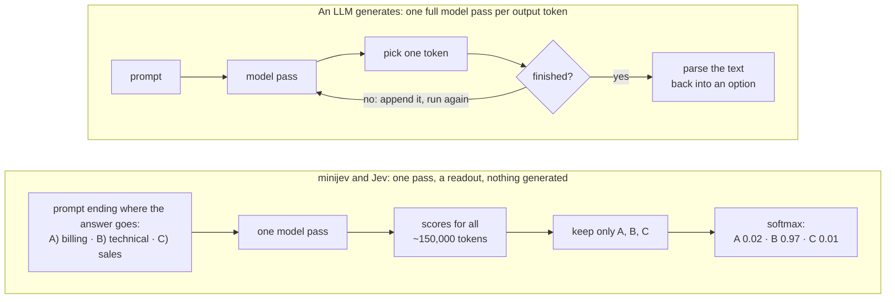
```mermaid
flowchart TB
    subgraph write["An LLM generates: one full model pass per output token"]
        direction LR
        w1["prompt"] --> w2["model pass"] --> w3["pick one token"] --> w4{"finished?"}
        w4 -- "no: append it, run again" --> w2
        w4 -- "yes" --> w5["parse the text<br/>back into an option"]
    end
    subgraph read["minijev and Jev: one pass, a readout, nothing generated"]
        direction LR
        r1["prompt ending where the answer goes:<br/>A) billing · B) technical · C) sales"] --> r2["one model pass"] --> r3["scores for all<br/>~150,000 tokens"] --> r4["keep only A, B, C"] --> r5["softmax:<br/>A 0.02 · B 0.97 · C 0.01"]
    end
    write ~~~ read
```

minijev still *returns* an answer: a typed value and a probability for each option. It calculates that answer from
the next-token scores of one pass. It does not generate tokens. In the demo, the model put 96.9% of its next-token
probability on `B`, 1.9% on `A`, 1.0% on `C`, and 0.2% on all other tokens together. minijev rescales those three
into `technical 0.97 · billing 0.02 · sales 0.01`. Thus in §6, "generates nothing" means "generates no tokens". It
does not mean "returns nothing".

Each of Jev's selling points follows from this method:
- **It cannot invent an option.** The readout looks only at the declared options.
- **Output is free.** Jev generates no text, so there is nothing to bill.
- **It is fast.** It does one pass and has no generation loop. §6 shows why this is important.

### 3.2 Many questions, one pass over the state

Jev answers every question in a request "in parallel and in isolation against the same state in one go" (Stated).
The evidence shows that Jev arranges a request as a **tree** (Inferred). The model processes the state once. Each
question is a *branch* from the state. A branch sees only the state and itself:

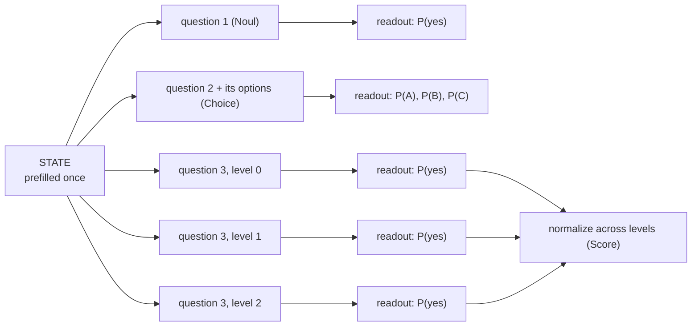
```mermaid
flowchart LR
    S["STATE<br/>prefilled once"]
    S --> Q1["question 1 (Noul)"] --> A1["readout: P(yes)"]
    S --> Q2["question 2 + its options (Choice)"] --> A2["readout: P(A), P(B), P(C)"]
    S --> L0["question 3, level 0"] --> Y0["readout: P(yes)"]
    S --> L1["question 3, level 1"] --> Y1["readout: P(yes)"]
    S --> L2["question 3, level 2"] --> Y2["readout: P(yes)"]
    Y0 & Y1 & Y2 --> N["normalize across levels (Score)"]
```

A branch never sees another branch. A Score uses one branch per level. Jev normalizes the answers of those
branches together.

Four independent clues point to this layout:

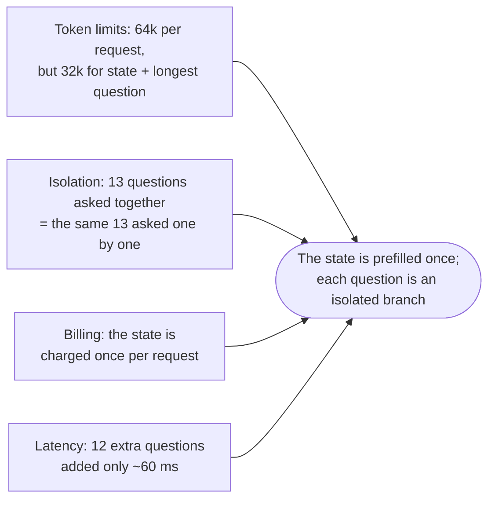
```mermaid
flowchart LR
    E1["Token limits: 64k per request,<br/>but 32k for state + longest question"] --> C
    E2["Isolation: 13 questions asked together<br/>= the same 13 asked one by one"] --> C
    E3["Billing: the state is<br/>charged once per request"] --> C
    E4["Latency: 12 extra questions<br/>added only ~60 ms"] --> C
    C(["The state is prefilled once;<br/>each question is an isolated branch"])
```

The clues in detail:
1. **Token limits (Stated).** Jev allows 64k tokens per request. But it allows only 32k for "the state plus the
   *longest* question". This second limit makes sense only if each question is a separate branch from the state.
2. **Isolation (Observed).** TypeSafe's cookbook asked 13 questions together and one at a time. The answers were
   identical. Thus the questions cannot see each other.
3. **Billing (Observed).** Jev charges for the state once per request, not once per question.
4. **Latency (Observed).** 12 added questions on an 11,800-token article made Jev only ~60 ms slower.

The founder's blog, one week before launch, gives the economic argument. Generation is the expensive part of an LLM
service. He announced "a new kind of foundation model" that avoids this cost. A model that answers in the same pass
that processes its input never generates anything. This is why output tokens can be free.

### 3.3 The three question types

| Type | Asks | Jev's readout (inferred unless marked) | Returns |
|---|---|---|---|
| **Noul** | Is this true? | One readout: P(yes) vs P(no) | `noul`: a single probability |
| **Choice** | Which option? | Small sets: all options shown at once, readout of the option labels. Large sets (up to 255): score each option separately, then choose among the best few (stated by TypeSafe). | `choice`, `probabilities`, `confidence` |
| **Score** | Where on this scale? | Each level judged **on its own** (stated by TypeSafe: "the model doesn't see a level's number or its neighbours"), then normalized | `score` (expected level, 0…n−1), `probabilities`, `confidence`, `legend` |

TypeSafe's launch blog gives this process for a large Choice (Stated):


```mermaid
flowchart LR
    O["up to 255 options"] --> S1["stage 1: judge every option<br/>on its own (pointwise)"] --> K["keep the best few"] --> S2["stage 2: one explicit choice<br/>among the survivors"] --> A["choice + probabilities"]
```

### 3.4 Confidence

`probabilities` *is* the answer. `confidence` is one number that shows how peaked the distribution is. TypeSafe's own
code ([system-one-adapter-python](https://github.com/typesafe-ai/system-one-adapter-python)) defines two formulas.
Together, they reproduce all 16 examples in Jev's docs:

- **Choice:** `(p_max − 1/k) / (1 − 1/k)`. It is 0 when all options are equally probable. It is 1 when one option has all the probability.
- **Score:** `1 − (expected distance from the most likely level) ÷ (expected distance from the middle level under a
  uniform guess)`, with a minimum of 0. A split between *adjacent* levels decreases confidence less than a split
  between opposite ends.

The two charts show the same 60/40 split on a 3-level Score, in two positions:

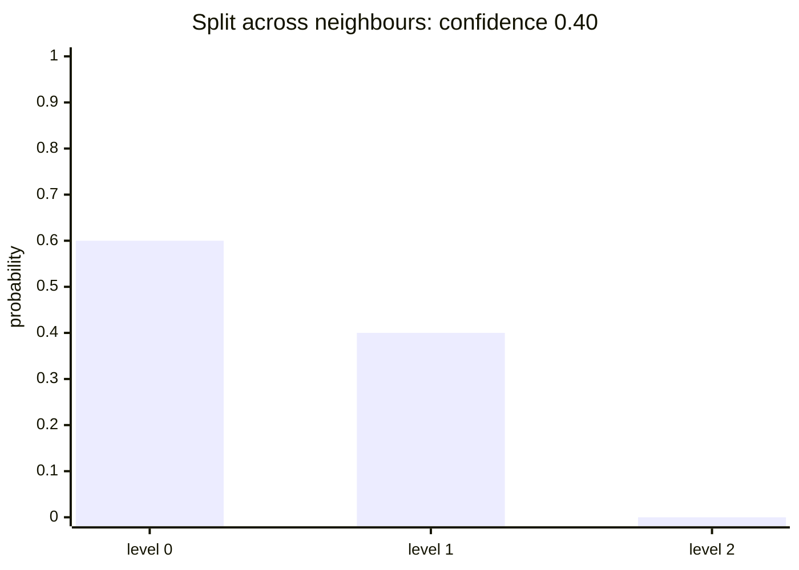
```mermaid
xychart-beta
    title "Split across neighbours: confidence 0.40"
    x-axis ["level 0", "level 1", "level 2"]
    y-axis "probability" 0 --> 1
    bar [0.6, 0.4, 0]
```

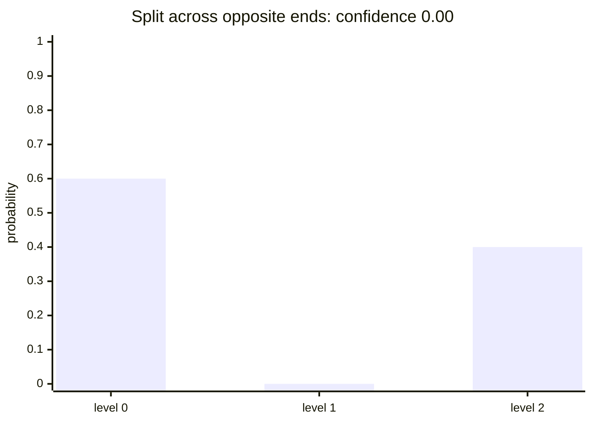
```mermaid
xychart-beta
    title "Split across opposite ends: confidence 0.00"
    x-axis ["level 0", "level 1", "level 2"]
    y-axis "probability" 0 --> 1
    bar [0.6, 0, 0.4]
```

### 3.5 What is unknown outside TypeSafe

- The model itself. TypeSafe says it is "neither small nor an LLM" with "a new model architecture". TechCrunch says
  it is "transformer-based".
- How RLCD, their training method, works. The nearest published method is RL with a Brier-score reward (Damani et al. 2025).
- What `output_tokens` counts.
- Whether calibration evidence exists. TypeSafe has published none.

---

## 4. What minijev (the POC) does

### 4.1 Files

| File | Contents |
|---|---|
| `src/minijev/` | The package: prompt building (`prompt.py`), the three evaluators (`engine.py`), the readout and `ask()`, which implements the Jev contract (`judge.py`), the primitives and confidence (`primitives.py`), calibration (`calibrate.py`, `settings.py`), the generation baselines (`generation.py`), the API and the CLI. |
| `poc/experiments.py` | One function per experiment. Run `uv run python experiments.py <name>`. |
| `poc/results/*.json` | Raw outputs of every run. The numbers below come from these files. |
| `src/minijev/api/` | A local HTTP API (FastAPI) for the web playground; start it with `minijev serve`. |
| `web/` | The web playground: a question editor, live calibration dials, a readout-vs-generation comparison, and views of the prefix tree and the attention mask. |

### 4.2 One request, from start to end

This example comes from DESIGN.md. The state is a Stripe outage message. The request has three questions: urgency,
team, and tone.

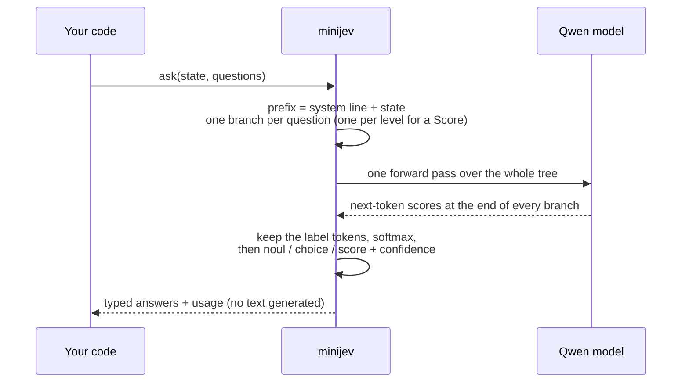
```mermaid
sequenceDiagram
    participant C as Your code
    participant M as minijev
    participant Q as Qwen model
    C->>M: ask(state, questions)
    M->>M: prefix = system line + state<br/>one branch per question (one per level for a Score)
    M->>Q: one forward pass over the whole tree
    Q-->>M: next-token scores at the end of every branch
    M->>M: keep the label tokens, softmax,<br/>then noul / choice / score + confidence
    M-->>C: typed answers + usage (no text generated)
```

minijev does these steps:

1. **Build the shared prefix.** It contains a system line and the state:
   `You are a precise classifier… STATE: Hi, my Stripe integration has failed for 3 days…`
2. **Build one branch per question.** A Score question gets one branch per level:
   - `urgency` → "QUESTION: Does this message express urgency? Answer with Yes or No." → 1 branch
   - `team` → "QUESTION: Which team…? OPTIONS: A) billing: … B) technical: … C) sales: … Answer with the letter…" → 1 branch
   - `tone` → "QUESTION: How upset…? PROPOSED ANSWER: calm. Is the proposed answer correct…? Yes or No." The other 3
     levels get the same branch. → 4 branches
3. **Run the tree.** Each branch sees the prefix and itself. It never sees another branch.
4. **Do the readout** at the end of each branch. Keep only the label tokens: `Yes`/`No`, or `A`/`B`/`C`. Merge
   spelling variants, for example `" Yes"` and `"yes"`.
5. **Change the scores into answers.** Use softmax, the Score expectation, and the confidence formulas.

This is the actual response, from `poc/results/demo.json`:

```json
"urgency": { "noul": 0.98 },
"team":    { "choice": "technical", "probabilities": {"billing": 0.02, "technical": 0.97, "sales": 0.01}, "confidence": 0.96 },
"tone":    { "score": 1.92, "probabilities": {"0": 0.09, "1": 0.08, "2": 0.65, "3": 0.18}, "confidence": 0.55 }
```

### 4.3 Three modes for the same tree

| Mode | How | Why it exists |
|---|---|---|
| `naive` | Prefill state + branch again for every branch | The reference: obviously correct |
| `kv` | Prefill the state once, keep its internal memory (the "KV cache"), run each branch on top, then rewind | The practical mode; servers use it |
| `packed` | **One** forward pass over `[state][branch 1][branch 2]…`, with an attention mask so that no branch sees another, and position numbers that restart after the state | Exactly "one pass, in parallel, in isolation". It is consistent with Jev's limit of "state + longest question", but `kv` is consistent with that limit too. |

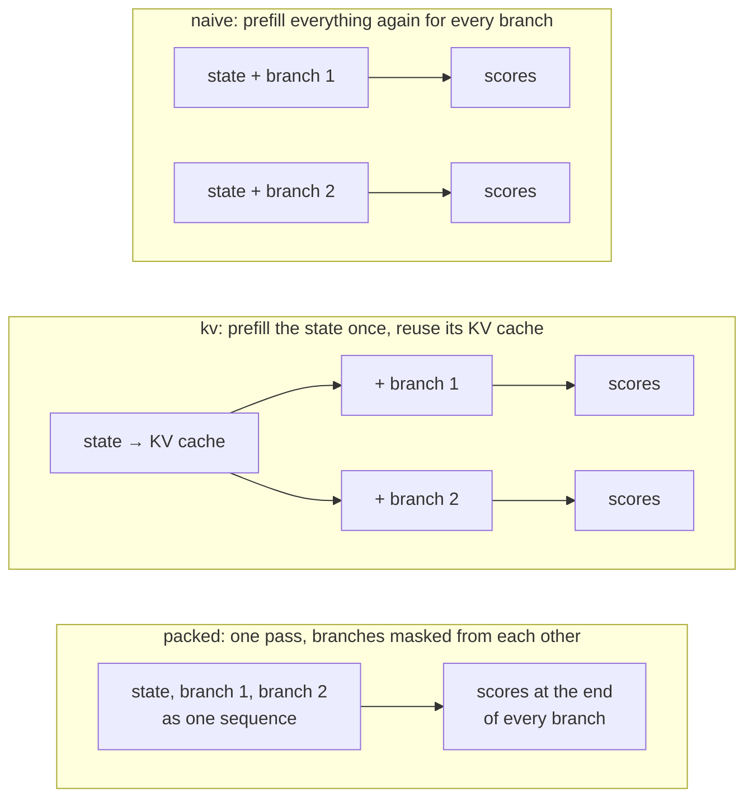
```mermaid
flowchart TB
    subgraph naive["naive: prefill everything again for every branch"]
        direction LR
        n1["state + branch 1"] --> n1o["scores"]
        n2["state + branch 2"] --> n2o["scores"]
    end
    subgraph kv["kv: prefill the state once, reuse its KV cache"]
        direction LR
        k0["state → KV cache"] --> k1["+ branch 1"] --> k1o["scores"]
        k0 --> k2["+ branch 2"] --> k2o["scores"]
    end
    subgraph packed["packed: one pass, branches masked from each other"]
        direction LR
        p1["state, branch 1, branch 2<br/>as one sequence"] --> p2["scores at the end<br/>of every branch"]
    end
    naive ~~~ kv ~~~ packed
```

All three modes give the same numbers (R2 below). The diagram shows the packed mask. ■ means "can attend to":

```text
                 keys →  state tokens   | branch 1 | branch 2
 state tokens            ■ (causal)     |          |
 branch 1 tokens         ■ ■ ■ ■ ■      | ■ causal |
 branch 2 tokens         ■ ■ ■ ■ ■      |          | ■ causal
 positions:              0 … S−1        | S …      | S …   ← both branches restart at S
```

---

## 5. What we measured (the POC experiments)

**R1 — The contract works.**
- A 0.5B model returns answers in Jev's format from label probabilities only.
- At least 99.8% of the next-token probability goes to the allowed labels. Thus the prompt works.

**R2 — The three modes give the same answers** (the core check).
- Naive, kv, and packed agree to 0.00002 in raw scores. That difference is floating-point noise.
- We asked TypeSafe's 13 GDPR questions together and one at a time. The answers changed by 0.0000034 or less.
- minijev isolates branches by construction (the attention mask), so this checks our implementation. It is not
  evidence about how Jev works.

**R3 — One prefill of the state gives ~9× the speed.** We asked 13 questions on a 1,000-token state. The naive mode
took 119 s (median of 5). The shared state took 13 s. Added questions are "almost free" only when the state is much longer than the
questions.

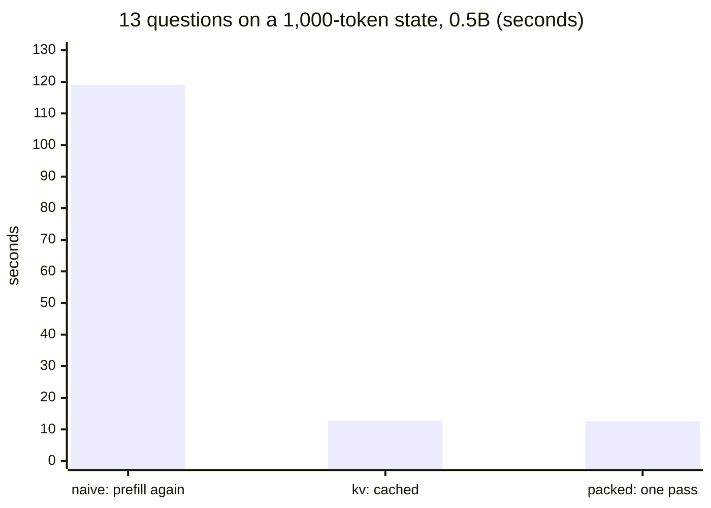
```mermaid
xychart-beta
    title "13 questions on a 1,000-token state, 0.5B (seconds)"
    x-axis ["naive: prefill again", "kv: cached", "packed: one pass"]
    y-axis "seconds" 0 --> 130
    bar [119.05, 12.76, 12.59]
```

**R4 — On small models, the A/B/C option list is sensitive to order.** We rotated the option order of 8 documented
Choice questions:

| Model | Winner changed when only the order changed | Same test, judging each option separately |
|---|---:|---:|
| 0.5B | 54% of rotations | 0% |
| 1.5B | 9% | 0% |

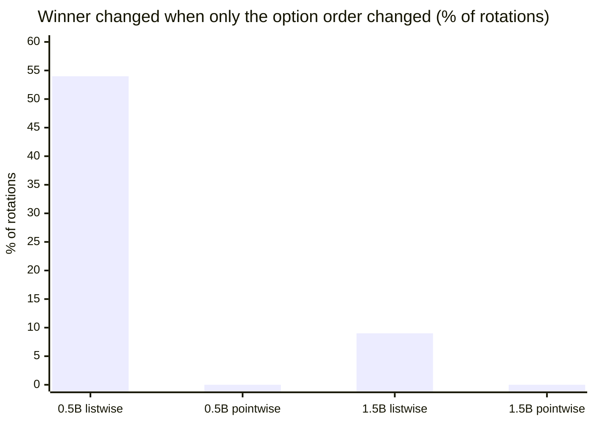
```mermaid
xychart-beta
    title "Winner changed when only the option order changed (% of rotations)"
    x-axis ["0.5B listwise", "0.5B pointwise", "1.5B listwise", "1.5B pointwise"]
    y-axis "% of rotations" 0 --> 60
    bar [54, 0, 9, 0]
```

A pointwise judgement (each option on its own) cannot have this bias, because of its design. The 0% is therefore a
check of the implementation, not a measurement. Jev removed this bias in training (Inferred).

**R5 — How near are we to Jev's published answers?** We ran the exact inputs from Jev's docs.
- **1.5B is much nearer than 0.5B.** On Score, the mean error was 0.62 levels for 0.5B and 0.22 levels for 1.5B.
  1.5B gave the same level as Jev 9 times out of 10.
- **The 0.5B failure comes from model capacity, not from the method.** 0.5B rated every bug report "workaround
  exists", from a misaligned icon to a total login outage.
- **Both sizes judge Noul questions differently from Jev.** Both counted "Used Python occasionally" as *strong in Python*.
- **The samples are small:** 15 Nouls, 10 Scores, and 8 Choices. "9 of 10" has a wide interval, and one example
  changes a Choice result by 12 points. Treat R5 as a direction, not a measurement.
- **R5 is not a held-out test.** These documented cases were public while we chose the prompt template.

**R6 — Calibration on BoolQ** (400 yes/no reading questions with known answers):

Each interval is a 95% bootstrap interval, written as [low–high].

| | 0.5B | 1.5B |
|---|---:|---:|
| Accuracy (always saying "yes" scores 0.615) | 0.652 [0.608–0.698] | 0.782 [0.743–0.825] |
| Calibration error (ECE), raw | 0.161 [0.130–0.215] | 0.099 [0.076–0.144] |
| ECE after temperature scaling | **0.053** [0.043–0.108] | **0.060** [0.047–0.104] |
| Fitted temperature (1 = already calibrated) | 2.72 | 1.93 |
| ECE after "contextual calibration" (subtracting an "N/A"-state prior) | 0.350, worse | 0.221, worse |

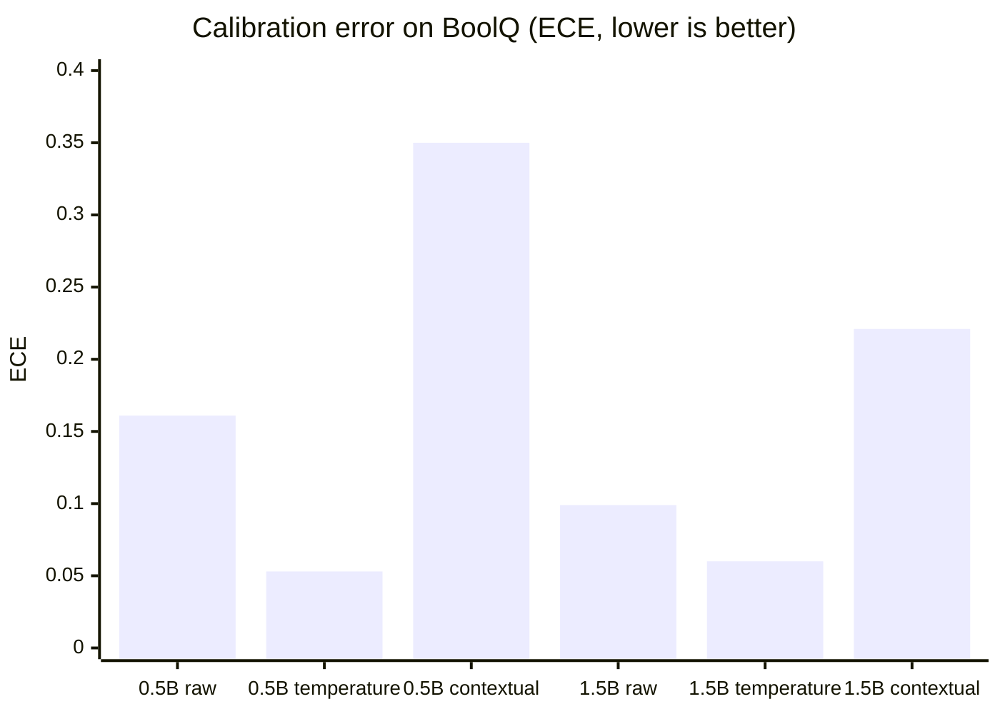
```mermaid
xychart-beta
    title "Calibration error on BoolQ (ECE, lower is better)"
    x-axis ["0.5B raw", "0.5B temperature", "0.5B contextual", "1.5B raw", "1.5B temperature", "1.5B contextual"]
    y-axis "ECE" 0 --> 0.4
    bar [0.161, 0.053, 0.350, 0.099, 0.060, 0.221]
```

- **Both models are overconfident without calibration.** When 0.5B was "95%+ sure", it was correct 86% of the time.
- **One fitted number corrects most of the error.** Temperature scaling makes the probabilities honest. It does not
  change any answer.
- **One popular method made the results worse.** Contextual calibration subtracts the model's answer for an "N/A"
  state. It made ECE worse at both sizes. For a yes/no question, "N/A" is itself evidence for "No".
- **Calibrated does not mean accurate.** 0.5B becomes honest about its uncertainty. But its accuracy interval
  includes 0.615, so it is not measurably better than the answer "yes" for every item.
- **The two sizes calibrate equally well.** Their ECE intervals after temperature scaling overlap. 0.053 vs 0.060 is
  not a real difference.
- **Put the fitted temperature in `poc/minijev.env`** (`MINIJEV_TEMP_NOUL`). The experiment prints the line to use.
- **Two limits.** The ECE intervals sit mostly above the point value, because ECE on a small resample is biased
  upward (Inferred). The fitted calibrators are held fixed in the bootstrap, so the intervals show evaluation noise
  only.

---

## 6. Generation baseline vs minijev: generate the answer, or read it out

### 6.1 The setup, and why it is fair

We cannot compare with Jev directly. Jev is a different model on different hardware. Also, no `ANTHROPIC_API_KEY`
was set, so we could not call a cloud LLM (see 6.5).

We *can* use **the same model, on the same laptop, in several ways**. This isolates the method:
- **Generation baseline:** a normal chat completion. The model *generates* its answer token by token (greedy, with a
  KV cache, as every LLM API does). Then code parses the text back into an option.
- **One generated token with logprobs:** what an LLM API returns when you ask for one token and its log
  probabilities. This is **the same computation as a readout**. It is the strongest generation baseline, and every
  comparison below includes it.
- **minijev:** the same model does a *readout* of the answer probabilities in one pass.

The prompts are as similar as possible: the same system line, state, and options. The name-generation baseline gets
the instruction "answer with the name of the best option". minijev and the logprobs baseline read the option letters.
The code is in `poc/experiments.py`, in `llm_vs_minijev` and `fan_out`. The raw results are in
`poc/results/llm_vs_minijev.json`, `poc/results/fanout.json`, and `poc/results/fanout-Qwen2.5-1.5B-Instruct.json`.

Each interval below is a 95% bootstrap interval, written as [low–high].

### 6.2 One decision at a time

The task is AG News topic classification (World / Sports / Business / Technology). We used 120 labelled articles and
Qwen2.5-0.5B:

| | minijev (readout) | 1 token + logprobs | Generate the label | Generate JSON probabilities* |
|---|---:|---:|---:|---:|
| Time per decision | **0.45 s** [0.43–0.46] | **0.45 s** [0.43–0.46] | 0.73 s [0.66–0.79] | 3.19 s [2.77–3.68] |
| Output tokens generated | 0 | 1 | 3.1 | 19.9 |
| Accuracy | 0.883 [0.825–0.942] | 0.883 (identical) | 0.908 [0.858–0.958] | 0.833 [0.733–0.917], lenient parser |
| Probabilities for every option | yes | yes, identical to the readout | no | only as the model writes them |
| Unusable replies | 0 | 0 | 0 | 1 of 60 (lenient), 44 of 60 (strict) |

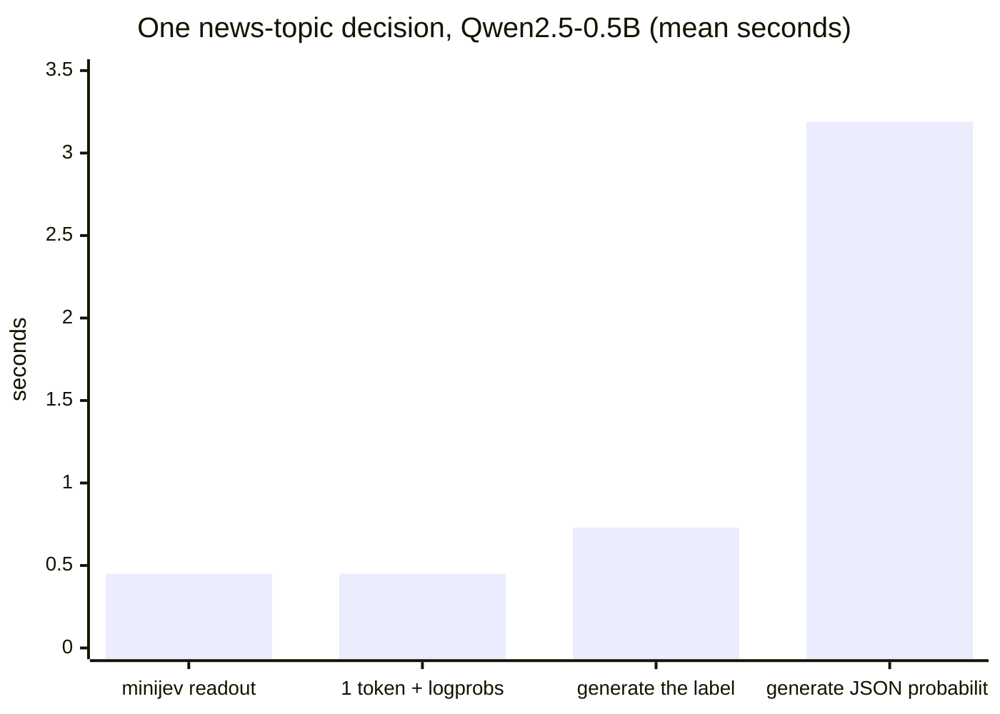
```mermaid
xychart-beta
    title "One news-topic decision, Qwen2.5-0.5B (mean seconds)"
    x-axis ["minijev readout", "1 token + logprobs", "generate the label", "generate JSON probabilities"]
    y-axis "seconds" 0 --> 3.5
    bar [0.45, 0.45, 0.73, 3.19]
```

*The JSON variant is slow, so it ran on the first 60 items only. On those 60 items, minijev scored 0.883
[0.800–0.967]. The strict parser accepts only the requested shape, `{"World": 0.1, "Sports": 0.7, …}`. The lenient
parser (`parse_probs_lenient`) also accepts the shape that the model usually writes, `{"topic": "Business",
"probability": 0.7}`, and loose key spellings.

The results show these points:
- **The readout and "1 token + logprobs" are the same thing.** Their probabilities differ by 0.0. Their times are
  equal. Any LLM API that returns logprobs gives a readout.
- **For one short answer, generation of the label is 1.6× slower.** It generates 3 tokens where the readout
  generates none.
- **Both methods give the answers of the same model.** They picked the same topic 94% of the time. The accuracy
  intervals overlap, so 0.908 vs 0.883 is not a real difference.
- **Written probabilities are 7× slower and poor.** The model usually wrote one answer and one number, not a
  distribution. The numbers it wrote took only a few values: 0.5, 0.7, 0.8, 0.9.
- **The readout's probabilities are not calibrated either.** Its ECE is 0.100 [0.055–0.156]. The readout gives a full
  distribution in the same pass, but it needs temperature scaling (§5 R6) before its numbers are honest.

### 6.3 Many questions about one state

The state is the GDPR article, shortened to its first 500 tokens. The request has the first N of TypeSafe's 13
cookbook questions. Every question is a Choice, so all methods answer exactly the same thing. We compared six
methods:

1. **One call per question.** Each call sends the state again with one question. This is the usual method.
2. **One call per question, state cached.** The calls reuse the KV cache of the state, as hosted APIs cache a shared
   prompt prefix.
3. **All questions in one batch, state cached.** The state is prefilled once. All questions are decoded together,
   one token for every question per step.
4. **One generated token with logprobs per question, state cached.** The same computation as a readout, but one
   call per question.
5. **One call, JSON answers.** One prompt contains all questions. The model generates `{"q1": …, "q2": …}`.
6. **minijev.** One packed pass does a readout of the probabilities for every answer.

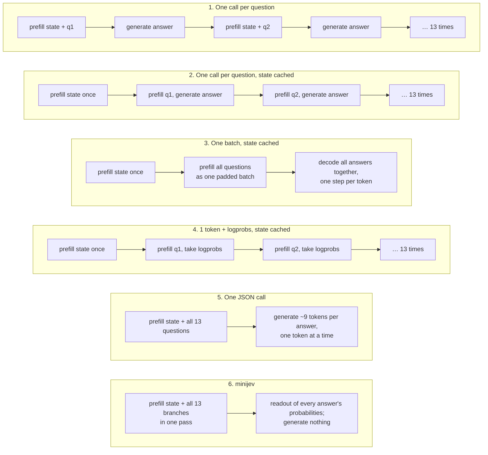
```mermaid
flowchart TB
    subgraph m1["1. One call per question"]
        direction LR
        a1["prefill state + q1"] --> a2["generate answer"] --> a3["prefill state + q2"] --> a4["generate answer"] --> a5["… 13 times"]
    end
    subgraph m2["2. One call per question, state cached"]
        direction LR
        b0["prefill state once"] --> b1["prefill q1, generate answer"] --> b2["prefill q2, generate answer"] --> b3["… 13 times"]
    end
    subgraph m3["3. One batch, state cached"]
        direction LR
        e0["prefill state once"] --> e1["prefill all questions<br/>as one padded batch"] --> e2["decode all answers together,<br/>one step per token"]
    end
    subgraph m4["4. 1 token + logprobs, state cached"]
        direction LR
        f0["prefill state once"] --> f1["prefill q1, take logprobs"] --> f2["prefill q2, take logprobs"] --> f3["… 13 times"]
    end
    subgraph m5["5. One JSON call"]
        direction LR
        c1["prefill state + all 13 questions"] --> c2["generate ~9 tokens per answer,<br/>one token at a time"]
    end
    subgraph m6["6. minijev"]
        direction LR
        d1["prefill state + all 13 branches<br/>in one pass"] --> d2["readout of every answer's probabilities;<br/>generate nothing"]
    end
    m1 ~~~ m2 ~~~ m3 ~~~ m4 ~~~ m5 ~~~ m6
```

Each cell gives the median wall-clock seconds of 3 runs for the full batch. The runs rotate through the methods in a
random order, so that a slow drift of the CPU speed affects all methods equally. The files also hold every single
run.

**Qwen2.5-0.5B**

| Questions | 1. Per question | 2. Cached | 3. Batch, cached | 4. 1 token + logprobs | 5. One JSON call | 6. minijev |
|---:|---:|---:|---:|---:|---:|---:|
| 1 | 2.47 | 2.42 | 2.34 | 2.23 | 4.08 | 2.52 |
| 4 | 8.33 | 3.40 | 2.45 | 2.72 | 8.39 | 2.69 |
| 13 | 31.40 | 9.57 | 10.14 | 6.14 | 30.89 | **5.71** |

**Qwen2.5-1.5B**

| Questions | 1. Per question | 2. Cached | 3. Batch, cached | 4. 1 token + logprobs | 5. One JSON call | 6. minijev |
|---:|---:|---:|---:|---:|---:|---:|
| 1 | 5.46 | 5.60 | 5.50 | 5.21 | 8.59 | 5.05 |
| 4 | 23.36 | 8.89 | 6.92 | 7.27 | 22.39 | 6.33 |
| 13 | 90.72 | 24.69 | 26.79 | 16.10 | 79.22 | **12.29** |

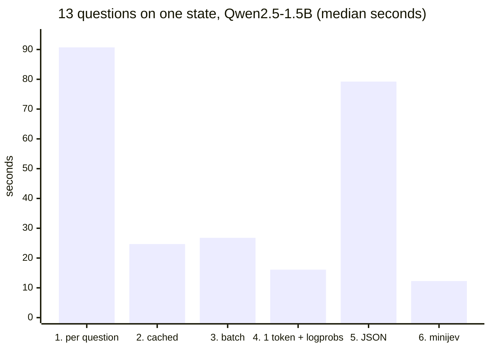
```mermaid
xychart-beta
    title "13 questions on one state, Qwen2.5-1.5B (median seconds)"
    x-axis ["1. per question", "2. cached", "3. batch", "4. 1 token + logprobs", "5. JSON", "6. minijev"]
    y-axis "seconds" 0 --> 95
    bar [90.72, 24.69, 26.79, 16.10, 79.22, 12.29]
```

**How large is the noise?** The spread of the 3 runs is about ±10% for most cells. Examples at 13 questions: the
0.5B readout took 5.60–5.72 s, and method 4 took 5.39–6.14 s. Thus a ratio below about 1.2× is not a real
difference. With 1 question, all methods except JSON are equal within the noise. With 4 questions at 0.5B, methods
3, 4, and 6 are equal within the noise.

**The result, against each baseline, at 13 questions:**

| minijev is faster than … | 0.5B | 1.5B |
|---|---:|---:|
| 1. One call per question | 5.5× | 7.4× |
| 5. One JSON call | 5.4× | 6.4× |
| 2. One call per question, cached | 1.7× | 2.0× |
| 3. One batch, cached | 1.8× | 2.2× |
| 4. 1 token + logprobs, cached | 1.08× (noise) | 1.3× |

The fair conclusion:
- **Against the strongest generation baseline (method 4), the readout has almost no advantage.** Method 4 does the
  same computation, one question per call. The 1.3× at 1.5B comes from 13 separate calls instead of one pass. At
  0.5B, the difference is within the noise.
- **The large gains come against the usual patterns:** a state sent again for each question, JSON output, or
  written answers.
- **Batching the decode did not help on this CPU** (§6.4). A decode step for 13 questions took 0.57 s, against
  0.13 s for one question. The padding of the batch also added prefill work.

At 13 questions, how often did each method pick the same option as minijev?
- **Method 4:** 100% at both sizes. It is the same computation.
- **Methods 1–3 (the model generates the name):** 69% at 0.5B, 92% at 1.5B. The three methods agreed with each other
  100%.
- **Method 5 (JSON):** 62% at 0.5B, 100% at 1.5B.

The difference comes from the prompt format: "answer with the name" vs a readout of the letter. The small model is
sensitive to it. In the JSON call, the model also generates the 13 answers in one stream, so they can affect each
other. They are not isolated, as Jev's answers are.

### 6.4 Why prefill is cheaper than generation

We measured this directly on this laptop. The setup: 0.5B in fp32, a 600-token context, 20 decode steps, median of
3 runs.

| | Cost per token | Range of the 3 runs |
|---|---:|---:|
| **Prefill** (all prompt tokens go through each weight matrix together) | **3.1 ms** | 3.08–3.15 ms |
| **Generation** (decode: each new token needs a full pass by itself, which loads all ~2 GB of weights from memory again) | **161 ms** | 156–162 ms |

Here, a generated token costs about **50× a prefilled token**. A separate profile run measured 130 ms per decode
step. Thus this cost changes by about 20% between runs.

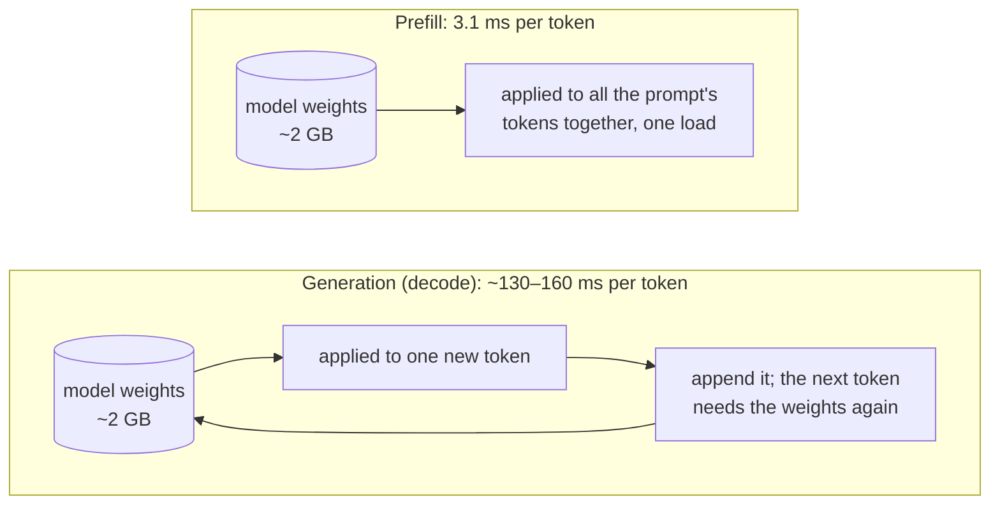
```mermaid
flowchart TB
    subgraph prefill["Prefill: 3.1 ms per token"]
        direction LR
        w1[("model weights<br/>~2 GB")] --> x1["applied to all the prompt's<br/>tokens together, one load"]
    end
    subgraph decode["Generation (decode): ~130–160 ms per token"]
        direction LR
        w2[("model weights<br/>~2 GB")] --> x2["applied to one new token"] --> x3["append it; the next token<br/>needs the weights again"]
        x3 --> w2
    end
    prefill ~~~ decode
```

During generation, most of each pass moves the weights from memory to the processor: ~2 GB for one token. Prefill
moves the weights once for the full prompt and uses its time for arithmetic. Generation cannot process its tokens
together in the same way, because each token depends on the token before it.

**Batching makes decode cheaper per token, but not free on a CPU.** A decode step for 13 questions at once took
0.57 s, and a step for one question took 0.13 s (Measured). Per token, that is 3× cheaper. A GPU has much more
arithmetic per byte of memory, so on a GPU a batch of 13 costs almost the same as a batch of 1 (Inferred).

This is also why cloud APIs charge more for output than for input. It is also why Jev can make output free: Jev
never generates. Jev's founder gives this argument about GPUs in his blog post *(KV) Cache Rules Everything Around Me*.

From 0.5B to 1.5B, the 13-question generation times increased 2.6–2.9×:
- one call per question: 31 s → 91 s;
- cached: 9.6 s → 25 s;
- JSON: 31 s → 79 s.

The readout time increased 2.2×, from 5.7 s to 12.3 s. Generation is more sensitive to model size, because each
generated token must load all the weights again (Inferred).

### 6.5 What about a cloud LLM such as Claude?

We did not measure this, because this environment has no `ANTHROPIC_API_KEY`. Two points are important:
- **Absolute speed depends on hardware.** A hosted LLM runs on GPUs. A single short call to a cloud model can return
  faster than minijev on a laptop CPU. The fair cloud comparison is minijev on a GPU, which is approximately what Jev
  is. This laptop can show the *ratio*, not the absolute speed.
- **The ratio applies to GPUs too (Observed).** SemIf ran the same 4B model on an RTX 3090. The readout of 21
  decisions took 1.02 s. Generation of the same decisions as a compact JSON array took 5.33 s (5.2×). TypeSafe's own
  evals (evals.typesafe.ai) report about 0.4 s per case for Jev. They report approximately 10–90 s for LLM workflows
  and up to ~190 s for single LLM prompts. Those numbers include larger models and reasoning, so they are not a
  controlled comparison.
- **Many hosted APIs do not return logprobs.** Without logprobs, the strongest baseline (method 4) is not available,
  and the fair comparison is method 2 or method 5.

To add the cloud point, do these steps:
1. Set `ANTHROPIC_API_KEY`.
2. Run TypeSafe's MIT-licensed `system-one-adapter-python` against Claude on the same AG News items and fan-out
   questions.
3. Add its results as one more column to the tables above. The adapter returns answers in Jev's format.

### 6.6 Summary: where the time goes

**The results.** With the same model on the same laptop, minijev is:
- **as fast as "1 token + logprobs"** for a single decision, because it is the same computation.
- **1.6× faster than generation of a one-word label** for a single decision.
- **7× faster than generation of written probabilities**, which are also malformed or poor.
- **5–7× faster for 13 questions on one state** than the usual methods: one call per question, or one JSON call.
- **1.7–2.0× faster at 13 questions than cached generation of one-word answers.**
- **1.0–1.3× faster than the strongest baseline**, cached "1 token + logprobs" per question. That baseline needs an
  API that returns logprobs.

#### How: count the tokens that each method prefills and generates

Each method does two types of work: **prefill** and **generation** (decode). Use the costs of §6.4: 3.1 ms per
prefilled token and 161 ms per generated token. For the batch, use the measured 0.57 s per decode step. Multiply
and add:

| 13 questions, 0.5B | Tokens prefilled | Tokens generated | Predicted | Measured | Error |
|---|---:|---:|---:|---:|---:|
| 1. One call per question | 8,247 | 33 | 25.6 s + 5.3 s = **30.9 s** | 31.4 s | −2% |
| 2. One call per question, cached | 1,347 | 33 | 4.2 s + 5.3 s = **9.5 s** | 9.6 s | −1% |
| 3. One batch, cached | 2,057 (with padding) | 33, in ~3 steps | 6.4 s + 1.7 s = **8.1 s** | 10.1 s | −20% |
| 4. 1 token + logprobs, cached | 1,371 | 0 | 4.3 s | 6.1 s | −30% |
| 5. One JSON call | 1,218 | 124 | 3.8 s + 20.0 s = **23.8 s** | 30.9 s | −23% |
| 6. minijev | 1,371 | 0 | 4.3 s | 5.7 s | −25% |

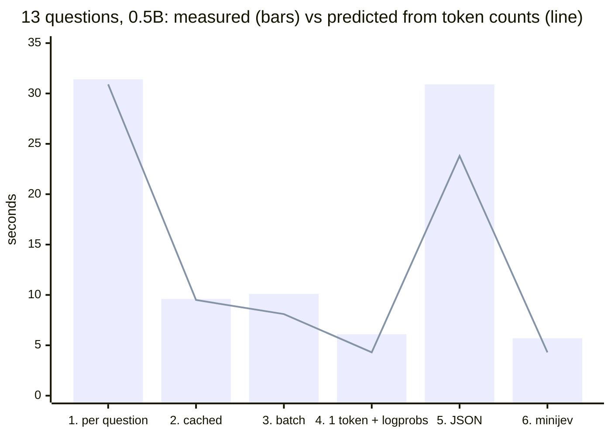
```mermaid
xychart-beta
    title "13 questions, 0.5B: measured (bars) vs predicted from token counts (line)"
    x-axis ["1. per question", "2. cached", "3. batch", "4. 1 token + logprobs", "5. JSON", "6. minijev"]
    y-axis "seconds" 0 --> 35
    bar [31.4, 9.6, 10.1, 6.1, 30.9, 5.7]
    line [30.9, 9.5, 8.1, 4.3, 23.8, 4.3]
```

The token counts predict the two per-question methods within 2%. They under-predict the other four by 20–30%. The
causes (Inferred, except where marked):
- **Method 3:** the padded suffix prefill took 5.0 s in the profile, not the 4.4 s that 1,482 tokens predict.
  The batch also needs its own copy of the state cache for each row.
- **Method 4:** 13 separate `generate()` calls, each with fixed overhead.
- **Method 5:** each generated token also attends to the full 1,200-token prompt and to the answers so far. This
  makes each step slower than the 161 ms measured at a fixed context.
- **Method 6:** the single packed pass calculates attention over the full 1,371 × 1,371 grid. This includes the
  blocks that the mask then hides (§4.3).

#### Why: two independent savings

1. **minijev prefills the state once.** All questions are branches from a single prefill of the state (§3.2).
   Thirteen questions cost one state plus 13 short branches, not 13 states. An LLM pipeline copies this with prompt
   caching (method 2).
2. **minijev stops at the first answer token and takes its probabilities.** An LLM that generates its answer pays
   161 ms for each extra token. "1 token + logprobs" (method 4) copies this saving exactly.

A third, smaller saving comes from one pass for all branches, instead of one call per question. The measurements
separate the three:

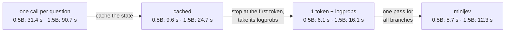
```mermaid
flowchart LR
    A["one call per question<br/>0.5B: 31.4 s · 1.5B: 90.7 s"] -->|"cache the state"| B["cached<br/>0.5B: 9.6 s · 1.5B: 24.7 s"] -->|"stop at the first token,<br/>take its logprobs"| C["1 token + logprobs<br/>0.5B: 6.1 s · 1.5B: 16.1 s"] -->|"one pass for<br/>all branches"| D["minijev<br/>0.5B: 5.7 s · 1.5B: 12.3 s"]
```

| 13 questions on one state | 0.5B | 1.5B |
|---|---:|---:|
| One call per question, no cache | 31.40 s | 90.72 s |
| … plus caching the state | 9.57 s (−21.8 s) | 24.69 s (−66.0 s) |
| … plus stopping at the first token (logprobs) | 6.14 s (−3.4 s) | 16.10 s (−8.6 s) |
| … plus one pass for all branches (minijev) | 5.71 s (−0.4 s) | 12.29 s (−3.8 s) |
| Share of the total saving: caching / first token / one pass | 85% / 13% / 2% | 84% / 11% / 5% |

- **Most of the saving comes from caching** in this test, because the state (500 tokens) is large and the answers
  are short.
- **The second saving is generation.** It increases with the length of the written answer: one-word labels < JSON <
  probabilities.
- **The one-pass layout adds little on a CPU.** On a GPU, one pass keeps all branches in one kernel launch
  (Inferred, not measured).

#### What applies to GPUs, and to Jev

- On GPUs, generation is also the bottleneck, because memory bandwidth limits each token. That is why APIs charge more
  for output than for input. Jev's founder uses this argument for a model that never generates (§3.2).
- A GPU makes all methods faster in absolute terms. It makes batched decode much cheaper than on this CPU (§6.4).
- Jev's price and latency need more than the readout: RESEARCH.md §3.9 shows what the published numbers allow.

**The method does not make the model more accurate.** The answers are the model's own answers. The readout and
"1 token + logprobs" pick the same option every time. The method changes the cost and the structure, and it gives
probabilities at no extra cost. That is the interface that Jev sells, without Jev's model and training.

---

### 6.7 Quality: which way of asking gives better answers?

§6.2–6.6 measure speed. This section measures quality, on questions with known answers. The same model answers
the same questions in four ways (experiment E11, `poc/results/quality*.json`):

1. **Reads out (minijev):** the probability of each allowed answer, from one pass. Nothing is written.
2. **Reads out, calibrated:** the same, then temperature scaling. T is fitted on one half of the questions and tested
   on the other half.
3. **Writes the answer:** the model writes "Yes" or "Sports"; code reads the word back. There is no probability.
4. **Writes a probability:** the model writes how sure it is: "0.8" for a yes/no question, a JSON object for a topic.

The question sets: BoolQ yes/no questions (62% of the answers are "yes"), n = 500 at 0.5B and 200 at 1.5B, and AG News
articles (4 topics), n = 300 at 0.5B and 120 at 1.5B. The two models were run on different samples, so compare the
ways of asking within one model, not the models. **E11 is exploratory:** it was run before the frozen splits of
docs/DATA.md, and it fits and reports on the same items. The held-out numbers are in §6.11.
ECE (expected calibration error) is the average gap between stated confidence and actual accuracy; 0 is perfect.

**Yes/no questions (BoolQ; n = 500 at 0.5B, 200 at 1.5B)**

| Way of asking | 0.5B accuracy | 0.5B ECE | 1.5B accuracy | 1.5B ECE | Time per question (0.5B / 1.5B) |
|---|---:|---:|---:|---:|---:|
| Reads out | 0.652 [0.610–0.692] | 0.186 | 0.820 [0.765–0.870] | 0.106 | 0.30 / 1.59 s |
| Reads out, calibrated | 0.652 | **0.047** | 0.820 | **0.066** | same |
| Writes the answer | 0.652 | — | 0.820 | — | 0.48 / 2.11 s |
| Writes a probability | 0.594 [0.552–0.634] | 0.334 | 0.740 [0.675–0.800] | 0.170 | 0.77 / 3.34 s |

**Topics (AG News; n = 300 at 0.5B, 120 at 1.5B)**

| Way of asking | 0.5B accuracy | 0.5B ECE | 1.5B accuracy | 1.5B ECE | Time per question (0.5B / 1.5B) |
|---|---:|---:|---:|---:|---:|
| Reads out | 0.860 [0.820–0.900] | 0.105 | 0.833 [0.767–0.900] | 0.149 | 0.21 / 1.41 s |
| Reads out, calibrated | 0.860 | **0.049** | 0.833 | **0.052** | same |
| Writes the answer | 0.863 [0.823–0.900] | — | 0.883 [0.825–0.942] | — | 0.37 / 1.78 s |
| Writes a probability | 0.847 | 0.103 | 0.875 | 0.103 | 1.74 / 17.26 s |

The results show these points:
- **A written one-word answer and the readout are equally right.** On BoolQ they agree to three decimals at both
  sizes. On AG News the intervals overlap. The reason (Inferred): a
  one-word answer is the first token of the same distribution that the readout reads.
- **Written probabilities are usually the least honest.** They have the highest ECE in three of the four cases; at
  0.5B on AG News they equal the raw readout (0.103 against 0.105), and the calibrated readout beats both (0.049).
  On BoolQ they are also less accurate (0.594 against 0.652 at 0.5B; 0.740 against 0.820 at 1.5B). They are the
  slowest: 17 s per question at 1.5B on AG News, for 39 written tokens.
- **The calibrated readout is the most honest,** with ECE 0.047–0.066. Calibration never changes an answer, so its
  accuracy equals the raw readout.
- **The 0.5B model is barely better than always answering "yes" on BoolQ.** The 0.62 base rate is just inside the
  interval of 0.652 [0.610–0.692].

The Compare page shows these tables, with the intervals, as section 2.

### 6.8 Same model, same questions, same answer format

The strictest speed test (experiment E12, `poc/results/same_format*.json`, median of 3 runs). Both sides get the same
state and questions and return the same JSON, for example `{"urgency": {"noul": 0.98}, "team": {"choice": …}}`:

- **Reads out (minijev):** one pass; the JSON is built in code from the read-out probabilities. 0 tokens written.
- **Writes freely:** the same model gets the questions and the exact JSON shape, and types the whole reply.
- **Writes with the format enforced (structured output):** the program types the fixed parts (braces, keys, quotes);
  the model chooses only the content, and only valid tokens: the digits of a number or one of the option names.
  This is what AI APIs call structured output or JSON mode.

| Request | Model | Reads out | Writes freely | Format enforced |
|---|---|---:|---:|---:|
| Support ticket (3 questions) | 0.5B | 0.75 s | 11.72 s · 75 tokens · 1 of 3 usable | 9.08 s · 3 of 3 usable |
| Jev shoes case (5 Choices) | 0.5B | 1.24 s | 9.26 s · 43 tokens · 0 of 5 usable | 23.06 s · 5 of 5 usable |
| Support ticket (3 questions) | 1.5B | 2.10 s | 45.34 s · 98 tokens · 3 of 3 usable | 23.73 s · 3 of 3 usable |
| Jev shoes case (5 Choices) | 1.5B | 3.83 s | 152.35 s · 301 tokens · 4 of 5 usable | 66.88 s · 5 of 5 usable |

"Usable" means that code can read the answer: the right key in the right place, an option name that exists, and a
number that is a probability. The results show these points:
- **Reading out is 7–40× faster than free writing** in the same format. The gap grows with the number of options and
  with the model size, because every written token costs a full pass (about 0.5 s at 1.5B on this CPU).
- **The small model breaks the format.** At 0.5B it nested questions inside each other and copied the template's
  `0.0` values; 0 of 5 answers were usable in the shoes case. At 1.5B most answers were usable.
- **An enforced format makes every answer usable** and is faster than free writing, because the fixed parts cost no
  choice. It is still 11–19× slower than the readout.
- **An enforced format does not make the numbers good.** At 0.5B the enforced reply wrote 0.05 for almost every
  probability, including an urgency that the readout put at 0.98. The written answers agreed with the readout on only
  1–2 of 3–5 questions. The model's internal probabilities are sensible; its written probabilities are not (§6.7).

### 6.9 What these lessons suggest about Jev (Inferred)

Each weakness of the writing baselines, and of listwise questions, has a clear counter. Jev's published behaviour
shows several of them:

| Lesson from our runs | What Jev shows | Inference |
|---|---|---|
| Written probabilities are poorly calibrated and slow (§6.7) | Output tokens are free; answers are probabilities (row 27) | Jev reads probabilities out; it does not write them |
| A written reply can break the format (§6.8) | Answers can never fall outside the declared options (Stated) | A readout over the declared labels, so a format error is impossible |
| The option order changes listwise answers (§5 R4, §6.10) | Score levels are judged "separately", without their number or neighbours (row 12); probability maps return in a different key order (row 24) | Order-invariant judging for Scores, and option shuffling or averaging for Choices |
| Raw probabilities are overconfident (§5 R6, §6.7) | Probabilities "optimized against outcomes" (row 6) | Calibration is trained in, not added afterwards |

docs/WEAKNESSES.md lists every open weakness, with a candidate fix and this Jev evidence for each. The web app shows
the same register on its Weaknesses page.

### 6.10 The option-order flaw, and three fixes

A listwise Choice shows the options as A, B, C, D, and the model picks a letter. If the model read only the content,
the order of the options would never change its answer. Experiment E13 (`poc/results/order_bias*.json`) tests this:
120 AG News articles with known topics, each asked in 4 option orders (the original and 3 random shuffles).
"Answer flips" is the share of articles whose answer changed when only the order changed.

| Way of asking | Branches | 0.5B: answer flips | 0.5B accuracy | 0.5B ECE | 1.5B: answer flips | 1.5B accuracy | 1.5B ECE |
|---|---:|---:|---:|---:|---:|---:|---:|
| As-is (listwise) | 1 | 20% [13%–28%] | 0.838 [0.78–0.89] | 0.130 | 8% [3%–13%] | 0.840 [0.78–0.90] | 0.143 |
| Debiased (letter liking divided out) | 1 | 18% [12%–24%] | 0.844 [0.79–0.90] | 0.125 | 8% [3%–13%] | 0.840 [0.78–0.90] | 0.143 |
| All orders averaged | 4 | 3% [1%–7%] | 0.881 [0.82–0.93] | 0.074 | 2% [0%–4%] | 0.844 [0.78–0.91] | 0.114 |
| Pointwise | 4 | 0% [0%–0%] | 0.850 [0.78–0.91] | 0.086 | 0% [0%–0%] | 0.908 [0.85–0.96] | 0.073 |

Which letter the model picks, against where the right answer is (picks / right answer):

| Model | A | B | C | D |
|---|---:|---:|---:|---:|
| 0.5B | 20% / 27% | 26% / 26% | 25% / 22% | 30% / 25% |
| 1.5B | 24% / 27% | 28% / 26% | 25% / 22% | 23% / 25% |

The results show these points:
- **The flaw is real at both sizes.** As-is, the answer changed with the order for 20% of the
  articles at 0.5B and 8% at 1.5B.
- **All orders averaged almost removes it** (3% and 2%), and it
  also gives the most honest probabilities at 0.5B (ECE 0.074 against 0.130).
  It costs one branch per option, but the text is still read once. It is not exactly zero, because it averages the
  rotations (ABCD, BCDA, …), not every possible order.
- **Pointwise removes it completely,** by construction: no option sees another. At 1.5B it is also the most accurate
  (0.908) and the most honest (ECE 0.073); at 0.5B, pointwise judging
  of each option alone is weaker (W5), so averaging wins there.
- **Debiasing barely helps** (18% and 8%). So the flaw is not a
  simple liking for one letter (Inferred). How much a position pulls depends on the options and the text, so only a
  fix that shows every option at every position removes it.
- **Accuracy changes little.** The accuracy intervals of the four ways overlap at each size. The fixes make the answer
  stable and honest more than they make it right.

The app offers the fix as the Choice mode "asked: all orders averaged". The Findings page shows this experiment.

### 6.11 Held-out results (E14)

Sections 6.2–6.10 are exploratory: they fitted and reported on overlapping items. E14 (`experiments.py heldout`,
`poc/results/heldout*.json`) uses the frozen splits of docs/DATA.md. It fits on train, chooses on val (the lowest
negative log-likelihood, NLL), and reports on test once. Each AG News article shows its options in its own random order.
Brackets are 95% bootstrap intervals.

**Noul on BoolQ** (train 500, val 200, test 300; always "yes" scores 0.620):

| Model | Method | T (or a, b) | Test accuracy | Test ECE | Test NLL | Val NLL |
|---|---|---|---:|---:|---:|---:|
| 0.5B | raw | T = 1 | 0.693 [0.64–0.74] | 0.160 [0.13–0.22] | 0.695 | — |
| 0.5B | temperature **(chosen on val)** | T = 2.23 | 0.693 [0.64–0.74] | 0.100 [0.08–0.16] | 0.577 | 0.577 |
| 0.5B | platt | a = 0.416, b = 0.219 | 0.720 [0.67–0.77] | 0.085 [0.07–0.14] | 0.578 | 0.584 |
| 1.5B | raw | T = 1 | 0.773 [0.73–0.82] | 0.120 [0.09–0.17] | 0.551 | — |
| 1.5B | temperature **(chosen on val)** | T = 1.74 | 0.773 [0.73–0.82] | 0.066 [0.05–0.12] | 0.471 | 0.468 |
| 1.5B | platt | a = 0.573, b = 0.023 | 0.773 [0.73–0.82] | 0.071 [0.05–0.12] | 0.471 | 0.469 |

**Choice on AG News** (train 600, val 200, test 400; chance is 0.25). The temperature T is fitted per mode on train:

| Model | Mode | T | Val NLL | Test accuracy | Test ECE raw → calibrated | Test NLL raw → calibrated |
|---|---|---:|---:|---:|---:|---:|
| 0.5B | listwise | 2.72 | 0.641 | 0.782 [0.74–0.82] | 0.183 → 0.064 [0.04–0.11] | 1.341 → 0.689 |
| 0.5B | averaged **(chosen on val)** | 1.74 | 0.546 | 0.797 [0.76–0.83] | 0.116 → 0.053 [0.03–0.09] | 0.764 → 0.577 |
| 0.5B | pointwise | 1.23 | 0.586 | 0.770 [0.73–0.81] | 0.084 → 0.051 [0.03–0.09] | 0.665 → 0.630 |
| 1.5B | listwise | 3.42 | 0.569 | 0.823 [0.78–0.86] | 0.157 → 0.044 [0.03–0.08] | 1.185 → 0.521 |
| 1.5B | averaged | 2.99 | 0.508 | 0.820 [0.78–0.86] | 0.128 → 0.035 [0.03–0.08] | 1.005 → 0.503 |
| 1.5B | pointwise **(chosen on val)** | 1.72 | 0.381 | 0.853 [0.82–0.89] | 0.087 → 0.054 [0.03–0.09] | 0.549 → 0.418 |

The results show these points:
- **Calibration works on unseen items.** The fitted temperature lowers the test ECE by 38% at 0.5B (0.160 → 0.100) and
  by 45% at 1.5B (0.120 → 0.066). Accuracy does not change, because a temperature never changes which side of 0.5 an
  answer is on.
- **Both models are over-confident.** Every fitted temperature is above 1 (1.23–3.42), so the raw probabilities are
  too close to 0 and 1.
- **Val chooses a different Choice mode for each size.** At 0.5B it chooses averaged; at 1.5B it chooses pointwise,
  which is also the most accurate at that size (0.853). Listwise is never chosen: with the options in a new order for
  every article, it has the highest raw ECE and NLL at both sizes (W1).
- **The val choice holds on test.** The chosen mode has the lowest test NLL at both sizes.
- **1.5B is better than 0.5B** on both tasks: 0.773 against 0.693 on BoolQ, and 0.853 against 0.797 on AG News.

`poc/calibration/<model>.json` stores these fitted values and choices. `ask()` and the web app use them by default.

### 6.12 Teaching the model: a LoRA fine-tune (E20)

Everything above changes how we ask the model. E20 changes the model. **Fine-tuning** means that we show the model
examples with the right answer and move its weights a little after each one. **LoRA** (Low-Rank Adaptation) does this
cheaply: the 494 M original weights stay frozen, and about 1 M new weights next to the attention layers learn.

1. `uv run --group train python train_lora.py parity` checks that the training forward pass gives the same label
   logits as the readout (largest difference 4e-5). Thus the loss is the log loss of the real answer.
2. `uv run --group train python train_lora.py train` trains on BoolQ train and AG News train. Each news article comes
   back in new option orders, so the model sees every topic at every letter. After each pass, val measures the loss.
3. `uv run --group train python experiments.py lora --adapter adapters/Qwen2.5-0.5B-Instruct/epoch-1` compares the
   base model and the adapter on the same test items.

| Test (0.5B, raw) | Base | LoRA |
|---|---:|---:|
| BoolQ accuracy | 0.693 | 0.770 |
| BoolQ ECE | 0.160 | 0.063 |
| AG News listwise accuracy | 0.782 | 0.873 |
| Listwise flips over 4 orders | 22% | 9% |

The fine-tuned 0.5B model reaches base 1.5B on BoolQ. It is also more honest: val asks for a Noul temperature of 1.20,
against 2.60 before (1.0 means no correction). E20 fits both temperatures on val, because the adapter has seen train;
thus the base value differs from the 2.23 that E14 fitted on train (§6.11). A temperature does not help the adapter:
its BoolQ test ECE is 0.063 raw and 0.076 with the val temperature. These are in-domain results: the training and test items come from the
same two datasets. Full table and limits: RESEARCH.md §7.3 R17. The Findings page shows the same results.

## 7. Next steps

1. **Fit a Score temperature.** SST-5 train (300) is frozen and unused; fit on it, choose on val, report on test.
2. **Build the agent-routing data** under the rules of docs/DATA.md §9: redact session logs first, freeze the
   splits before any model sees them.
3. **Test the fine-tune outside its training tasks.** Run the E20 adapter on SST-5 Scores and the GDPR questions. If
   it is worse there, the gain is narrow.
4. **Test distillation** (RESEARCH.md §3.9). Fine-tune with LoRA on soft labels from Claude, with option shuffles.
   The hard-label step is done (§6.12); soft labels need an API budget (PLAN.md 6.2).
5. **Add the Claude baseline (E2).** Set `ANTHROPIC_API_KEY` and run TypeSafe's adapter on the same held-out data.
6. **Add a two-stage Choice** for more than 25 options, when a labelled dataset with that many options exists.
7. **With a Jev API key, run the cheap tests** in RESEARCH.md §8:
   - A shuffle of the options shows whether Jev judges options together or one at a time.
   - The step in latency shows where the two-stage Choice starts.
   - A repeated state vs a nonce-prefixed state shows whether Jev caches states across requests.

---

## Glossary

The full project glossary is in [CLAUDE.md](../CLAUDE.md).

- **Token** — a piece of text that the model processes or generates (approximately ¾ of a word).
- **Logits / scores** — the raw output of the model: one number per vocabulary token for "the next token".
- **Softmax** — a function that changes scores into probabilities with a sum of 1.
- **Prefill** — the model processes the prompt. All its tokens go through the model together, which is efficient.
- **Decode (generation)** — the model generates one token per model pass. Each pass loads the full model from memory
  again, which is slow.
- **Readout** — take the probabilities of the label tokens at one position, from one forward pass. No tokens are
  generated.
- **KV cache** — the internal memory of the model for tokens that it already processed. The model reuses it, so it
  does not prefill those tokens again.
- **Listwise / pointwise** — judge all options together in one prompt, or judge each option separately.
- **Calibration** — the property that "70% sure" is correct 70% of the time.
- **ECE** (expected calibration error) — the mean difference between stated confidence and actual accuracy. 0 is perfect.
- **Brier score** — the mean squared error of the probabilities. Lower is better.
- **Temperature scaling** — divide the scores of the model by one fitted number T. T > 1 makes the model less confident.
- **Platt scaling** — temperature scaling plus a fitted shift.
- **Contextual calibration** — subtract the answer of the model on a content-free input ("N/A"). This removes a bias
  that the model has before it sees any content.
