# minijev — Walkthrough: what we did, and what we learned

*2026-09-23. [DESIGN.md](DESIGN.md) is the plan. [RESEARCH.md](RESEARCH.md) is the evidence. This document
explains both, in order, in plain language. We measured every number here on this laptop (Intel i7-8850H, CPU only).
Every number comes from `poc/results/*.json`.*

*Evidence levels follow RESEARCH.md: **Stated** (TypeSafe says it), **Observed** (visible in real Jev outputs or
third-party measurements), **Inferred** (our reasoning). **Measured** means a result from our own POC runs.*

---

## 1. The short version

- **Jev** is TypeSafe's "System One" model. You give it an input text (the *state*) and typed questions: yes/no, pick
  one of these options, or rate on this scale. It returns probabilities, not text. It is fast and cheap. It cannot give
  an answer outside the options you declared.
- **We inferred how it works** from TypeSafe's docs, blog, code, and outside measurements. Jev does not generate an
  answer. It takes the probabilities of the allowed answers from a single forward pass (a *readout*). It processes the
  state once and answers every question from that one pass.
- **We built a laptop-sized version** (`poc/`) on a small open model (Qwen2.5, 0.5B and 1.5B parameters). Then we
  measured it. The *mechanism* reproduces exactly. The *quality* does not reproduce, because it comes from Jev's model
  and training, which are secret.
- **We compared minijev with a generation baseline:** the same model, on the same laptop, generates its answer as text.
  - For a single one-word answer, the readout is a little faster, or equal.
  - It is about 7× faster when you want probabilities.
  - It is 5–6× faster for 13 questions than the usual LLM patterns.
  - Against the best LLM set-up (prompt caching, one-word answers), the advantage decreases to 1.4–2×.
  - See §6.

---

## 2. What we did, step by step

1. **We reviewed DESIGN.md.** The core idea was correct. Several details were wrong or guessed: the API shape, how
   Score works, and the confidence formula.
2. **We did research.** We read these sources:
   - All ~60 pages of TypeSafe's docs, the launch blog and its FAQ, and the TechCrunch article.
   - A real Jev client from a launch partner (Browser Use).
   - Several open-source clones, the founder's blog, and TypeSafe's public GitHub.
   - We sorted each claim into **Stated** (TypeSafe says so), **Observed** (visible in real outputs or code), or
     **Inferred** (our reasoning). The result is RESEARCH.md.
3. **We built a proof of concept** in `poc/`, about 330 lines of Python. It runs requests in Jev's format from start
   to end on a CPU.
4. **We ran seven experiments** on the 0.5B and 1.5B models. They cover speed, correctness, bias, agreement with Jev's
   published answers, calibration, and generation vs readout.
5. **We found TypeSafe's exact confidence formulas** in its own open-source code. With them, our numbers match Jev's
   documentation.
6. **We corrected DESIGN.md and the README** to match what we learned.

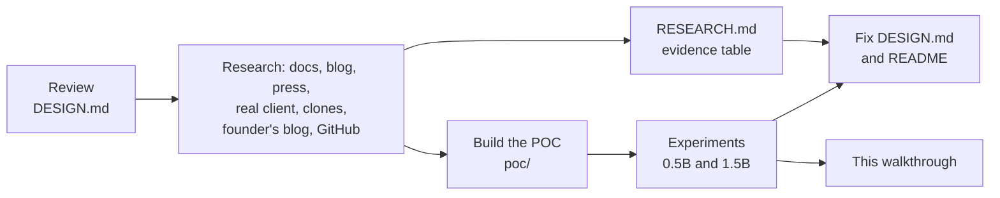
```mermaid
flowchart LR
    A["Review<br/>DESIGN.md"] --> B["Research: docs, blog, press,<br/>real client, clones,<br/>founder's blog, GitHub"]
    B --> C["RESEARCH.md<br/>evidence table"]
    B --> D["Build the POC<br/>poc/"]
    D --> E["Experiments<br/>0.5B and 1.5B"]
    E --> F["Fix DESIGN.md<br/>and README"]
    C --> F
    E --> G["This walkthrough"]
```

---

## 3. How Jev works (inferred)

### 3.1 The method: a readout, not generation

A language model takes the tokens so far. It gives a score for **every token in its vocabulary** (about 150,000 for
Qwen). A softmax changes those scores into probabilities.

To *generate*, an LLM picks one token, adds it to the input, and runs the full model again. It does one model pass
for each output token. A Jev-style model stops after **one** pass. It keeps only the tokens that name the allowed
answers (the *labels*):

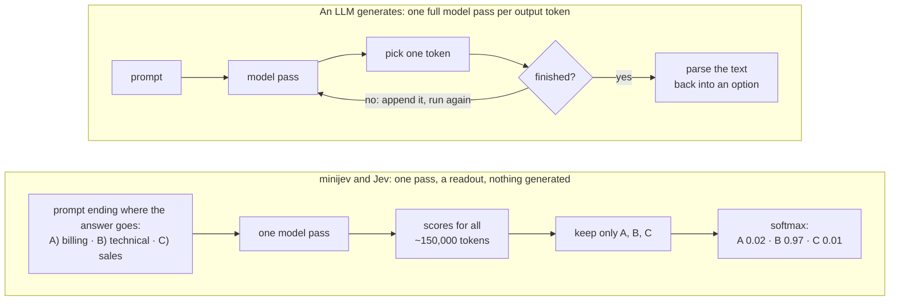
```mermaid
flowchart TB
    subgraph write["An LLM generates: one full model pass per output token"]
        direction LR
        w1["prompt"] --> w2["model pass"] --> w3["pick one token"] --> w4{"finished?"}
        w4 -- "no: append it, run again" --> w2
        w4 -- "yes" --> w5["parse the text<br/>back into an option"]
    end
    subgraph read["minijev and Jev: one pass, a readout, nothing generated"]
        direction LR
        r1["prompt ending where the answer goes:<br/>A) billing · B) technical · C) sales"] --> r2["one model pass"] --> r3["scores for all<br/>~150,000 tokens"] --> r4["keep only A, B, C"] --> r5["softmax:<br/>A 0.02 · B 0.97 · C 0.01"]
    end
    write ~~~ read
```

minijev still *returns* an answer: a typed value and a probability for each option. It calculates that answer from
the next-token scores of one pass. It does not generate tokens. In the demo, the model put 96.9% of its next-token
probability on `B`, 1.9% on `A`, 1.0% on `C`, and 0.2% on all other tokens together. minijev rescales those three
into `technical 0.97 · billing 0.02 · sales 0.01`. Thus in §6, "generates nothing" means "generates no tokens". It
does not mean "returns nothing".

Each of Jev's selling points follows from this method:
- **It cannot invent an option.** The readout looks only at the declared options.
- **Output is free.** Jev generates no text, so there is nothing to bill.
- **It is fast.** It does one pass and has no generation loop. §6 shows why this is important.

### 3.2 Many questions, one pass over the state

Jev answers every question in a request "in parallel and in isolation against the same state in one go" (Stated).
The evidence shows that Jev arranges a request as a **tree** (Inferred). The model processes the state once. Each
question is a *branch* from the state. A branch sees only the state and itself:

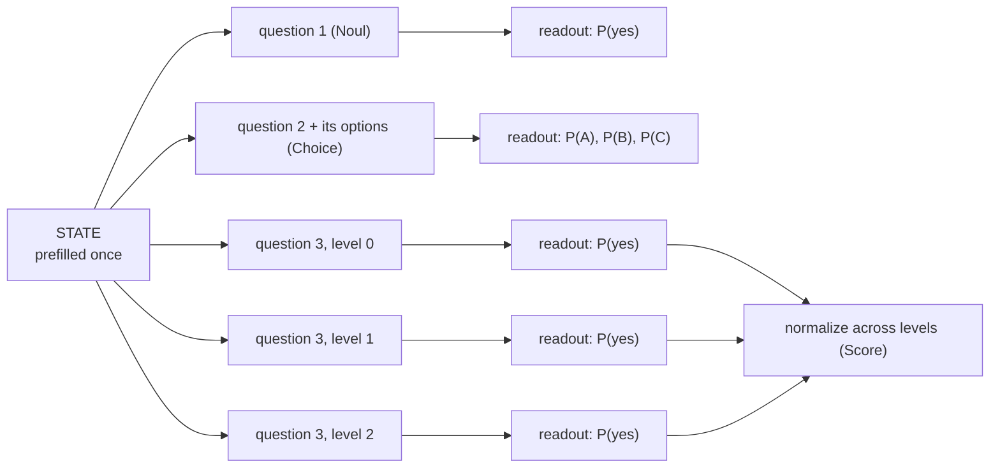
```mermaid
flowchart LR
    S["STATE<br/>prefilled once"]
    S --> Q1["question 1 (Noul)"] --> A1["readout: P(yes)"]
    S --> Q2["question 2 + its options (Choice)"] --> A2["readout: P(A), P(B), P(C)"]
    S --> L0["question 3, level 0"] --> Y0["readout: P(yes)"]
    S --> L1["question 3, level 1"] --> Y1["readout: P(yes)"]
    S --> L2["question 3, level 2"] --> Y2["readout: P(yes)"]
    Y0 & Y1 & Y2 --> N["normalize across levels (Score)"]
```

A branch never sees another branch. A Score uses one branch per level. Jev normalizes the answers of those
branches together.

Four independent clues point to this layout:


```mermaid
flowchart LR
    E1["Token limits: 64k per request,<br/>but 32k for state + longest question"] --> C
    E2["Isolation: 13 questions asked together<br/>= the same 13 asked one by one"] --> C
    E3["Billing: the state is<br/>charged once per request"] --> C
    E4["Latency: 12 extra questions<br/>added only ~60 ms"] --> C
    C(["The state is prefilled once;<br/>each question is an isolated branch"])
```

The clues in detail:
1. **Token limits (Stated).** Jev allows 64k tokens per request. But it allows only 32k for "the state plus the
   *longest* question". This second limit makes sense only if each question is a separate branch from the state.
2. **Isolation (Observed).** TypeSafe's cookbook asked 13 questions together and one at a time. The answers were
   identical. Thus the questions cannot see each other.
3. **Billing (Observed).** Jev charges for the state once per request, not once per question.
4. **Latency (Observed).** 12 added questions on an 11,800-token article made Jev only ~60 ms slower.

The founder's blog, one week before launch, gives the economic argument. Generation is the expensive part of an LLM
service. He announced "a new kind of foundation model" that avoids this cost. A model that answers in the same pass
that processes its input never generates anything. This is why output tokens can be free.

### 3.3 The three question types

| Type | Asks | Jev's readout (inferred unless marked) | Returns |
|---|---|---|---|
| **Noul** | Is this true? | One readout: P(yes) vs P(no) | `noul`: a single probability |
| **Choice** | Which option? | Small sets: all options shown at once, readout of the option labels. Large sets (up to 255): score each option separately, then choose among the best few (stated by TypeSafe). | `choice`, `probabilities`, `confidence` |
| **Score** | Where on this scale? | Each level judged **on its own** (stated by TypeSafe: "the model doesn't see a level's number or its neighbours"), then normalized | `score` (expected level, 0…n−1), `probabilities`, `confidence`, `legend` |

TypeSafe's launch blog gives this process for a large Choice (Stated):


```mermaid
flowchart LR
    O["up to 255 options"] --> S1["stage 1: judge every option<br/>on its own (pointwise)"] --> K["keep the best few"] --> S2["stage 2: one explicit choice<br/>among the survivors"] --> A["choice + probabilities"]
```

### 3.4 Confidence

`probabilities` *is* the answer. `confidence` is one number that shows how peaked the distribution is. TypeSafe's own
code ([system-one-adapter-python](https://github.com/typesafe-ai/system-one-adapter-python)) defines two formulas.
Together, they reproduce all 16 examples in Jev's docs:

- **Choice:** `(p_max − 1/k) / (1 − 1/k)`. It is 0 when all options are equally probable. It is 1 when one option has all the probability.
- **Score:** `1 − (expected distance from the most likely level) ÷ (expected distance from the middle level under a
  uniform guess)`, with a minimum of 0. A split between *adjacent* levels decreases confidence less than a split
  between opposite ends.

The two charts show the same 60/40 split on a 3-level Score, in two positions:

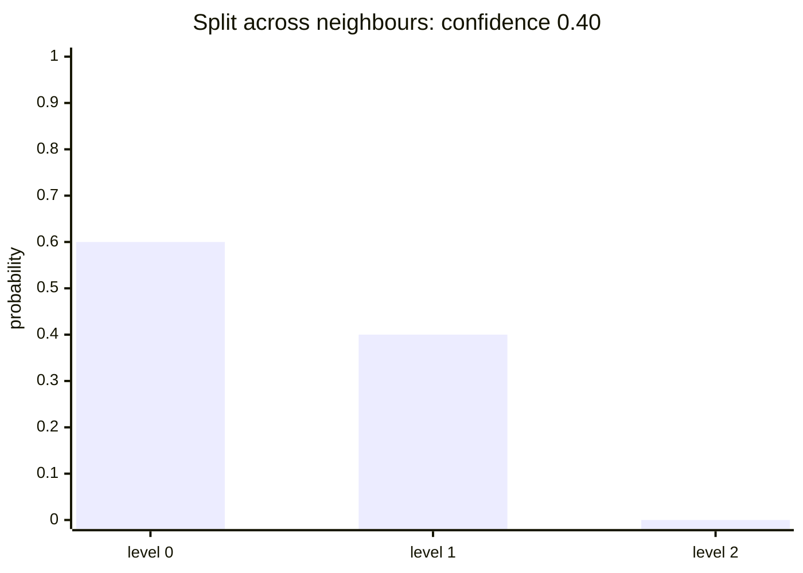
```mermaid
xychart-beta
    title "Split across neighbours: confidence 0.40"
    x-axis ["level 0", "level 1", "level 2"]
    y-axis "probability" 0 --> 1
    bar [0.6, 0.4, 0]
```

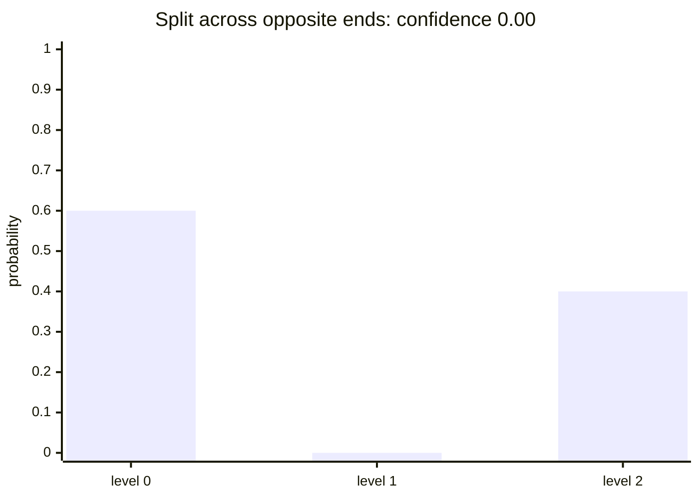
```mermaid
xychart-beta
    title "Split across opposite ends: confidence 0.00"
    x-axis ["level 0", "level 1", "level 2"]
    y-axis "probability" 0 --> 1
    bar [0.6, 0, 0.4]
```

### 3.5 What is unknown outside TypeSafe

- The model itself. TypeSafe says it is "neither small nor an LLM" with "a new model architecture". TechCrunch says
  it is "transformer-based".
- How RLCD, their training method, works. The nearest published method is RL with a Brier-score reward (Damani et al. 2025).
- What `output_tokens` counts.
- Whether calibration evidence exists. TypeSafe has published none.

---

## 4. What minijev (the POC) does

### 4.1 Files

| File | Contents |
|---|---|
| `poc/minijev_poc.py` | Prompt building, the three evaluators, the primitives, confidence, and `ask()`, which implements the Jev contract. About 330 lines. |
| `poc/experiments.py` | One function per experiment. Run `uv run python experiments.py <name>`. |
| `poc/results/*.json` | Raw outputs of every run. The numbers below come from these files. |

### 4.2 One request, from start to end

This example comes from DESIGN.md. The state is a Stripe outage message. The request has three questions: urgency,
team, and tone.

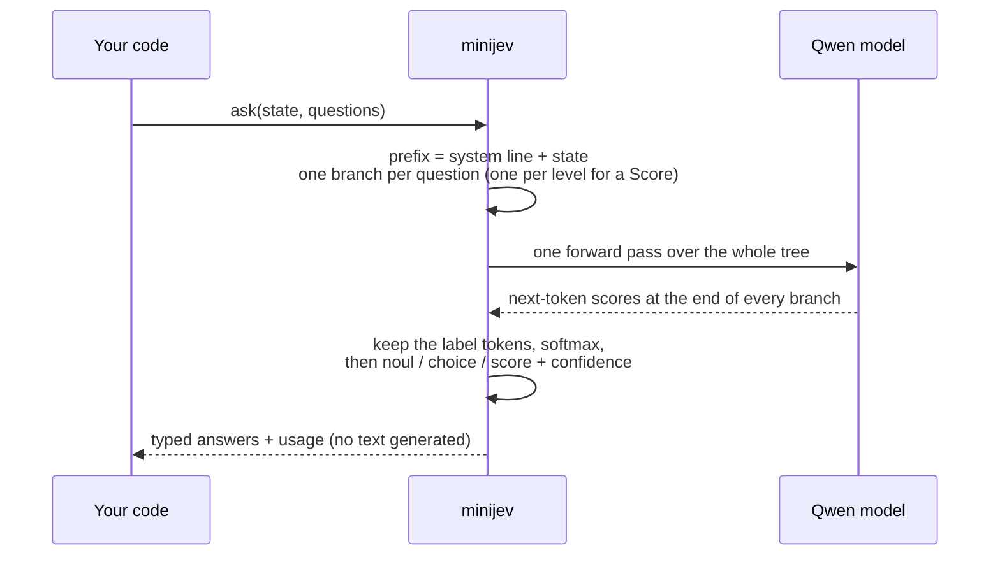
```mermaid
sequenceDiagram
    participant C as Your code
    participant M as minijev
    participant Q as Qwen model
    C->>M: ask(state, questions)
    M->>M: prefix = system line + state<br/>one branch per question (one per level for a Score)
    M->>Q: one forward pass over the whole tree
    Q-->>M: next-token scores at the end of every branch
    M->>M: keep the label tokens, softmax,<br/>then noul / choice / score + confidence
    M-->>C: typed answers + usage (no text generated)
```

minijev does these steps:

1. **Build the shared prefix.** It contains a system line and the state:
   `You are a precise classifier… STATE: Hi, my Stripe integration has failed for 3 days…`
2. **Build one branch per question.** A Score question gets one branch per level:
   - `urgency` → "QUESTION: Does this message express urgency? Answer with Yes or No." → 1 branch
   - `team` → "QUESTION: Which team…? OPTIONS: A) billing: … B) technical: … C) sales: … Answer with the letter…" → 1 branch
   - `tone` → "QUESTION: How upset…? PROPOSED ANSWER: calm. Is the proposed answer correct…? Yes or No." The other 3
     levels get the same branch. → 4 branches
3. **Run the tree.** Each branch sees the prefix and itself. It never sees another branch.
4. **Do the readout** at the end of each branch. Keep only the label tokens: `Yes`/`No`, or `A`/`B`/`C`. Merge
   spelling variants, for example `" Yes"` and `"yes"`.
5. **Change the scores into answers.** Use softmax, the Score expectation, and the confidence formulas.

This is the actual response, from `poc/results/demo.json`:

```json
"urgency": { "noul": 0.98 },
"team":    { "choice": "technical", "probabilities": {"billing": 0.02, "technical": 0.97, "sales": 0.01}, "confidence": 0.96 },
"tone":    { "score": 1.92, "probabilities": {"0": 0.09, "1": 0.08, "2": 0.65, "3": 0.18}, "confidence": 0.55 }
```

### 4.3 Three modes for the same tree

| Mode | How | Why it exists |
|---|---|---|
| `naive` | Prefill state + branch again for every branch | The reference: obviously correct |
| `kv` | Prefill the state once, keep its internal memory (the "KV cache"), run each branch on top, then rewind | The practical mode; servers use it |
| `packed` | **One** forward pass over `[state][branch 1][branch 2]…`, with an attention mask so that no branch sees another, and position numbers that restart after the state | Exactly "one pass, in parallel, in isolation". It also explains Jev's limit of "state + longest question". |

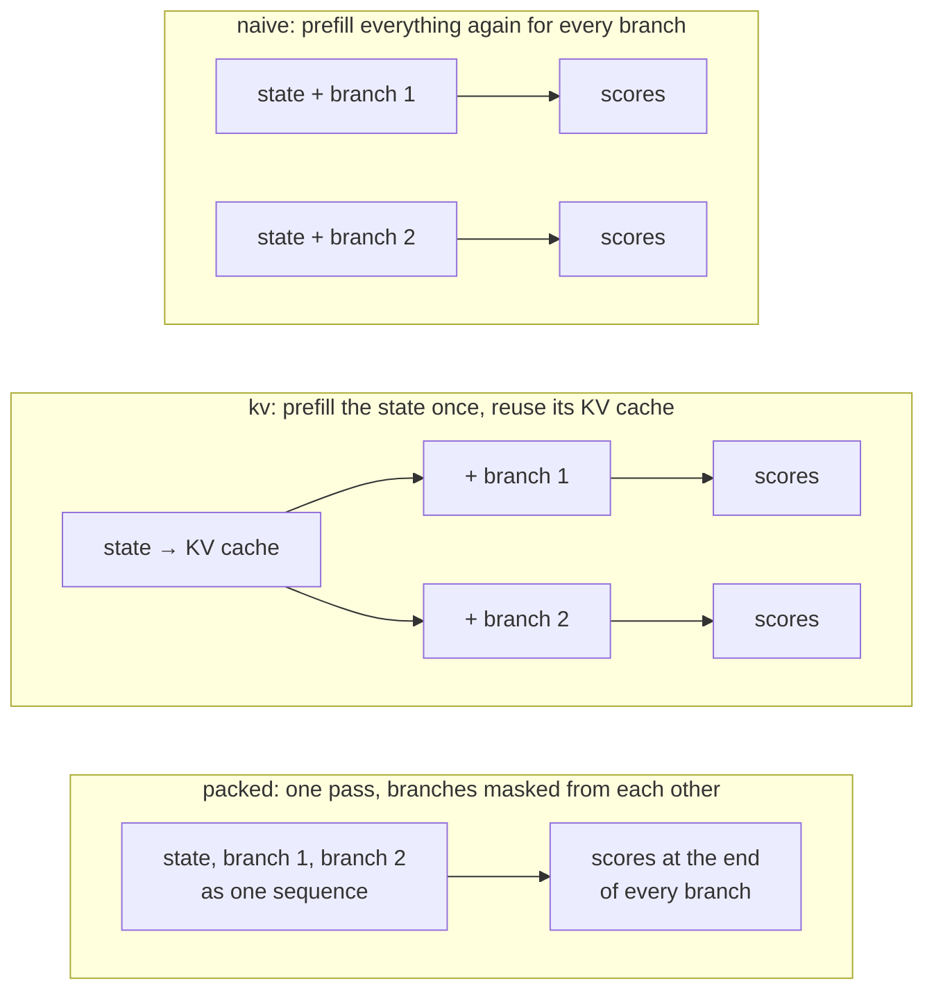
```mermaid
flowchart TB
    subgraph naive["naive: prefill everything again for every branch"]
        direction LR
        n1["state + branch 1"] --> n1o["scores"]
        n2["state + branch 2"] --> n2o["scores"]
    end
    subgraph kv["kv: prefill the state once, reuse its KV cache"]
        direction LR
        k0["state → KV cache"] --> k1["+ branch 1"] --> k1o["scores"]
        k0 --> k2["+ branch 2"] --> k2o["scores"]
    end
    subgraph packed["packed: one pass, branches masked from each other"]
        direction LR
        p1["state, branch 1, branch 2<br/>as one sequence"] --> p2["scores at the end<br/>of every branch"]
    end
    naive ~~~ kv ~~~ packed
```

All three modes give the same numbers (R2 below). The diagram shows the packed mask. ■ means "can attend to":

```text
                 keys →  state tokens   | branch 1 | branch 2
 state tokens            ■ (causal)     |          |
 branch 1 tokens         ■ ■ ■ ■ ■      | ■ causal |
 branch 2 tokens         ■ ■ ■ ■ ■      |          | ■ causal
 positions:              0 … S−1        | S …      | S …   ← both branches restart at S
```

---

## 5. What we measured (the POC experiments)

**R1 — The contract works.**
- A 0.5B model returns answers in Jev's format from label probabilities only.
- At least 99.8% of the next-token probability goes to the allowed labels. Thus the prompt works.

**R2 — The three modes give the same answers** (the core check).
- Naive, kv, and packed agree to 0.00002 in raw scores. That difference is floating-point noise.
- We asked TypeSafe's 13 GDPR questions together and one at a time. The answers changed by 0.0000034 or less.
- This result reproduces Jev's isolation result exactly.

**R3 — One prefill of the state gives ~9× the speed.** We asked 13 questions on a 1,000-token state. The naive mode
took 93 s. The shared state took 10 s. Added questions are "almost free" only when the state is much longer than the
questions.

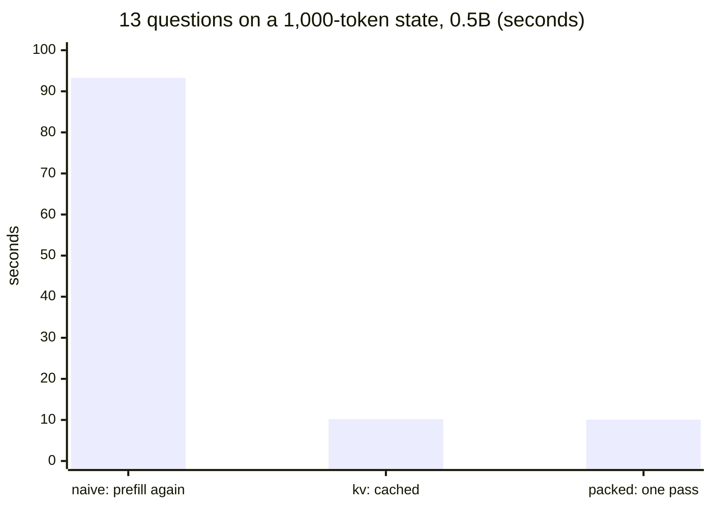
```mermaid
xychart-beta
    title "13 questions on a 1,000-token state, 0.5B (seconds)"
    x-axis ["naive: prefill again", "kv: cached", "packed: one pass"]
    y-axis "seconds" 0 --> 100
    bar [93.25, 10.20, 10.07]
```

**R4 — On small models, the A/B/C option list is sensitive to order.** We rotated the option order of 8 documented
Choice questions:

| Model | Winner changed when only the order changed | Same test, judging each option separately |
|---|---:|---:|
| 0.5B | 54% of rotations | 0% |
| 1.5B | 9% | 0% |

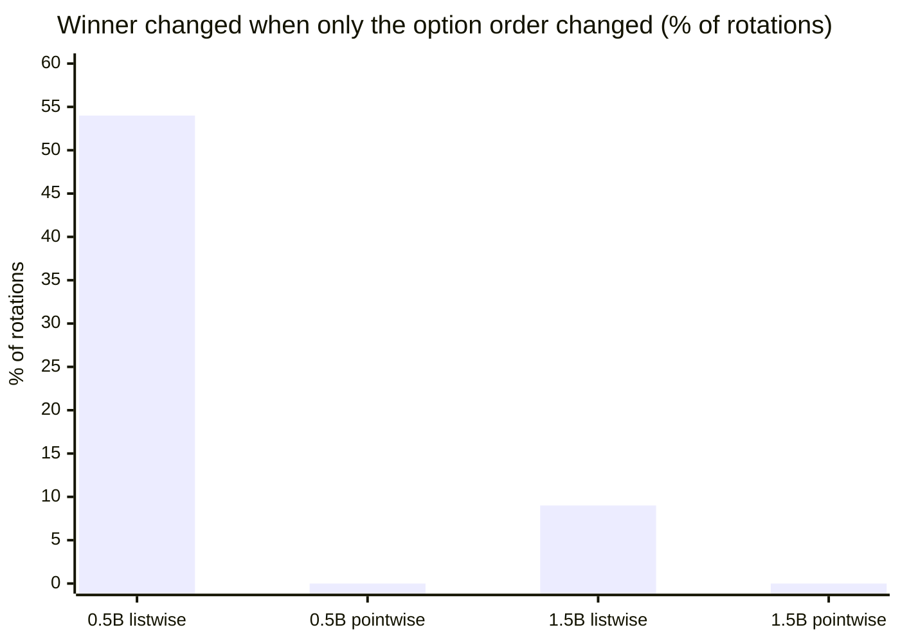
```mermaid
xychart-beta
    title "Winner changed when only the option order changed (% of rotations)"
    x-axis ["0.5B listwise", "0.5B pointwise", "1.5B listwise", "1.5B pointwise"]
    y-axis "% of rotations" 0 --> 60
    bar [54, 0, 9, 0]
```

A pointwise judgement (each option on its own) cannot have this bias, because of its design. Jev removed this bias
in training (Inferred).

**R5 — How near are we to Jev's published answers?** We ran the exact inputs from Jev's docs.
- **1.5B is much nearer than 0.5B.** On Score, the mean error was 0.62 levels for 0.5B and 0.22 levels for 1.5B.
  1.5B gave the same level as Jev 9 times out of 10.
- **The 0.5B failure comes from model capacity, not from the method.** 0.5B rated every bug report "workaround
  exists", from a misaligned icon to a total login outage.
- **Both sizes judge Noul questions differently from Jev.** Both counted "Used Python occasionally" as *strong in Python*.

**R6 — Calibration on BoolQ** (400 yes/no reading questions with known answers):

| | 0.5B | 1.5B |
|---|---:|---:|
| Accuracy (always saying "yes" scores 0.615) | 0.652 | 0.782 |
| Calibration error (ECE), raw | 0.161 | 0.099 |
| ECE after temperature scaling | **0.053** | **0.060** |
| Fitted temperature (1 = already calibrated) | 2.72 | 1.93 |
| ECE after "contextual calibration" (subtracting an "N/A"-state prior) | 0.350, worse | 0.221, worse |

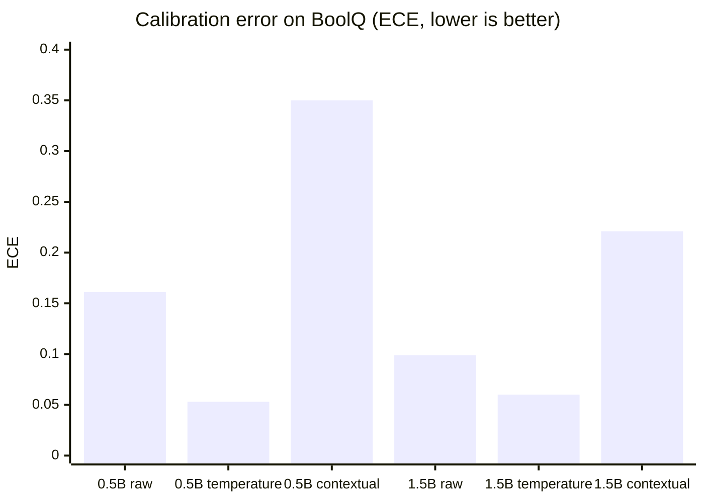
```mermaid
xychart-beta
    title "Calibration error on BoolQ (ECE, lower is better)"
    x-axis ["0.5B raw", "0.5B temperature", "0.5B contextual", "1.5B raw", "1.5B temperature", "1.5B contextual"]
    y-axis "ECE" 0 --> 0.4
    bar [0.161, 0.053, 0.350, 0.099, 0.060, 0.221]
```

- **Both models are overconfident without calibration.** When 0.5B was "95%+ sure", it was correct 86% of the time.
- **One fitted number corrects most of the error.** Temperature scaling makes the probabilities honest. It does not
  change any answer.
- **One popular method made the results worse.** Contextual calibration subtracts the model's answer for an "N/A"
  state. It made ECE worse at both sizes. For a yes/no question, "N/A" is itself evidence for "No".
- **Calibrated does not mean accurate.** 0.5B becomes honest about its uncertainty. But its accuracy is only a little
  better than the base rate.

---

## 6. Generation baseline vs minijev: generate the answer, or read it out

### 6.1 The setup, and why it is fair

We cannot compare with Jev directly. Jev is a different model on different hardware. Also, no `ANTHROPIC_API_KEY`
was set, so we could not call a cloud LLM (see 6.5).

We *can* use **the same model, on the same laptop, in two ways**. This isolates the method:
- **Generation baseline:** a normal chat completion. The model *generates* its answer token by token (greedy, with a
  KV cache, as every LLM API does). Then code parses the text back into an option.
- **minijev:** the same model does a *readout* of the answer probabilities in one pass.

The prompts are as similar as possible: the same system line, state, and options. The generation baseline gets the
instruction "answer with the name of the best option". minijev does a readout of the option letters (the two paths in
the §3.1 diagram). The code is in `poc/experiments.py`, in `llm_vs_minijev` and `fanout`. The raw results are in
`poc/results/llm_vs_minijev.json` (single decisions), `poc/results/fanout.json`, and
`poc/results/fanout-Qwen2.5-1.5B-Instruct.json` (many questions).

### 6.2 One decision at a time

The task is AG News topic classification (World / Sports / Business / Technology). We used 120 labelled articles and
Qwen2.5-0.5B:

| | minijev (readout) | LLM: generate the label | LLM: generate JSON probabilities* |
|---|---:|---:|---:|
| Time per decision | **0.44 s** | 0.71 s (1.6× slower) | 3.13 s (7× slower) |
| Output tokens generated | 0 | 3.1 | 19.9 |
| Accuracy | 0.883 | 0.908 | 0.683 with a lenient parser, 0.200 with a strict one |
| Probabilities for every option | yes, in the same pass | no | only when the JSON is right (16 of 60) |
| Unusable replies | 0 | 0 | 9 of 60, even with the lenient parser |

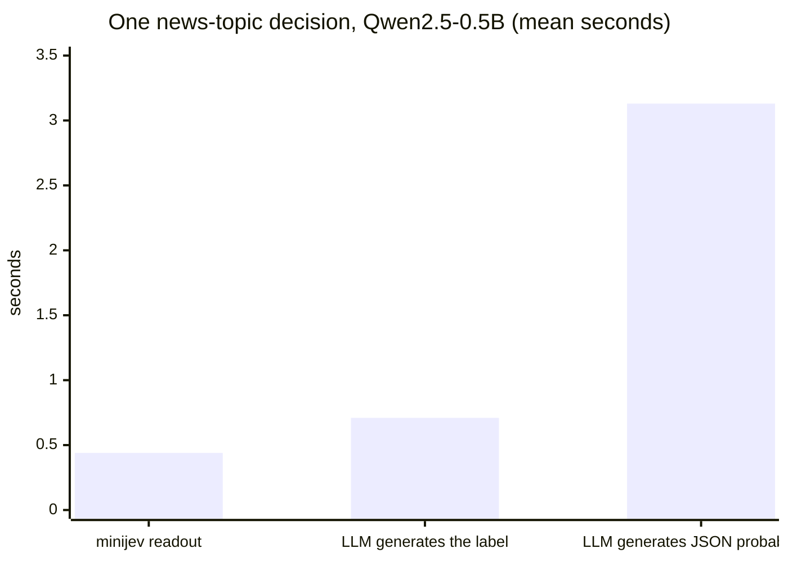
```mermaid
xychart-beta
    title "One news-topic decision, Qwen2.5-0.5B (mean seconds)"
    x-axis ["minijev readout", "LLM generates the label", "LLM generates JSON probabilities"]
    y-axis "seconds" 0 --> 3.5
    bar [0.44, 0.71, 3.13]
```

*The JSON variant is slow, so we ran it on the first 60 items only. On those same 60 items, minijev scored 0.883.
The "lenient" parser also accepts replies in the shape `{"topic": …, "probability": …}`. We applied it afterwards to
the replies saved in `poc/results/llm_vs_minijev.json`.

The results show these points:
- **For one short answer, generation is only a little slower.** To generate one or two tokens costs almost the same
  forward pass as a readout of them.
- **Both methods give the answers of the same model.** They picked the same topic 94% of the time. The difference
  between 0.908 and 0.883 is 3 articles out of 120. That is noise.
- **When you want probabilities, generation is 7× slower, and most replies are wrong.**
  - We asked for one probability per option. The model usually replied `{"topic": "Technology", "probability": 0.7}`.
    That is one answer and one number, not a distribution.
  - The probabilities it gave had only four values: 0.5, 0.7, 0.8, and 0.9.
  - The request for probabilities also decreased accuracy: 0.683 vs 0.883.
- **minijev gives the full distribution in the same pass, every time, with nothing to parse.**

### 6.3 Many questions about one state

The state is the GDPR article, shortened to its first 500 tokens. The request has the first N of TypeSafe's 13
cookbook questions. Every question is a Choice, so all methods answer exactly the same thing. We compared four
methods:

1. **LLM, one call per question.** This is the usual method. Each call sends the state again with one question.
2. **LLM, one call per question, with the state cached.** The calls reuse the KV cache of the state, as hosted APIs
   cache a shared prompt prefix. This is the **strongest generation baseline**.
3. **LLM, one call, JSON answers.** One prompt contains all questions. The model generates `{"q1": …, "q2": …}`.
4. **minijev.** One packed pass does a readout of the probabilities for every answer.

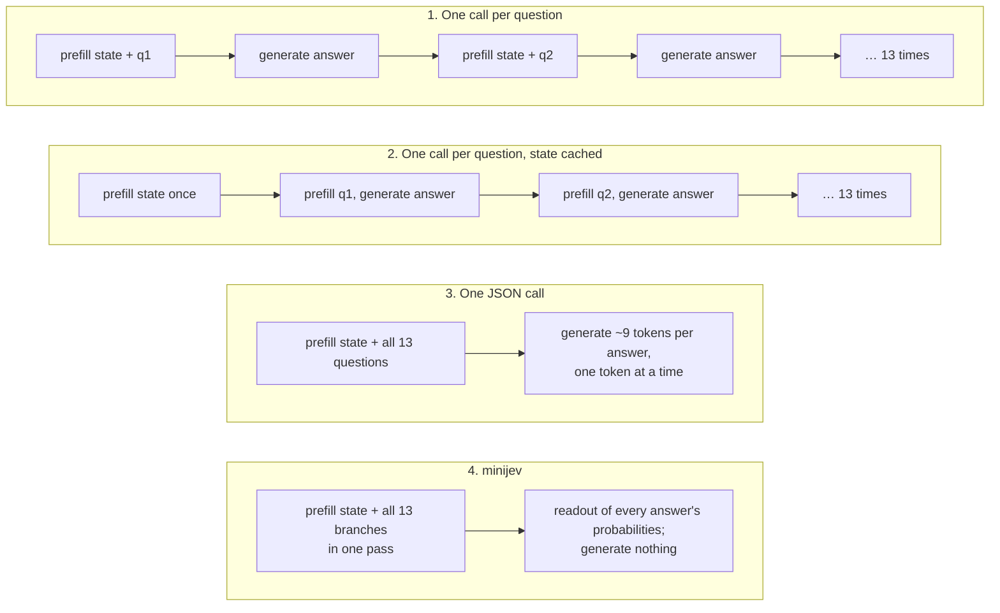
```mermaid
flowchart TB
    subgraph m1["1. One call per question"]
        direction LR
        a1["prefill state + q1"] --> a2["generate answer"] --> a3["prefill state + q2"] --> a4["generate answer"] --> a5["… 13 times"]
    end
    subgraph m2["2. One call per question, state cached"]
        direction LR
        b0["prefill state once"] --> b1["prefill q1, generate answer"] --> b2["prefill q2, generate answer"] --> b3["… 13 times"]
    end
    subgraph m3["3. One JSON call"]
        direction LR
        c1["prefill state + all 13 questions"] --> c2["generate ~9 tokens per answer,<br/>one token at a time"]
    end
    subgraph m4["4. minijev"]
        direction LR
        d1["prefill state + all 13 branches<br/>in one pass"] --> d2["readout of every answer's probabilities;<br/>generate nothing"]
    end
    m1 ~~~ m2 ~~~ m3 ~~~ m4
```

Each cell gives the wall-clock seconds for the full batch. The raw data is in `poc/results/fanout*.json`.

**Qwen2.5-0.5B**

| Questions | 1. Per question | 2. Per question, cached | 3. One JSON call | 4. minijev | minijev vs strongest baseline |
|---:|---:|---:|---:|---:|---:|
| 1 | 2.48 s | 2.48 s | 3.94 s | **2.28 s** | 1.1× |
| 4 | 9.07 s | 3.48 s | 8.02 s | **2.67 s** | 1.3× |
| 13 | 30.95 s | 8.96 s | 28.86 s (2 unparseable) | **6.27 s** | 1.4× (and 4.6–4.9× vs 1 and 3) |

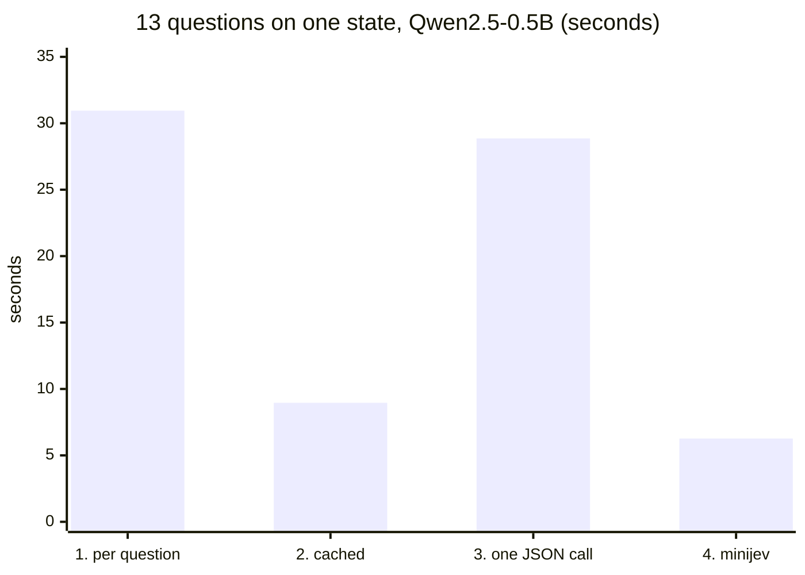
```mermaid
xychart-beta
    title "13 questions on one state, Qwen2.5-0.5B (seconds)"
    x-axis ["1. per question", "2. cached", "3. one JSON call", "4. minijev"]
    y-axis "seconds" 0 --> 35
    bar [30.95, 8.96, 28.86, 6.27]
```

**Qwen2.5-1.5B**

| Questions | 1. Per question | 2. Per question, cached | 3. One JSON call | 4. minijev | minijev vs strongest baseline |
|---:|---:|---:|---:|---:|---:|
| 1 | 6.31 s | 6.64 s | 9.72 s | 6.83 s | 0.9× (noise: an earlier run gave 1.4×) |
| 4 | 28.59 s | 8.86 s | 22.47 s | **6.22 s** | 1.4× |
| 13 | 75.66 s | 25.33 s | 78.28 s | **12.44 s** | **2.0×** (and 6.1–6.3× vs 1 and 3) |

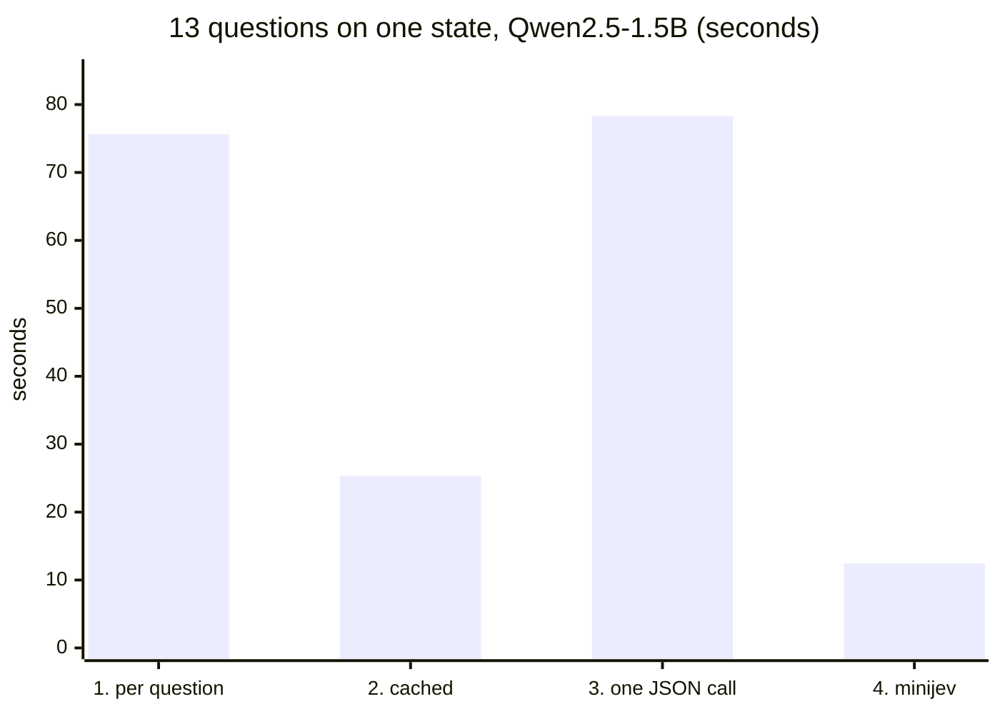
```mermaid
xychart-beta
    title "13 questions on one state, Qwen2.5-1.5B (seconds)"
    x-axis ["1. per question", "2. cached", "3. one JSON call", "4. minijev"]
    y-axis "seconds" 0 --> 85
    bar [75.66, 25.33, 78.28, 12.44]
```

With a single question, both methods prefill the same ~620 tokens. minijev saves only the generation of 2 tokens.
Thus the two results are within the run-to-run noise.

The methods scale differently for these reasons:
- **1. Per question** prefills the 500-token state again for each question. Cost ≈ N × state.
- **3. One JSON call** prefills the state once. But then it *generates* about 9 tokens per answer, one at a time.
  Cost ≈ N × 9 generated tokens, and each generated token is expensive (6.4).
- **2. Per question, cached** prefills the state once, as minijev does. The remaining cost is 2–3 generated tokens per
  answer (33 in total for 13 questions) and one short call per question.
- **4. minijev** prefills the state once. Each question adds only its own short branch. With 13 questions, it
  prefills 1,371 tokens in total and generates none.

**The honest conclusion.** The strongest generation baseline uses prompt caching and one-word answers. Against it,
minijev is only **1.3–1.4× faster at 0.5B and 1.4–2.0× at 1.5B** for 4–13 questions. For a single question, the two
are about equal. This result is expected. To generate the first token of a one-word answer, the model calculates the
probability of that token. minijev is the limit of that optimization. It stops at the first token and takes the
probability of every option, not a sample of one. §6.6 shows where the time goes.

The large differences come from the usual LLM methods:
- Send the state again for each question: 4.9–6.1× slower at 13 questions.
- Ask for JSON: 4.6–6.3× slower.
- Ask for probabilities: 7× slower, and most replies are malformed (§6.2).

At 13 questions, how often did the generation methods pick the same option as minijev?
- **0.5B:** 69% for per-question calls, cached or not. The two per-question methods agreed with each other 100%.
  62% for JSON.
- **1.5B:** 92% for per-question calls and 100% for JSON.

These questions are harder, and the small model is sensitive to the prompt format: "answer with the name" vs a readout of
the letter. In the JSON call, the model also generates the 13 answers in one stream, so they can affect each other.
They are not isolated, as Jev's answers are.

### 6.4 Why prefill is cheaper than generation

We measured on this laptop, 0.5B in fp32, from 180 completions and 120 readouts:

| | Cost per token |
|---|---:|
| **Prefill** (all prompt tokens go through each weight matrix together) | **3.1 ms** |
| **Generation** (decode: each new token needs a full pass by itself, which loads all ~2 GB of weights from memory again) | **140 ms** |

Here, a generated token costs about **45× a prefilled token**. This one fact explains all results in 6.2 and 6.3.

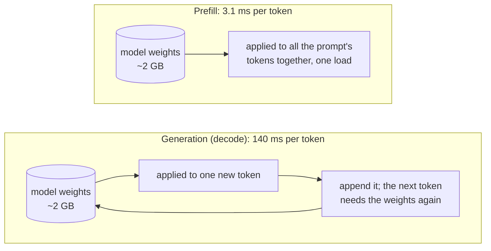
```mermaid
flowchart TB
    subgraph prefill["Prefill: 3.1 ms per token"]
        direction LR
        w1[("model weights<br/>~2 GB")] --> x1["applied to all the prompt's<br/>tokens together, one load"]
    end
    subgraph decode["Generation (decode): 140 ms per token"]
        direction LR
        w2[("model weights<br/>~2 GB")] --> x2["applied to one new token"] --> x3["append it; the next token<br/>needs the weights again"]
        x3 --> w2
    end
    prefill ~~~ decode
```

During generation, most of each pass moves the weights from memory to the processor: ~2 GB for one token. Prefill
moves the weights once for the full prompt and uses its time for arithmetic. Generation cannot batch its tokens in
the same way, because each token depends on the token before it.

This is also why cloud APIs charge more for output than for input. It is also why Jev can make output free: Jev
never generates. Jev's founder gives this argument about GPUs in his blog post *(KV) Cache Rules Everything Around Me*.

The difference also increased with model size. From 0.5B to 1.5B, the 13-question generation times increased 2.4–2.8×:
- one call per question: 31 s → 76 s;
- cached: 9.0 s → 25 s;
- JSON: 29 s → 78 s.

The readout time increased only 2.0×, from 6.3 s to 12.4 s. This agrees with the fact that each generated token must
load three times as many weights.

### 6.5 What about a cloud LLM such as Claude?

We did not measure this, because this environment has no `ANTHROPIC_API_KEY`. Two points are important:
- **Absolute speed depends on hardware.** A hosted LLM runs on GPUs. A single short call to a cloud model can return
  faster than minijev on a laptop CPU. The fair cloud comparison is minijev on a GPU, which is approximately what Jev
  is. This laptop can show the *ratio*, not the absolute speed.
- **The ratio applies to GPUs too (Observed).** SemIf ran the same 4B model on an RTX 3090. The readout of 21
  decisions took 1.02 s. Generation of the same decisions as a compact JSON array took 5.33 s (5.2×). TypeSafe's own
  evals (evals.typesafe.ai) report about 0.4 s per case for Jev. They report approximately 10–90 s for LLM workflows
  and up to ~190 s for single LLM prompts. Those numbers include larger models and reasoning, so they are not a
  controlled comparison.

To add the cloud point, do these steps:
1. Set `ANTHROPIC_API_KEY`.
2. Run TypeSafe's MIT-licensed `system-one-adapter-python` against Claude on the same AG News items and fan-out
   questions.
3. Add its results as one more column to the tables above. The adapter returns answers in Jev's format.

### 6.6 Summary: how minijev is faster, and why

**The results.** With the same model on the same laptop, minijev is:
- **a little faster, or equal, for a single one-word answer.** The only saving is the generation of 2–3 tokens. The
  speed-up was 1.6× on short news items (0.44 vs 0.71 s). On a 500-token state, the difference was within noise.
- **about 7× faster** when you want probabilities. It also gives them: complete distributions, no parsing, and no
  malformed replies.
- **about 5–6× faster for 13 questions on one state** than the usual LLM methods: one call per question, or one JSON
  call.
- **1.4× (0.5B) to 2.0× (1.5B) faster at 13 questions than the strongest generation baseline**, which uses prompt
  caching and one-word answers. That baseline still returns one answer per question, not probabilities.

#### How: count the tokens that each method prefills and generates

Each method does only two types of work: **prefill** and **generation** (decode). On this laptop, prefill cost 3.1 ms
per token and generation cost 140 ms per token (§6.4). Multiply and add these costs. The token counts alone then
predict the 13-question results:

| 13 questions, 0.5B | Tokens prefilled | Tokens generated | Predicted: 3.1 ms × prefilled + 140 ms × generated | Measured |
|---|---:|---:|---:|---:|
| 1. One call per question | 8,247 | 33 | 25.6 s + 4.6 s = **30.2 s** | 30.95 s |
| 2. One call per question, cached | 1,347 | 33 | 4.2 s + 4.6 s = **8.8 s** | 8.96 s |
| 3. One JSON call | 1,218 | 124 | 3.8 s + 17.4 s = **21.1 s** | 28.86 s* |
| 4. minijev | 1,371 | **0** | 4.3 s + 0 s = **4.3 s** | 6.27 s* |

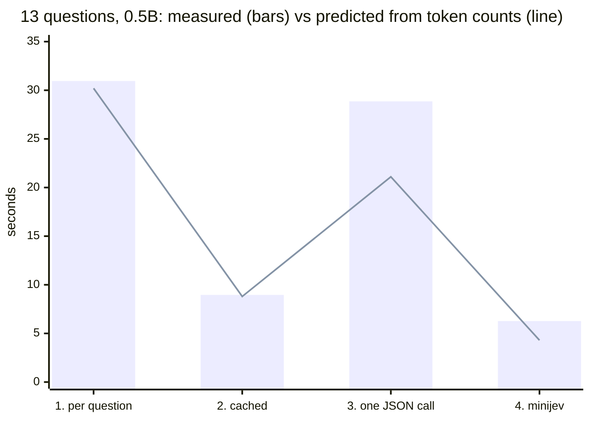
```mermaid
xychart-beta
    title "13 questions, 0.5B: measured (bars) vs predicted from token counts (line)"
    x-axis ["1. per question", "2. cached", "3. one JSON call", "4. minijev"]
    y-axis "seconds" 0 --> 35
    bar [30.95, 8.96, 28.86, 6.27]
    line [30.2, 8.8, 21.1, 4.3]
```

*The two prediction errors have known causes:
- **Method 3:** each generated token also attends to the full 1,200-token prompt. Thus generation cost about 200 ms
  per token here, not the 140 ms that we measured with short prompts.
- **Method 4:** the single packed pass calculates attention over the full 1,371 × 1,371 grid. This includes the
  blocks that the mask then hides (§4.3). There are also fixed overheads.

The table shows these points:
- **Methods 2 and 4 prefill almost the same tokens.** The only difference is 33 generated tokens, which cost 4.6 s.
- **Methods 1 and 3 are slow for opposite reasons.** Method 1 prefills the state 13 times (8,247 tokens). Method 3
  generates 124 tokens.

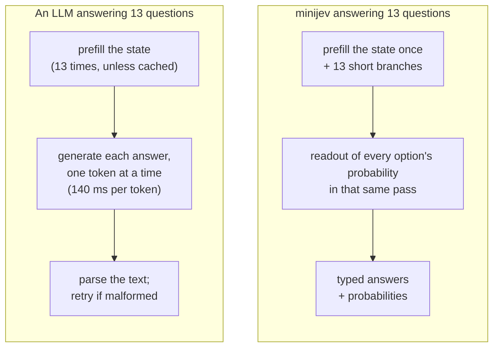
```mermaid
flowchart LR
    subgraph llm["An LLM answering 13 questions"]
        direction TB
        l1["prefill the state<br/>(13 times, unless cached)"] --> l2["generate each answer,<br/>one token at a time<br/>(140 ms per token)"] --> l3["parse the text;<br/>retry if malformed"]
    end
    subgraph mj["minijev answering 13 questions"]
        direction TB
        m1["prefill the state once<br/>+ 13 short branches"] --> m2["readout of every option's probability<br/>in that same pass"] --> m3["typed answers<br/>+ probabilities"]
    end
    llm ~~~ mj
```

#### Why: three reasons

1. **minijev never generates.** An LLM produces its answer one token at a time. Each token needs its own pass
   through the full model. Here that cost 140 ms per token, 45× the prefill cost of one token. The reason is that each
   generated token loads all ~2 GB of weights from memory again (§6.4). minijev stops at the exact position where the
   model *would* start to generate, and does the readout there. Thus it pays only the cheap prefill rate.
2. **minijev prefills the state once.** All questions are branches from a single prefill of the state (§3.2).
   Thirteen questions cost one state plus 13 short branches, not 13 states. An LLM pipeline can copy this part with
   prompt caching (method 2).
3. **The same pass gives the full distribution of every answer.** The probabilities for every option are already
   available at the readout position. An LLM must *generate* the probabilities to give them: 19.9 tokens per answer in
   §6.2, and most replies were malformed. minijev has nothing to parse and nothing to retry.

#### Is it only caching?

No. Caching is one of two independent factors. The measurements separate them:

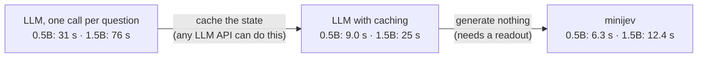
```mermaid
flowchart LR
    A["LLM, one call per question<br/>0.5B: 31 s · 1.5B: 76 s"] -->|"cache the state<br/>(any LLM API can do this)"| B["LLM with caching<br/>0.5B: 9.0 s · 1.5B: 25 s"] -->|"generate nothing<br/>(needs a readout)"| C["minijev<br/>0.5B: 6.3 s · 1.5B: 12.4 s"]
```

| 13 questions on one state | 0.5B | 1.5B |
|---|---:|---:|
| LLM, one call per question, no cache | 30.95 s | 75.66 s |
| … plus caching the state (reason 2) | 8.96 s (−22.0 s) | 25.33 s (−50.3 s) |
| … plus generating nothing, i.e. minijev (reason 1) | 6.27 s (−2.7 s) | 12.44 s (−12.9 s) |
| Share of the total saving: caching / no generation | 89% / 11% | 80% / 20% |

- **Against the simplest generation method, most of the saving comes from caching.** The reason is that this test has
  a large state: 13 questions on a 500-token article.
- **When there is nothing to cache, all of the gain comes from no generation.** With one question per state (§6.2),
  minijev was 1.6× faster than generation of a label and 7× faster than generation of probabilities.
- **The one-JSON-call method also prefills the state only once, but it is still 4.6–6.3× slower.** All of that
  difference comes from generation.
- **The share of the saving from no generation increases** with model size (11% → 20%). It also increases with the
  quantity that the LLM generates: labels < JSON < probabilities.

Thus caching explains why it is slow to send the state again for each question. Caching does not explain why minijev
is faster than an LLM that already caches. That part comes from the readout: there is no decode phase.

#### When minijev is not faster

- **A single short answer.** The generation of 2–3 tokens adds little to the prefill that both methods must do. On a
  500-token state, the two methods were equal.
- **The strongest generation baseline** uses prompt caching and one-word answers. It prefills the same tokens as
  minijev and pays only for the few tokens that it generates. minijev is the limit of that optimization: it generates
  zero tokens and takes the probability of every option, not a sample of one.

#### What applies to GPUs, and to Jev

The difference between prefill and generation is not specific to this laptop:
- On GPUs, generation is also the bottleneck, because memory bandwidth limits each token. That is why APIs charge more
  for output than for input. Jev's founder uses this argument for a model that never generates (§3.2).
- A GPU makes both methods faster in absolute terms. It does not change the count: minijev generates nothing.

**The method does not make the model more accurate.** The answers are the model's own answers. Single decisions had
94% identical picks, and the 1.5B fan-out had up to 100%. The method changes the cost and the structure, and it gives
probabilities at no extra cost. That is exactly what Jev sells, without Jev's better model and training.

---

## 7. What changed in DESIGN.md

- **§2 Known vs inferred** now contains the evidence table from the research.
- **§4 API** now matches Jev's real API:
  - Score takes `criteria` as an ordered list. There is no `levels` field.
  - `score` is in level units 0…n−1 and comes with a `legend`.
  - Noul accepts optional `criteria`.
  - The model never sees question ids.
  - `latency_ms` is marked as our extension.
- **§5.1 Judges:** the claim that stated confidence is less well calibrated is now balanced. Tian et al. 2023 found
  the opposite for chat-tuned models. The section also refers to TypeSafe's adapter as a ready Claude baseline.
- **§5.2 Labels and templates:**
  - Noul uses a readout of Yes/No, not letters.
  - Score judges one level at a time.
  - Choice has a pointwise option and a two-stage plan for large option sets.
  - The template is the one that works in our tests.
- **§5.4 Shared prefix** adds the packed one-pass mode and the three-way equivalence check.
- **§5.5 Maths** uses TypeSafe's two confidence formulas.
- **§6 Calibration:** temperature scaling is now the primary method. Contextual calibration is optional, with the
  measured reason.
- **§8, §9, §12, §13** record verified versions, measured speed, the status of each experiment, and new measured risks.

---

## 8. Next steps

1. **Package the POC** (Phase 2). Move `poc/` into `src/minijev` with a pydantic API and a CLI.
2. **Make calibration sets for Choice and Score.** Check whether a temperature fitted on one dataset transfers to another.
3. **Add a two-stage Choice** for more than 25 options, as Jev does.
4. **Add the Claude baseline (E2).** Set `ANTHROPIC_API_KEY` and run TypeSafe's adapter on the same data. This gives
   the cloud-LLM comparison that this walkthrough does not include.
5. **With a Jev API key, run the cheap tests** in RESEARCH.md §8.
   - A shuffle of the options shows whether Jev judges options together or one at a time.
   - The step in latency shows where the two-stage Choice starts.

---

## Glossary

The full project glossary is in [CLAUDE.md](../CLAUDE.md).

- **Token** — a piece of text that the model processes or generates (approximately ¾ of a word).
- **Logits / scores** — the raw output of the model: one number per vocabulary token for "the next token".
- **Softmax** — a function that changes scores into probabilities with a sum of 1.
- **Prefill** — the model processes the prompt. All its tokens go through the model together, which is efficient.
- **Decode (generation)** — the model generates one token per model pass. Each pass loads the full model from memory
  again, which is slow.
- **Readout** — take the probabilities of the label tokens at one position, from one forward pass. No tokens are
  generated.
- **KV cache** — the internal memory of the model for tokens that it already processed. The model reuses it, so it
  does not prefill those tokens again.
- **Listwise / pointwise** — judge all options together in one prompt, or judge each option separately.
- **Calibration** — the property that "70% sure" is correct 70% of the time.
- **ECE** (expected calibration error) — the mean difference between stated confidence and actual accuracy. 0 is perfect.
- **Brier score** — the mean squared error of the probabilities. Lower is better.
- **Temperature scaling** — divide the scores of the model by one fitted number T. T > 1 makes the model less confident.
- **Platt scaling** — temperature scaling plus a fitted shift.
- **Contextual calibration** — subtract the answer of the model on a content-free input ("N/A"). This removes a bias
  that the model has before it sees any content.
